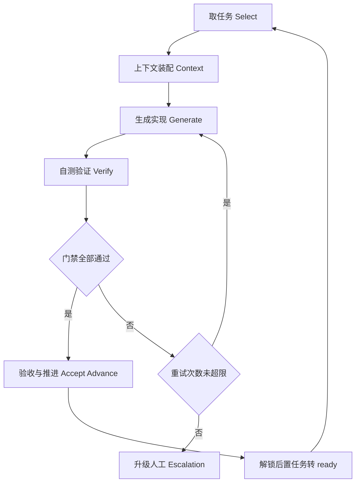
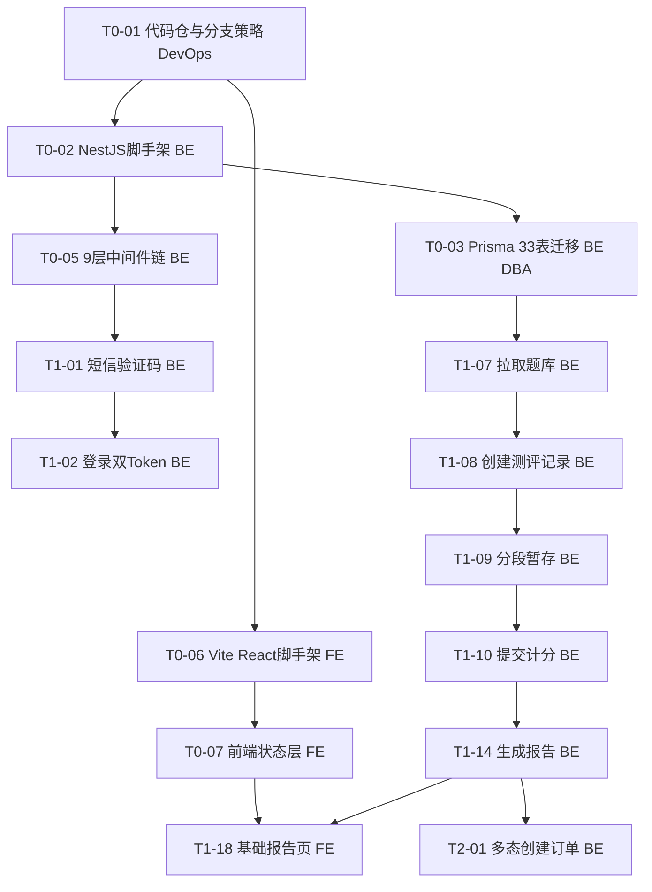
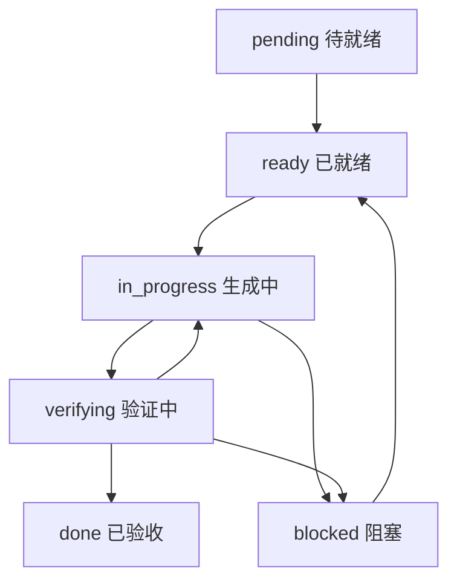

# InnerQuest 向内求索 — AI 代码智能体自动开发循环（Loop Engineering）落地方案

> **配套主计划**: `Vibe-Coding执行计划与上线清单.md`（6 阶段 / 61 项任务 / 6 个验证检查点）
> **适用产品**: InnerQuest 向内求索（AI + MBTI 职业规划与辅导平台）
> **技术栈基线**: React 18 + TS + Vite + Tailwind + Zustand + React Query / Node.js 20 + NestJS 10 + Prisma / MySQL 8 + Redis 7 + MongoDB + ClickHouse + OSS（33 表；统一响应 `{code,message,data,traceId}`）
> **版本**: v1.0  ·  **日期**: 2026-07-05  ·  **状态**: 落地蓝图

---

## 目录

1. [方案目标与适用范围](#1-方案目标与适用范围)
2. [循环单元模型（Task Loop Unit）](#2-循环单元模型task-loop-unit)
3. [任务就绪判定（Definition of Ready）](#3-任务就绪判定definition-of-ready)
4. [上下文装配策略](#4-上下文装配策略)
5. [验证与门禁（Verify Gates）](#5-验证与门禁verify-gates)
6. [停止条件与人工介入（Stop & Escalation）](#6-停止条件与人工介入stop--escalation)
7. [智能体角色与并行编排](#7-智能体角色与并行编排)
8. [循环状态机与任务看板](#8-循环状态机与任务看板)
9. [Prompt 模板](#9-prompt-模板)
10. [端到端循环示例](#10-端到端循环示例)
11. [落地清单与推进节奏](#11-落地清单与推进节奏)

---

## 1. 方案目标与适用范围

本方案将主计划中的 **61 项任务**（T0-01~T0-11 / T1-01~T1-23 / T2-01~T2-11 / T3系列 / T4系列 / T5系列）逐一转化为 **AI 智能体可循环执行的最小交付单元（Task Loop Unit）**，目标是：

- **最大化自动化交付**：让智能体依据任务的「依赖 / 负责端 / 验收标准」自主取任务、生成实现、自测验证、推进下一任务。
- **每轮产出可验证**：每一轮循环必须以主计划中该任务的**真实验收标准**作为断言依据，未通过断言不得标记 `done`。
- **对齐真实结构**：所有循环引用的任务 ID、依赖、验收措辞严格与《Vibe-Coding执行计划与上线清单.md》一致，不重新发明任务或技术栈。

**适用范围**：覆盖阶段 0（环境脚手架）→ 阶段 5（上线冲刺）的全部任务；每阶段末的「验证检查点 0~5」作为阶段级门禁纳入循环。**免费首发先行、付费拓展后置**——阶段 1 完成即达成免费首发上线里程碑，阶段 2 及以后为上线后拓展迭代。

**不适用/需人工的边界**（详见第 6 章）：需外部资质的任务（微信支付商户号 / 微信 OAuth / OSS / 域名备案 / LLM Key / 短信通道）及验收标准无法自动断言的任务。

---

## 2. 循环单元模型（Task Loop Unit）

单次循环由标准五步组成，一个 Task Loop Unit 对应主计划中的一项任务（如 `T1-14`）：

1. **取任务（Select）**：从看板中挑选状态为 `ready` 的任务；若无 `ready` 任务则检查依赖或触发升级。
2. **上下文装配（Context）**：为该任务注入最小充分上下文——任务名称、依赖任务产物、相关文档章节、技术栈基线、统一响应/错误码规范（详见第 4 章）。
3. **生成实现（Generate）**：智能体依据装配上下文产出代码/配置/迁移脚本等交付物，写入对应产物路径。
4. **自测验证（Verify）**：按分层门禁执行 编译/lint → 单测 → 契约/接口测试 → 验收标准断言（详见第 5 章）。
5. **验收与推进（Accept/Advance）**：全部门禁通过则标记 `done`、登记 artifacts，并把「依赖该任务的后置任务」重新评估是否转入 `ready`；未通过则回退 Generate 或升级。



---

## 3. 任务就绪判定（Definition of Ready）

一个任务从 `pending` 转入 `ready`、可进入循环，必须同时满足以下前置条件：

- **依赖任务已 done**：任务表「依赖」列的全部前置任务 ID 状态均为 `done`。例如 `T1-14 生成报告`（依赖 `T1-10`）要求 `T1-10 提交计分` 已 done；`T1-18 基础报告页 P08`（依赖 `T0-07`、`T1-14`）要求两者均 done。依赖为 `-` 的任务（如 `T0-01`）天然满足。
- **验收标准可自动化断言**：任务表「验收标准」能转化为可执行断言。例如 `T1-14` 的「每日 3 份配额(超限 40003)」可写成接口断言（第 4 次请求返回 `code=40003`）。若验收标准仅为主观描述且无法自动断言 → 不得进入循环，转人工（见第 6 章）。
- **上下文文件可定位**：该任务涉及的文档章节、依赖产物路径、技术栈基线均可在装配阶段定位到（例如统一响应规范、错误码表、相关设计文档章节）。

---

## 4. 上下文装配策略

每轮循环仅为智能体注入**最小充分上下文**，控制上下文体积、避免噪声：

| 上下文块 | 内容 | 来源 |
|---------|------|------|
| 任务卡 | 任务 ID / 名称 / 负责端 / 依赖 / 工时 / 验收标准（**逐字引用**主计划任务表） | 主计划对应阶段任务表 |
| 依赖产物 | 前置任务 done 后登记的 artifacts（接口签名、DTO、迁移表、组件路径） | 看板 artifacts 字段 |
| 文档章节引用 | 仅注入与任务强相关的章节（如报告任务注入报告服务章节，不注入无关模块） | 五份设计文档相关章节 |
| 技术栈基线 | 该任务所属层的选型（前端 React18+TS+Vite+Tailwind / 后端 NestJS10+Prisma / 存储 MySQL8+Redis7+MongoDB+ClickHouse+OSS） | 主计划「技术栈基线」 |
| 统一响应/错误码规范 | `{code,message,data,traceId}` 结构 + 相关错误码（如 40002/40003/70001/70002/50002 等） | 主计划「全局边界约束基线」 |

**体积控制原则**：
- 只装配「当前任务 + 直接依赖」的产物，不注入孙层任务。
- 文档按章节切片注入，而非整篇；错误码只注入本任务验收涉及的码值。
- 依赖产物以「接口签名/表结构摘要」形式注入，避免整段源码堆叠。

---

## 5. 验证与门禁（Verify Gates）

采用**分层门禁**，逐层通过才可进入下一层；任一层失败即中止本轮并回退：

1. **门禁 L1 — 编译 / Lint**：TS 编译通过、ESLint 无 error（前后端通用）。
2. **门禁 L2 — 单元测试**：任务相关单测通过（如 `T1-10` 的 ScoringService 计分单测：维度累加 → 4 字母类型正确）。
3. **门禁 L3 — 契约 / 接口测试**：对齐**统一响应结构** `{code,message,data,traceId}` 与**错误码**。例如 `T1-15 报告查询` 断言「未解锁访问付费段返回 40002」；`T2-04 支付回调` 断言「重复回调幂等成功、uk_channel_trade_no 唯一」。
4. **门禁 L4 — 验收标准断言**：逐条断言主计划该任务「验收标准」列的措辞。例如 `T1-01` 断言「限流生效（1 次/60s）、验证码入 Redis 有 TTL」。

**阶段级门禁（验证检查点）**：每阶段全部任务 done 后，运行该阶段末的「验证检查点」作为阶段闸门：
- 检查点 0：样例接口走通 9 层中间件链并返回标准响应结构。
- 检查点 1：新用户完成「登录 → 60 题测评 → 生成免费报告 → 职业匹配 TOP10 → 分享海报」全链路，断点续答/每日 3 份配额/限流生效 → **即为免费首发上线里程碑**。
- 检查点 2~5：付费漏斗 / AI 对话 / 辅导与后台联调 / 上线终检，逐一作为进入下一阶段的门禁。

**失败回退处理**：
- 任务级门禁失败 → `attempts+1`，回退到 Generate 重生成；连续失败达阈值 → 升级人工。
- 阶段级检查点失败 → 阻塞进入下一阶段，定位失败任务重开循环（该任务回 `in_progress`），修复后重跑检查点。

---

## 6. 停止条件与人工介入（Stop & Escalation）

循环在以下情形**自动停止或升级人工**，任务置为 `blocked`：

| 触发条件 | 说明 | 处理 |
|---------|------|------|
| 连续 N 次验证失败 | `attempts ≥ N`（建议 N=3），门禁反复不通过 | 停止本任务循环，升级人工排查 |
| 依赖缺失 | 依赖任务未 done 或被 blocked | 保持 `pending`，等待依赖解锁 |
| 需外部资质 | 微信支付商户号（T2-03/T2-04）、微信 OAuth（T1-03）、OSS（T0-04）、域名备案、LLM Key（T3-01）、短信通道（T1-01） | 转人工提供凭证/开通后再入循环 |
| 验收标准无法自动断言 | 主观/压测/演练类（如 T5-03 压测、T5-10 灾备演练、T5-09 灰度回滚） | 转人工执行与签署 |
| 契约冲突 | 生成结果与统一响应/错误码规范不兼容且无法自动修复 | 升级人工裁决规范 |

> 涉及外部资质的任务在依赖满足前保持 `blocked`，不占用自动循环，避免阻塞可自动化任务（如 T1-01 短信通道未开通时，其限流/TTL 逻辑可先用 mock 通过 L1~L2，L3/L4 真实通道断言待人工补齐）。

---

## 7. 智能体角色与并行编排

依据主计划「负责角色」划分智能体：

| 智能体角色 | 负责端 | 承接任务示例 |
|-----------|--------|-------------|
| FE-Agent | FE | T0-06/T0-07/T0-08/T1-06/T1-12/T1-18… |
| BE-Agent | BE | T0-02/T0-05/T1-01/T1-10/T1-14/T2-04… |
| DevOps-Agent | DevOps | T0-01/T0-10/T0-11/T5-04/T5-09… |
| DBA-Agent | DBA | T0-03（BE/DBA 协作）/ T5-06/T5-10… |
| QA-Agent | QA | 各验证检查点回归、T5-03 压测、T5-05 越权 |

**编排规则**：
- **无依赖任务并行**：同一时刻 `ready` 且互不依赖的任务可分派给不同角色并行。
- **有依赖任务串行**：后置任务须等前置 done 才转 `ready`。

**阶段 0 → 1 → 2 编排示例（引用真实任务 ID 与依赖）**：



- 并行：`T0-02`（BE 链路）与 `T0-06`（FE 链路）在 `T0-01` 完成后可**并行启动**；`T1-01→T1-02`（认证串行）与 `T1-07→…→T1-10`（测评串行）两条链可**并行推进**。
- 串行：`T1-14 生成报告` 必须等 `T1-10 提交计分` done；`T1-18 基础报告页 P08`（依赖 T0-07、T1-14）需两条链汇合；`T2-01 多态创建订单`（依赖 T1-14）在免费首发之后启动。

---

## 8. 循环状态机与任务看板

**任务状态流转**：



- `pending`：依赖未满足或未达 DoR。
- `ready`：满足第 3 章 DoR，可被取任务。
- `in_progress`：Generate 阶段。
- `verifying`：执行分层门禁。
- `done`：全部门禁通过并登记 artifacts。
- `blocked`：达到停止/升级条件（第 6 章）。

**任务状态 JSON Schema 样例**（以 T1-14 为例）：

```json
{
  "id": "T1-14",
  "title": "生成报告 POST /reports（免费预览段，report 3 表）",
  "phase": 1,
  "deps": ["T1-10"],
  "owner": "BE",
  "acceptance": "预览段落生成，每日 3 份配额(超限 40003)",
  "status": "ready",
  "attempts": 0,
  "artifacts": []
}
```

字段说明：`id`（任务ID）/ `title`（任务名称）/ `phase`（阶段）/ `deps`（依赖ID数组）/ `owner`（负责端）/ `acceptance`（验收标准，逐字引用）/ `status`（状态机取值）/ `attempts`（已重试次数，用于停止判定）/ `artifacts`（产物路径/接口签名列表，供后置任务装配）。

---

## 9. Prompt 模板

可直接复用的**循环单步 Prompt 模板**（占位符以 `{{}}` 标注）：

```text
【角色】你是 {{owner}}-Agent（负责端：{{owner}}），在 InnerQuest 全栈项目中执行单个开发任务的一轮循环。

【技术栈基线】{{techStackForLayer}}
（前端 React18+TS+Vite+Tailwind+Zustand+React Query；后端 NestJS10+Prisma；存储 MySQL8/Redis7/MongoDB/ClickHouse/OSS）

【本轮任务】
- 任务ID：{{id}}
- 任务名称：{{title}}
- 依赖（均已 done）：{{deps}}
- 依赖产物：{{dependencyArtifacts}}
- 相关文档章节：{{docSections}}

【统一响应与错误码规范】
- 所有接口必须返回 {code,message,data,traceId}
- 本任务涉及错误码：{{errorCodes}}

【验收标准（必须逐条满足）】
{{acceptance}}

【输出约束】
1. 仅产出本任务范围内的交付物，不越界修改其他任务产物。
2. 命名/页面/表/接口必须回溯设计文档，不新增未定义资源。
3. 生成后需自测：编译/lint → 单测 → 契约/接口测试 → 验收标准断言。

【推进规则】
- 只有当上述四层门禁全部通过、且验收断言逐条为真时，才可将任务标记为 done 并登记 artifacts。
- 任一断言失败：attempts+1 后重生成；连续失败达 {{N}} 次或需外部资质，则置为 blocked 并升级人工。
```

---

## 10. 端到端循环示例

以真实任务 **T1-14（生成报告，依赖 T1-10）→ T1-18（基础报告页 P08，依赖 T0-07/T1-14）** 走一遍完整循环。

### 10.1 循环 A：T1-14 生成报告

1. **取任务（Select）**：看板中 `T1-10 提交计分` 已 `done`，`T0-07` 与本任务无直接约束；`T1-14` 满足 DoR，状态 `pending → ready`，被 BE-Agent 取走。
2. **上下文装配（Context）**：注入任务卡（验收标准「预览段落生成，每日 3 份配额(超限 40003)」）、依赖产物（T1-10 输出的 4 字母 MBTI 类型、record 结构）、报告服务章节（report 3 表）、技术栈（NestJS10+Prisma+Redis 日计数器）、错误码 40003。
3. **生成实现（Generate）**：实现 `POST /reports`，含免费预览段落生成、Redis 日计数器（每日 3 份），LLM 深度解读段落走已就绪的网关兜底（LLM 不可用时占位/兜底文案，不影响 MBTI 类型与基础报告）。
4. **自测验证（Verify）**：
   - L1 编译/lint 通过；
   - L2 单测：预览段落字段完整；
   - L3 契约：返回 `{code,message,data,traceId}`；
   - L4 验收断言：连续第 4 次生成请求返回 `code=40003`（每日 3 份配额生效）。
5. **验收与推进（Accept/Advance）**：门禁全通过 → `T1-14` 置 `done`，登记 artifacts（`POST /reports` 签名、report DTO）。触发后置评估：`T1-18`（依赖 T0-07、T1-14）——若 `T0-07` 亦 done，则 `T1-18` 由 `pending → ready`。

### 10.2 循环 B：T1-18 基础报告页 P08

1. **取任务**：`T0-07 前端状态层` 与 `T1-14` 均 done，`T1-18` 转 `ready`，FE-Agent 取走。
2. **上下文装配**：注入验收标准「维度雷达/柱状图渲染，RequireResult 守卫」、依赖产物（T1-14 的 `/reports/:id` 接口、report DTO；T0-07 的 Zustand/React Query 样板）、报告页 P08 章节、技术栈（React18+Chart.js+Tailwind）。
3. **生成实现**：实现 P08 基础报告页，Chart.js 渲染维度雷达/柱状图，接入 `RequireResult` 路由守卫。
4. **自测验证**：L1 编译/lint → L2 组件单测 → L3 接口联调（对齐 `/reports/:id` 统一响应）→ L4 验收断言（图表渲染 + 守卫拦截未出结果的访问）。
5. **验收与推进**：全通过 → `T1-18` 置 `done`。当阶段 1 全部任务（T1-01~T1-23）done，触发**验证检查点 1** 阶段门禁回归。

---

## 11. 落地清单与推进节奏

**启动第一轮循环（阶段 0）**：
1. 从依赖为 `-` 的任务起步：`T0-01 代码仓与分支策略`（DevOps）作为首个 `ready` 任务进入循环。
2. `T0-01` done 后并行解锁 `T0-02`（BE 链）与 `T0-06`（FE 链），按第 7 章编排并行推进。
3. 阶段 0 全部 done 后运行**验证检查点 0**（样例接口走通 9 层中间件链、返回标准响应结构）作为阶段门禁。

**推进节奏与里程碑**：
- 阶段 0 检查点 0 通过 → 进入阶段 1。
- 阶段 1（T1-01~T1-23）全部 done 且**验证检查点 1** 通过 → **达成免费首发上线里程碑**（免费闭环独立发布，首个可上线里程碑）。
- 免费首发上线后，作为上线后拓展迭代依次推进：阶段 2（付费拓展，检查点 2）→ 阶段 3（AI 对话，检查点 3）→ 阶段 4（辅导与后台，检查点 4）→ 阶段 5（上线冲刺，检查点 5 上线终检）。
- 全程遵循「依赖顺序 + 阶段门禁」：前置未 done 不启动后置；检查点未通过不进入下一阶段。

**推进准则**（承接主计划增量交付准则）：
- 每次合并保持数据库变更向后兼容，支持灰度回滚。
- 命名回溯五份设计文档，不新增未定义资源。
- 需外部资质任务（支付/OAuth/OSS/LLM Key/短信/备案）置 `blocked` 等待人工，不阻塞可自动化循环。

---

> **方案完** ｜ 本方案严格基于《Vibe-Coding执行计划与上线清单.md》真实任务结构（6 阶段 / 61 项 / 6 检查点）设计，所引用任务 ID、依赖、验收措辞均与主计划一致，可直接作为 AI 智能体自动开发循环的落地依据。