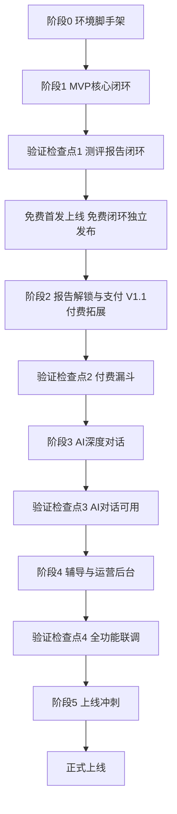
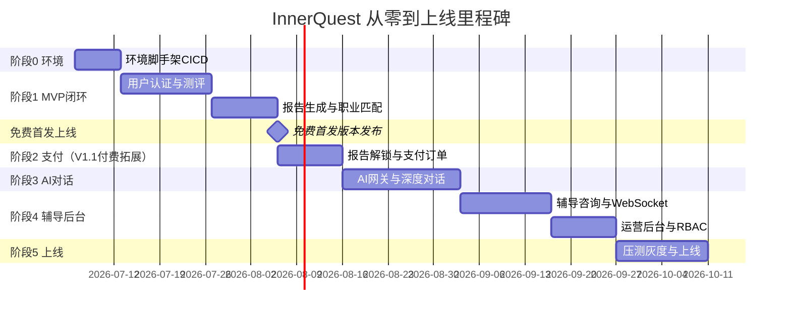
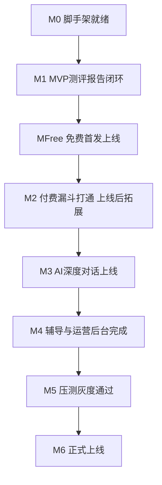

# InnerQuest 向内求索 — Vibe Coding 执行计划与上线清单

> **产品**: InnerQuest 向内求索（基于 AI 的 MBTI 职业规划与辅导平台）
> **定位**: 测评 + 规划 + 辅导 三位一体
> **版本**: v1.0  ·  **日期**: 2026-07-05  ·  **状态**: 执行蓝图
> **配套文件**: `产品分析报告-MBTI职业规划网页产品.md`、`前端页面清单与路由文档.md`、`数据库设计文档.md`、`技术架构设计文档.md`、`后端设计文档.md`
> **用途**: 本文档作为从零开发到正式上线的开发排期与执行看板，任务清单可直接拆解为 Issue/看板卡片。

---

## 目录

1. [执行总览](#1-执行总览)
2. [技术栈基线（引用一致性锚点）](#2-技术栈基线引用一致性锚点)
3. [阶段划分与里程碑甘特图](#3-阶段划分与里程碑甘特图)
4. [阶段 0：环境与脚手架](#4-阶段-0环境与脚手架)
5. [阶段 1：MVP 核心闭环](#5-阶段-1mvp-核心闭环)
6. [阶段 2：报告解锁与支付（V1.1 付费拓展）](#6-阶段-2报告解锁与支付v11-付费拓展)
7. [阶段 3：AI 深度对话（V1.1）](#7-阶段-3ai-深度对话v11)
8. [阶段 4：辅导咨询与运营后台（V1.1）](#8-阶段-4辅导咨询与运营后台v11)
9. [阶段 5：V2.0 预留与上线冲刺](#9-阶段-5v20-预留与上线冲刺)
10. [Go-Live 上线检查清单](#10-go-live-上线检查清单)
11. [风险应对矩阵](#11-风险应对矩阵)
12. [团队分工与里程碑总结](#12-团队分工与里程碑总结)

---

## 1. 执行总览

### 1.1 交付原则

- **增量交付**：每个阶段结束都产出可演示、可验证的完整闭环，而非半成品堆叠。
- **验证优先**：每阶段设「验证检查点」，通过后方可进入下一阶段。
- **引用一致**：所有页面编号（P01-P35/S01-S05）、数据表（32 张）、服务模块（10 个）、API 前缀（`/api/v1`）严格复用五份设计文档，不重新发明技术栈。
- **演进式架构**：先模块化单体（Modular Monolith），V1.1 起将 AI 服务、实时通信服务按需拆分。

### 1.2 阶段-产品分期映射

| 阶段 | 产品分期 | 核心目标 | 关键页面 | 预计周期 |
|------|---------|---------|---------|---------|
| 阶段 0 | 全期基础 | 环境、脚手架、CI/CD、DB 迁移 | S01-S05 | 1 周 |
| 阶段 1 | MVP / 免费首发 | 免费闭环:测评→报告→职业匹配→登录,可独立上线首发版本 | P01-P14 | 3-4 周 |
| 阶段 2 | V1.1 / 付费拓展 | 上线后拓展:报告解锁/支付/会员套餐 | P08/P12/P30/P31 | 1-2 周 |
| 阶段 3 | V1.1 | AI 深度对话（SSE/摘要/50 轮） | P15-P18 | 2-3 周 |
| 阶段 4 | V1.1 | 辅导咨询、WebSocket、运营后台 | P19-P27/P33-P35 | 3-4 周 |
| 阶段 5 | V2.0/上线 | V2.0 预留、压测、灰度上线 | P28-P35 | 2 周 |

### 1.3 整体推进流程

---

## 2. 技术栈基线（引用一致性锚点）

| 层 | 技术选型 | 说明 |
|----|---------|------|
| 前端框架 | React 18 + React Router v6 + TypeScript + Vite | 三层布局嵌套路由 |
| 前端状态 | Zustand（全局）/ React Query（服务端）/ React Hook Form（表单） | 草稿用 localStorage-IndexedDB |
| 前端 UI | Tailwind CSS + Chart.js | 响应式 + 数据可视化 |
| 后端框架 | Node.js 20 LTS + NestJS 10 + TypeScript 5 | 模块化单体 |
| ORM | Prisma / TypeORM | 复用 33 表 DDL |
| 主库 | MySQL 8.0（InnoDB / utf8mb4） | 33 张表 8 模块 |
| 缓存/限流 | Redis 7.x | 令牌桶、草稿、配额、黑名单、分布式锁 |
| 文档库 | MongoDB 6.x | AI 消息流 + 报告 JSON |
| 埋点 | ClickHouse | event_log 按天分区 |
| 搜索 | Elasticsearch | 职业检索（V1.1；MVP 用 MySQL LIKE/全文索引兜底） |
| 文件 | OSS / S3 | 临时凭证直传 |
| 通信协议 | RESTful + SSE + WebSocket（Socket.IO） | `/api/v1`，AI 流式，辅导实时 |
| 部署 | Docker + K8s + Ingress + HPA + CI/CD | 金丝雀/蓝绿，dev/test/staging/prod |

### 2.1 服务模块基线（10 个）

| # | 服务模块 | 核心职责 |
|---|---------|---------|
| 1 | 用户服务 | 认证、资料、隐私、注销 |
| 2 | 测评服务 | 题库、答卷、MBTI 计分 |
| 3 | 报告服务 | 报告生成、解锁、导出 |
| 4 | 职业规划服务 | 职业库、推荐、资源、规划 |
| 5 | AI 对话服务 | 会话、消息、SSE、上下文摘要 |
| 6 | 辅导咨询服务 | 辅导师、排期、预约、评价 |
| 7 | 支付订单服务 | 多态下单、支付、关单、退款 |
| 8 | 运营后台服务 | 后台各页、RBAC、审计 |
| 9 | AI 网关 LLMGateway | LLM 调用、Prompt、限流降级 |
| 10 | 实时通信服务 | WebSocket/Socket.IO 会话 |

### 2.2 全局边界约束基线（贯穿所有阶段）

| 约束 | 落地机制 | 错误码 |
|------|---------|--------|
| 全局限流 100 次/分/用户 | 令牌桶 Redis+Lua | 90001 / 429 |
| 支付 15 分钟关单 | 延迟队列 + 定时兜底 | 70001 |
| AI 对话 ≤ 50 轮 | 会话轮次计数校验 | 50002 |
| 每日 ≤ 3 份报告 | Redis 日计数器 | 40003 |
| 文件 ≤ 10MB（PDF/DOCX） | 上传中间件校验 | 90003 |
| 搜索 ≤ 200 条/页 20 | ES 分页上限 | - |
| AI 每日配额 | Redis 配额扣减 | 50001 |
| 支付回调幂等 | uk_channel_trade_no 唯一约束 | 70002 |
| 注销 T+30 天删除 | 定时清理任务 | - |
| 题量 ≤ 150 分页 10 题 | 分页拉题 + 分段暂存 | - |

---

## 3. 阶段划分与里程碑甘特图

### 3.1 任务表字段说明

后续各阶段任务表统一采用以下字段：

- **任务 ID**：`T-<阶段>-<序号>`，如 `T1-03`。
- **任务名称**：具体交付物。
- **阶段**：所属阶段编号。
- **依赖**：前置任务 ID，`-` 表示无依赖。
- **负责角色**：FE（前端）/ BE（后端）/ DBA / DevOps / QA / PM。
- **工时估算**：人日（pd）。
- **验收标准**：可验证的完成定义（DoD）。

---

## 4. 阶段 0：环境与脚手架

**目标**：搭建前后端工程骨架、数据库迁移、CI/CD 流水线与系统公共页（S01-S05），为后续增量开发提供可运行底座。

| 任务 ID | 任务名称 | 依赖 | 负责角色 | 工时(pd) | 验收标准 |
|---------|---------|------|---------|---------|---------|
| T0-01 | 代码仓与分支策略（monorepo/主干+特性分支） | - | DevOps | 0.5 | 仓库建成，分支保护与 PR 模板生效 |
| T0-02 | 后端 NestJS 10 脚手架 + 模块目录（10 服务模块骨架） | T0-01 | BE | 1.5 | `npm run start` 启动，10 模块空壳挂载 |
| T0-03 | Prisma/TypeORM 接入 + 33 表迁移脚本 | T0-02 | BE/DBA | 2 | 迁移在 dev 库全 33 表建成，utf8mb4/InnoDB |
| T0-04 | Redis/MongoDB/ClickHouse/OSS 连接封装 | T0-02 | BE | 1 | 各存储连通性健康检查通过 |
| T0-05 | 9 层中间件链骨架（Trace/Auth/Perm/Rate/Quota/Valid/Resp/Err/Audit） | T0-02 | BE | 2 | 统一响应 `{code,message,data,traceId}` 生效 |
| T0-06 | 前端 Vite + React 18 + Router v6 脚手架 | T0-01 | FE | 1.5 | 三层布局（Root/Public/Auth/Assessment/App/Admin）路由骨架 |
| T0-07 | 前端状态层接入（Zustand/React Query/RHF） | T0-06 | FE | 1 | 全局/服务端/表单状态样板可用 |
| T0-08 | API 封装（axios 拦截器 + 统一错误处理 + Token 刷新） | T0-06 | FE | 1.5 | 401 自动刷新、429 提示、错误码统一提示 |
| T0-09 | 系统公共页 S01-S05（404/错误/维护/隐私/关于） | T0-06 | FE | 1.5 | 5 页可访问，非法访问守卫返回 404 |
| T0-10 | Docker 化 + K8s 基础编排 + 四环境配置 | T0-03 | DevOps | 2 | dev/test/staging/prod 配置分离，镜像可构建 |
| T0-11 | CI/CD 流水线（lint/test/build/deploy） | T0-10 | DevOps | 2 | 推送触发流水线，dev 自动部署 |

**验证检查点 0**：脚手架启动成功，健康检查全绿，一个样例接口走通 9 层中间件链并返回标准响应结构。

---

## 5. 阶段 1：MVP 核心闭环

**目标**：打通「登录 → 测评 → 生成报告 → 职业匹配」核心闭环（P01-P14），对应 MVP 分期，覆盖用户/测评/报告/职业规划 4 大服务。

### 5.1 用户认证（用户服务，P29）

| 任务 ID | 任务名称 | 依赖 | 负责角色 | 工时(pd) | 验收标准 |
|---------|---------|------|---------|---------|---------|
| T1-01 | 短信验证码发送 `POST /auth/sms/send`（1 次/60s） | T0-05 | BE | 1 | 限流生效，验证码入 Redis 有 TTL |
| T1-02 | 登录 `POST /auth/login` + 双 Token 签发 | T1-01 | BE | 1.5 | 返回 accessToken/refreshToken/user，封禁返回 20002 |
| T1-03 | 微信 OAuth `POST /auth/oauth/:provider`（降级手机号） | T1-02 | BE | 2 | 微信登录成功，异常降级手机号登录 |
| T1-04 | Token 刷新/登出 + Redis 黑名单 | T1-02 | BE | 1 | 登出后旧 Token 拒绝，refresh 有效 |
| T1-05 | 用户资料/隐私/注销申请接口（user 4 表） | T1-02 | BE | 1.5 | `/users/me` CRUD，注销进入冷静期 |
| T1-06 | 登录页 P29 + 认证布局 AuthLayout | T0-08,T1-02 | FE | 2 | 验证码/微信登录联调通过，RequireAuth 守卫生效 |

### 5.2 测评闭环（测评服务，P04-P07）

| 任务 ID | 任务名称 | 依赖 | 负责角色 | 工时(pd) | 验收标准 |
|---------|---------|------|---------|---------|---------|
| T1-07 | 拉取题库 `GET /assessments/questions`（按维度/版本） | T0-03 | BE | 1.5 | 返回当前版本题库，按 EI/SN/TF/JP 维度 |
| T1-08 | 创建测评记录 `POST /assessments/records` | T1-07 | BE | 1 | 生成 record，防遍历 record_no |
| T1-09 | 分段暂存答案 `PATCH /records/:id/answers`（草稿） | T1-08 | BE | 1.5 | 答案入库 + Redis 草稿，支持断点续答 |
| T1-10 | 提交计分 `POST /records/:id/submit`（ScoringService） | T1-09 | BE | 2 | 校验完整性(不完整 30002)，累加得 4 字母类型 |
| T1-11 | 测评历史/结果查询接口 | T1-10 | BE | 1 | `/records`、`/records/:id/result` 返回正确 |
| T1-12 | 测评引导页 P04 + 答题页 P05（分页 10 题/页） | T0-08,T1-07 | FE | 2.5 | 分页答题，进度条，本地草稿缓存 |
| T1-13 | 生成中页 P06 + 断点续答页 P07 | T1-12 | FE | 2 | 续答恢复草稿，AssessmentLayout 生效 |

### 5.3 报告与职业匹配（报告/职业规划服务，P08-P14）

| 任务 ID | 任务名称 | 依赖 | 负责角色 | 工时(pd) | 验收标准 |
|---------|---------|------|---------|---------|---------|
| T1-14 | 生成报告 `POST /reports`（免费预览段，report 3 表） | T1-10 | BE | 2 | 预览段落生成，每日 3 份配额(超限 40003) |
| T1-15 | 报告查询 `GET /reports/:id`（未解锁仅预览） | T1-14 | BE | 1 | 未解锁访问付费段返回 40002 |
| T1-16 | 职业列表/详情/推荐（career 9 表，MBTI 匹配 TOP10） | T1-10 | BE | 2.5 | `/careers`、`/careers/recommend` 返回匹配职业 |
| T1-17 | 报告分享/海报 `report_share`（P14） | T1-14 | BE | 1.5 | 生成分享链接与海报数据 |
| T1-18 | 基础报告页 P08 + 可视化（Chart.js） | T0-07,T1-14 | FE | 2.5 | 维度雷达/柱状图渲染，RequireResult 守卫 |
| T1-19 | 职业匹配页 P12 + 职业详情 P13 | T1-16 | FE | 2 | TOP10 职业卡片，详情职责/薪资/技能 |
| T1-20 | 分享海报页 P14 + 首页营销 P01-P03 | T1-17 | FE | 2 | 海报生成下载，营销页引导测评 |
| T1-21 | 用户中心 P09-P11（我的报告/测评/资料） | T1-05,T1-11 | FE | 2 | AppLayout 下列表与详情联调通过 |

> **MVP 职业检索降级策略**：T1-16 职业列表/详情/推荐在 MVP 阶段的检索（含 `/careers`、`/careers/search`）统一使用 **MySQL `LIKE` / 全文索引（FULLTEXT）兜底**实现，**Elasticsearch 延后至 V1.1**（对应内容管理 `/admin/careers` 的 ES 增量索引同步一并延后），避免 ES 依赖阻塞 MVP 上线。
> **MVP 测评结果生成 AI 降级策略**：T1-10 提交计分严格采用**基础规则计算（维度累加 → 4 字母 MBTI 类型），不依赖 LLM**；仅 T1-14 报告的深度解读段落依赖 LLM。因此 **LLM 网关的限流 / 降级 / 超时兜底（首 token>10s 重试、>30s 熔断降级模板）必须在 MVP 阶段就绪**（不可全部延后至阶段 3），当 LLM 不可用时深度解读走兜底文案或占位，MBTI 类型判定与基础报告不受影响。

### 5.4 埋点与限流（运营数据）

| 任务 ID | 任务名称 | 依赖 | 负责角色 | 工时(pd) | 验收标准 |
|---------|---------|------|---------|---------|---------|
| T1-22 | 全局令牌桶限流（100 次/分，Redis+Lua） | T0-05 | BE | 1.5 | 超限返回 429 + Retry-After |
| T1-23 | 埋点上报（event_log → ClickHouse 按天分区，MQ 异步） | T0-04 | BE | 2 | 关键行为埋点入库，核心漏斗可查 |

**验证检查点 1**：新用户可完成「登录 → 完成 60 题测评 → 生成免费报告 → 查看 MBTI 职业匹配 TOP10 → 分享海报」全链路；断点续答、每日 3 份配额、限流均生效。

> **免费首发上线**：验证检查点 1 通过即达成免费首发版本上线标准，可先行发布；后续付费能力（阶段 2）作为上线后的拓展迭代增量交付，不阻塞免费首发上线。

---

## 6. 阶段 2：报告解锁与支付（V1.1 付费拓展）

**目标**：作为免费首发版本上线之后的拓展迭代（V1.1 付费拓展），打通付费漏斗（报告解锁/咨询/会员多态订单），完成支付订单服务闭环，含 15 分钟关单与回调幂等；上线会员套餐商品能力，付费闭环为「P08 基础报告 → P30 套餐选择 → 支付 → P31 支付结果 → P09 完整报告」，覆盖会员套餐(biz_type=3)下单-支付路径。该阶段在免费首发上线之后交付，不阻塞首发上线。

| 任务 ID | 任务名称 | 依赖 | 负责角色 | 工时(pd) | 验收标准 |
|---------|---------|------|---------|---------|---------|
| T2-01 | 多态创建订单 `POST /payments/orders`（bizType+bizId） | T1-14 | BE | 2 | 支持报告解锁/咨询/会员，payment_order 落库 |
| T2-02 | 15 分钟延迟关单（延迟队列 + 定时兜底扫描） | T2-01 | BE | 2 | 超时未支付自动关单，返回 70001 |
| T2-03 | 发起支付 `POST /orders/:id/pay`（微信支�适配） | T2-01 | BE | 2 | 返回支付参数，金额不符 70003 |
| T2-04 | 支付回调 `POST /payments/callback/:channel`（签名+幂等） | T2-03 | BE | 2 | uk_channel_trade_no 幂等，重复回调成功 |
| T2-05 | 报告解锁 `POST /reports/:id/unlock` + 支付成功放开付费段 | T2-04,T1-15 | BE | 1.5 | 支付成功后完整报告可见 |
| T2-06 | 报告导出 PDF `GET /reports/:id/export`（已解锁） | T2-05 | BE | 1.5 | 生成 PDF，未解锁拒绝 |
| T2-07 | 退款申请 `POST /orders/:id/refund`（payment_refund） | T2-04 | BE | 1.5 | 退款单创建，状态机流转正确 |
| T2-08 | 支付收银台页 + 报告解锁引导（P08 付费段/P30 收银台） | T0-08,T2-03 | FE | 2.5 | 收银台联调，RequirePaid 守卫生效 |
| T2-09 | 订单列表/详情页（用户中心） | T2-01 | FE | 1.5 | 订单状态实时刷新，关单倒计时 |
| T2-10 | 会员套餐商品接口 `GET /membership/plans`、`GET /membership/plans/:code`（游客可访问）+ 后台 `/admin/membership-plans` CRUD 与 `PATCH /:id/status` 上下架 | T0-03,T2-01 | BE | 2 | 游客可读上架套餐，会员下单校验套餐上架，下架下单返回 70004 |
| T2-11 | 套餐选择页 P30 + 支付结果页 P31 | T0-08,T2-08 | FE | 2 | P30 套餐选择跳收银台，P31 展示支付结果并回跳完整报告 |

**验证检查点 2**：用户可完成「解锁报告 → 创建订单 → 支付成功 → 查看完整报告 → 导出 PDF」；付费闭环（上线后拓展 V1.1，于免费首发版本上线之后交付）覆盖「P08 基础报告 → P30 套餐选择 → 支付 → P31 支付结果 → P09 完整报告」，含会员套餐(biz_type=3)下单-支付路径；15 分钟关单、回调幂等、退款流程均验证通过。

---

## 7. 阶段 3：AI 深度对话（V1.1）

**目标**：上线 AI 网关与 AI 对话服务，实现 SSE 流式、上下文摘要压缩、50 轮与每日配额约束（P15-P18）。

### 7.1 AI 网关（LLMGateway）

| 任务 ID | 任务名称 | 依赖 | 负责角色 | 工时(pd) | 验收标准 |
|---------|---------|------|---------|---------|---------|
| T3-01 | LLM 网关统一出口（多模型路由 + Prompt 分层编排） | T0-04 | BE | 3 | 统一调用出口，Prompt 模板可配置 |
| T3-02 | 首 token>10s 重试 / >30s 熔断降级模板 | T3-01 | BE | 2 | 超时按策略重试/降级，不阻塞请求 |
| T3-03 | AI 网关限流与降级（Redis） | T3-01 | BE | 1.5 | 高峰限流生效，降级返回兜底文案 |

### 7.2 AI 对话服务（P15-P18）

| 任务 ID | 任务名称 | 依赖 | 负责角色 | 工时(pd) | 验收标准 |
|---------|---------|------|---------|---------|---------|
| T3-04 | 会话 CRUD（ai_conversation，MongoDB 消息流） | T0-04 | BE | 2 | 创建/列表/删除会话，消息落 MongoDB |
| T3-05 | 发送消息 SSE 流式 `POST /conversations/:id/messages` | T3-01,T3-04 | BE | 3 | 逐 token 推送，event:done 结束 |
| T3-06 | 上下文摘要压缩（ContextService，ai_conversation_summary） | T3-05 | BE | 2.5 | 超长上下文自动摘要，token 受控 |
| T3-07 | 50 轮 + 每日配额校验（QuotaGuard，Redis） | T3-05 | BE | 1.5 | 超 50 轮返回 50002，超配额 50001 |
| T3-08 | AI 对话页 P15 + SSE 前端渲染（打字机效果） | T0-08,T3-05 | FE | 3 | 流式逐字渲染，中断重连，轮次提示 |
| T3-09 | 技能差距/学习资源/成长仪表盘页 P16-P18 | T1-16 | FE | 3 | skill_gap/learning_resource/growth_plan 联调 |

**验证检查点 3**：用户可发起 AI 深度对话，SSE 流式返回稳定，50 轮与每日配额限制生效，超时自动降级不报错。

---

## 8. 阶段 4：辅导咨询与运营后台（V1.1）

**目标**：上线辅导咨询服务 + 实时通信服务 + 运营后台服务，完成辅导预约、WebSocket 会话与后台 RBAC 管理（P19-P27、P33-P35）。

### 8.1 辅导咨询与实时通信（P19-P24）

| 任务 ID | 任务名称 | 依赖 | 负责角色 | 工时(pd) | 验收标准 |
|---------|---------|------|---------|---------|---------|
| T4-01 | 辅导师列表/详情/排期接口（coach 6 表） | T0-03 | BE | 2 | `/coaches`、`/coaches/:id/schedule` 返回可约时段 |
| T4-02 | 辅导预约下单（时段分布式锁 + uk_coach_slot 防重叠） | T4-01,T2-01 | BE | 2.5 | 时段锁定，已占返回 60001，停接单 60002 |
| T4-03 | 支付成功确认占用时段（confirmAfterPaid） | T4-02,T2-04 | BE | 1.5 | 支付回调后时段确认，未支付释放 |
| T4-04 | 咨询评价 `POST /orders/:id/review`（coaching_review） | T4-02 | BE | 1 | 评价入库，评分聚合 |
| T4-05 | 实时通信服务 WebSocket（Socket.IO + Redis Adapter） | T0-04 | BE | 3 | 多实例广播，ip-hash 粘性 |
| T4-06 | WS 会话可靠性（ACK 重发 + 断线重连 + 长轮询降级） | T4-05 | BE | 2 | 断线自动重连，消息不丢 |
| T4-07 | 辅导师列表/详情/预约页 P19-P21 | T0-08,T4-01 | FE | 2.5 | 时段选择、下单联调通过 |
| T4-08 | 辅导会话页 P22（WebSocket 实时消息） | T4-05 | FE | 3 | 双向实时消息，重连恢复 |
| T4-09 | 咨询订单/评价页 P23-P24 + 社区/职业百科 P25-P27 | T4-04 | FE | 2.5 | 评价提交，百科检索（ES）联调 |

### 8.2 运营后台服务（P33-P35 + 用户/辅导师管理）

| 任务 ID | 任务名称 | 依赖 | 负责角色 | 工时(pd) | 验收标准 |
|---------|---------|------|---------|---------|---------|
| T4-10 | 后台登录（scope=admin JWT）+ RBAC 权限点模型 | T1-02 | BE | 2 | @RequirePermission 校验，权限点映射生效 |
| T4-11 | 审计拦截器（写操作前后值快照 → event_log） | T4-10 | BE | 1.5 | admin_op 审计记录操作人/IP/前后值 |
| T4-12 | 数据看板接口 `/admin/analytics/*`（P35，ClickHouse 聚合） | T1-23 | BE | 2.5 | overview/growth/funnel/revenue/rate 返回 |
| T4-13 | 题库管理接口 `/admin/questions/*`（P33，导入/批量上下架） | T1-07 | BE | 2.5 | CRUD/import/batch-status，版本隔离 |
| T4-14 | 用户管理接口 `/admin/users/*`（脱敏/封禁 user:pii/user:ban） | T4-10 | BE | 2 | 封禁写黑名单强制下线，手机号脱敏 |
| T4-15 | 辅导师管理接口 `/admin/coaches/*`（审核/上下架/评价） | T4-01 | BE | 2 | 审核通过开放排期，下线校验进行中订单 |
| T4-16 | 内容管理接口 `/admin/careers|resources|topics`（ES 同步） | T1-16 | BE | 2.5 | 职业库 CRUD 触发 ES 增量索引 |
| T4-17 | 后台数据看板页 P35（AdminLayout + Chart.js） | T4-12 | FE | 3 | 指标卡/漏斗/趋势图，时间范围联动 |
| T4-18 | 后台题库/用户/辅导师/内容管理页（P33-P34） | T4-13,T4-14,T4-15,T4-16 | FE | 4 | 各管理页 CRUD、二次确认、导入向导 |

**验证检查点 4**：辅导预约→支付→WebSocket 会话→评价全链路通过；运营后台 RBAC 权限隔离、审计、看板数据准确；全功能联调无阻塞缺陷。

---

## 9. 阶段 5：V2.0 预留与上线冲刺

**目标**：完成 V2.0 预留能力（企业 B2B/社区话题审核占位）、全链路压测、安全加固与灰度上线（P28-P35 收尾）。

| 任务 ID | 任务名称 | 依赖 | 负责角色 | 工时(pd) | 验收标准 |
|---------|---------|------|---------|---------|---------|
| T5-01 | V2.0 预留：话题审核接口占位 `/admin/topics`（topic:review） | T4-10 | BE | 1.5 | 接口挂载，敏感词过滤骨架 |
| T5-02 | V2.0 预留：企业 B2B/团队分析入口页 P28 | T4-17 | FE | 2 | 页面占位，路由与权限就绪 |
| T5-03 | 全链路压测（测评/AI/支付/WS 高并发场景） | 阶段4 | QA/DevOps | 3 | 达标 QPS，P99 延迟符合 SLA |
| T5-04 | HPA 与容量规划验证（K8s 自动扩缩容） | T0-10 | DevOps | 1.5 | 压测触发扩容，回落正常 |
| T5-05 | 安全加固（HTTPS/JWT 双 Token/RBAC/越权扫描/依赖漏洞） | 阶段4 | BE/QA | 2.5 | 越权测试通过，无高危漏洞 |
| T5-06 | 多级缓存与 MySQL 读写分离验证 | 阶段2 | BE/DBA | 2 | 缓存命中率达标，读写分离生效 |
| T5-07 | 定时任务上线（注销 T+30/15 分钟关单/排期释放/90 天 TTL 清理） | 阶段4 | BE | 2 | 各定时任务按期执行，幂等无重复 |
| T5-08 | 监控告警接入（TraceId 链路/指标/日志聚合） | T0-05 | DevOps | 2 | 关键指标可观测，告警触发正常 |
| T5-09 | 灰度发布（金丝雀 → 蓝绿），staging 全量回归 | T5-03 | DevOps/QA | 2.5 | 金丝雀无异常后全量，可一键回滚 |
| T5-10 | 数据备份与灾备演练（MySQL/MongoDB/OSS） | 阶段0 | DBA/DevOps | 1.5 | 备份可恢复，RTO/RPO 达标 |

**验证检查点 5（上线终检）**：staging 全量回归通过，压测达标，安全无高危项，灰度可回滚，监控告警就绪。

---

## 10. Go-Live 上线检查清单

### 10.1 功能就绪

> 本清单区分两个上线关口：**免费首发上线关口**（阶段 1，免费闭环独立发布）与**付费拓展上线关口**（阶段 2 及以后，作为上线后拓展迭代）。

**免费首发上线关口（阶段 1）**

- [ ] MVP 免费核心闭环（P01-P14，测评→报告→职业匹配→登录/分享）全链路回归通过
- [ ] 系统公共页 S01-S05 与非法访问守卫（返回 404）生效
- [ ] 免费闭环边界约束（全局限流/每日 3 份报告/题量分页/断点续答）生效

**付费拓展上线关口（阶段 2 及以后）**

- [ ] 支付付费漏斗（下单/支付/回调/退款/关单，含 P30/P31 套餐-支付路径）验证通过
- [ ] AI 对话（SSE/50 轮/配额/摘要/超时降级）稳定
- [ ] 辅导预约 + WebSocket 会话 + 评价链路通过
- [ ] 运营后台 RBAC/审计/看板/题库/用户/辅导师/内容管理可用

### 10.2 边界约束核对（10 项）

> 标注「付费拓展」的约束项归属**付费拓展上线关口**（阶段 2 及以后），其余属**免费首发上线关口**（阶段 1）。

- [ ] 全局限流 100 次/分（429 + Retry-After）
- [ ] 支付 15 分钟关单（延迟队列 + 定时兜底）〔付费拓展〕
- [ ] AI 对话 ≤ 50 轮（50002）
- [ ] 每日 ≤ 3 份报告（40003）
- [ ] 文件 ≤ 10MB PDF/DOCX（90003）
- [ ] 搜索 ≤ 200 条/页 20
- [ ] AI 每日配额（50001）
- [ ] 支付回调幂等（uk_channel_trade_no）〔付费拓展〕
- [ ] 注销 T+30 天清理
- [ ] 题量 ≤ 150 分页 10 题

### 10.3 数据与存储

- [ ] 33 张表迁移在 prod 全部就绪，索引/唯一约束生效
- [ ] Redis/MongoDB/ClickHouse/ES/OSS 连接与容量就绪
- [ ] 数据备份策略与灾备演练通过（RTO/RPO 达标）
- [ ] 敏感字段脱敏，隐私合规（注销/隐私设置）

### 10.4 安全与合规

- [ ] HTTPS 全站，JWT 双 Token + Redis 黑名单
- [ ] RBAC 权限��校验，越权扫描通过
- [ ] 第三方密钥/回调签名安全存储（环境变量/密钥管理）
- [ ] 依赖漏洞扫描无高危项

### 10.5 运维与可观测

- [ ] CI/CD 流水线稳定，金丝雀/蓝绿可回滚
- [ ] K8s HPA 自动扩缩容验证
- [ ] TraceId 全链路追踪 + 指标 + 日志聚合
- [ ] 告警规则（错误率/延迟/资源）就绪
- [ ] 定时任务上线并监控

### 10.6 发布流程

- [ ] staging 全量回归签署
- [ ] 灰度发布计划与回滚预案确认
- [ ] 客服/运营话术与常见问题就绪
- [ ] 上线公告与降级预案（微信登录降级手机号）

---

## 11. 风险应对矩阵

| 风险项 | 影响 | 概率 | 应对策略 | 责任角色 |
|--------|------|------|---------|---------|
| LLM 响应超时/不稳定 | AI 对话中断，体验受损 | 高 | 首 token>10s 重试、>30s 熔断降级模板，网关多模型路由 | BE |
| 支付回调丢失/重复 | 订单状态错乱、资损 | 中 | uk_channel_trade_no 幂等 + 定时对账兜底 | BE |
| 高并发限流误伤 | 正常用户被拦 | 中 | 令牌桶按用户维度，分级配额，白名单机制 | BE/DevOps |
| WebSocket 多实例消息不一致 | 辅导会话丢消息 | 中 | Redis Adapter 广播 + ACK 重发 + 长轮询降级 | BE |
| 测评断点丢失 | 用户重答，流失 | 中 | localStorage-IndexedDB + Redis 双写草稿 | FE/BE |
| 报告生成配额被刷 | 成本超支 | 中 | Redis 日计数器（每日 3 份）+ 埋点监控 | BE |
| 微信登录不可用 | 无法注册登录 | 低 | 降级手机号验证码登录 | BE/FE |
| 数据库慢查询 | 接口超时 | 中 | 索引审查、读写分离、慢 SQL 告警 | DBA |
| ES 索引与主库不一致 | 职业搜索脏数据 | 中 | 写后增量同步 + 定时全量校对 | BE |
| 上线回滚失败 | 故障扩大 | 低 | 蓝绿部署 + 数据库变更向后兼容 + 演练 | DevOps |

---

## 12. 团队分工与里程碑总结

### 12.1 角色职责（RACI 精简）

| 角色 | 主要职责 | 覆盖阶段 |
|------|---------|---------|
| PM | 需求把关、验证检查点评审、上线决策 | 全周期 |
| FE | 40 页面、路由守卫、状态管理、SSE/WS 前端 | 阶段 0-5 |
| BE | 10 服务模块、API、中间件、边界约束、定时任务 | 阶段 0-5 |
| DBA | 33 表迁移、索引、读写分离、备份灾备 | 阶段 0/2/5 |
| DevOps | 脚手架、CI/CD、K8s/HPA、灰度、监控 | 阶段 0/5 |
| QA | 各检查点回归、压测、安全越权测试 | 阶段 1-5 |

### 12.2 关键里程碑

### 12.3 执行汇总

| 维度 | 数量 |
|------|------|
| 阶段数 | 6（阶段 0-5） |
| 验证检查点 | 6 个 |
| 任务总数 | 61 项（T0:11 / T1:23 / T2:9 / T3:9 / T4:18 / T5:10）※跨阶段编号连续 |
| 覆盖页面 | 40 页（P01-P35 + S01-S05） |
| 覆盖数据表 | 32 张（8 模块） |
| 覆盖服务模块 | 10 个 |
| 覆盖 API | 50+（`/api/v1` + `/api/v1/admin`） |
| 边界约束 | 10 项全覆盖 |

### 12.4 增量交付准则

1. 每阶段结束必须通过对应「验证检查点」，未通过不进入下一阶段。
2. 任务遵循依赖顺序，前置未完成不启动后置。
3. 每次合并保持数据库变更向后兼容，支持灰度回滚。
4. 引用一致：任何新增代码的页面/表/服务/接口命名必须回溯到五份设计文档，不新增未定义资源。

---

> **文档完** ｜ 本执行计划与《产品分析报告》《前端页面清单与路由文档》《数据库设计文档》《技术架构设计文档》《后端设计文档》技术选型、编号、表、接口、服务模块完全一致，可直接作为开发排期与执行看板落地。