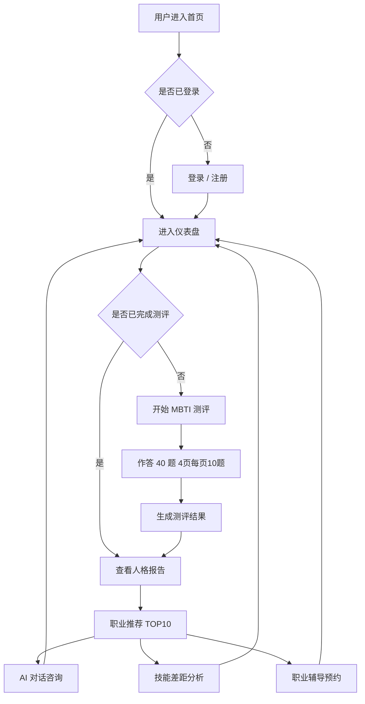
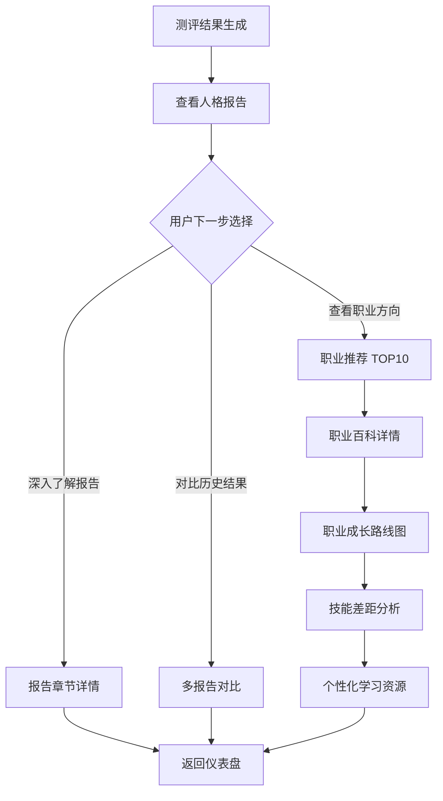
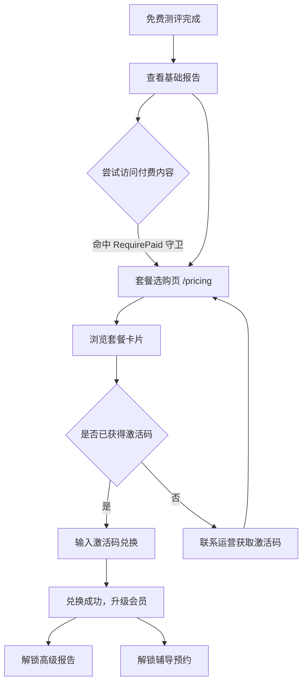
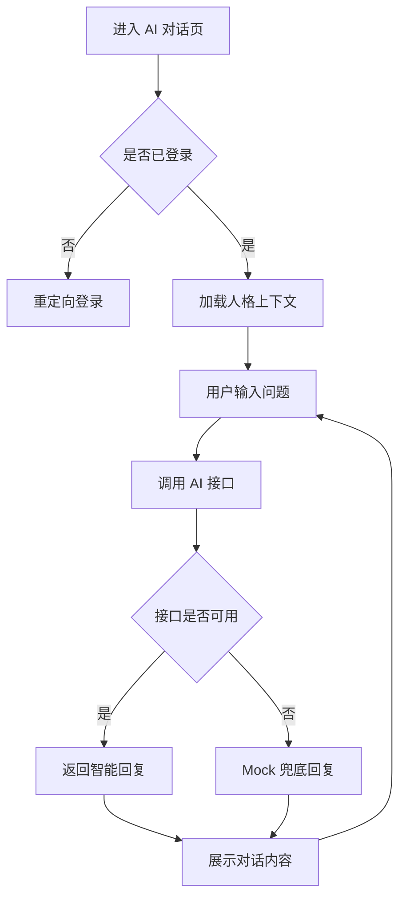
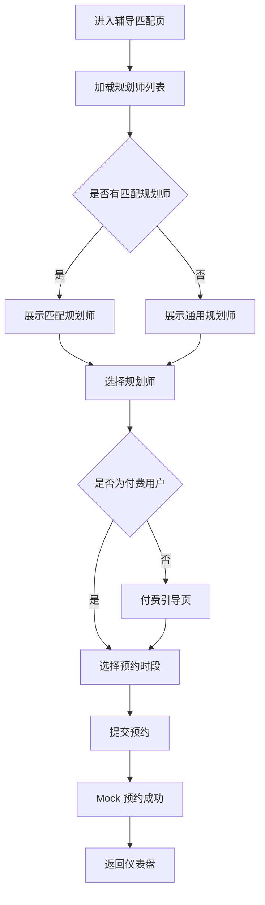

# InnerQuest 向内求索 — 产品分析报告（MBTI 人格探索与职业规划平台）

> **版本**: v1.3
> **日期**: 2026-07-05
> **状态**: 修订版（对齐当前代码实际落地状态：微信登录/支付已移除，新增邮箱登录 + 激活码兑换）

---

## 目录

1. [品牌方案](#0-品牌方案)
2. [竞品功能对比表](#1-竞品功能对比表)
3. [核心差异点分析](#2-核心差异点分析)
4. [PRD 草稿结构](#3-prd-草稿结构)
5. [高保真用户流程图](#4-高保真用户流程图)

---

## 0. 品牌方案

### 0.1 品牌命名

- **英文名**：InnerQuest
- **中文译名**：向内求索
- **品牌释义**：InnerQuest 意为“内心的远征与探寻”，契合 MBTI 向内剖析人格特质、向外规划长期职业生涯的核心内核。

### 0.2 一句话品牌介绍

InnerQuest 意为内心的远征与探寻，契合 MBTI 向内剖析人格特质、向外规划长期职业生涯的核心内核。

### 0.3 多版本 Slogan（按场景选用）

| 使用场景 | 版本 | Slogan |
| --- | --- | --- |
| 专业官网正式版 | 1 | Explore your inner self, find your destined career path.（向内求索｜探寻内在本心，奔赴专属职业前路） |
| 专业官网正式版 | 2 | Unlock your personality blueprint for lifelong career success. |
| 简约短句版（导航栏 / LOGO 下方小字） | 1 | InnerQuest – Seek Within, Choose Career Wisely |
| 简约短句版（导航栏 / LOGO 下方小字） | 2 | Seek Inner Truth, Chart Your Career Quest |
| 年轻化走心版（新媒体 / 测评页） | 1 | 深入内在人格，开启你的职业求索之旅 |
| 年轻化走心版（新媒体 / 测评页） | 2 | Your inner personality holds the key to your ideal career. |
| SEO 商业定位版（MBTI 职业规划专用） | 1 | MBTI Personality Exploration & Career Quest Platform（向内求索｜人格探索与职业规划平台） |

### 0.4 Slogan 使用规范

- **官网首页 Hero 区**：优先使用「专业官网正式版 1」中英对照。
- **导航栏 / LOGO 下方**：使用「简约短句版」，保持简洁。
- **测评页 / 新媒体推广**：使用「年轻化走心版」，增强情感共鸣。
- **SEO / 搜索引擎标题**：使用「SEO 商业定位版」，突出 MBTI + 职业规划关键词。

---

## 1. 竞品功能对比表

### 1.1 竞品概览

| 编号 | 竞品名称 | 定位 | 目标用户 | 商业模式 |
| --- | --- | --- | --- | --- |
| A | 16Personalities | 全球最大免费 MBTI 测试平台 | 泛人群（18-35 岁） | 广告 + 付费报告 |
| B | 奥思 MBTI | 中文 MBTI 测评 + 职业规划 | 职场新人 / 转行者 | 测评付费 + 课程 |
| C | MBTIonline | 官方认证 MBTI 测评 | 企业 HR / 个人发展 | B2B + B2C 订阅 |
| D | 向阳生涯 | 职业规划咨询机构 | 职业困惑人群 | 一对一咨询 |
| E | 简则 MBTI | 轻量级性格测试 | 社交娱乐用户 | 广告 + 会员 |

### 1.2 12 维度功能对比矩阵

> “我们”一列基于当前产品实际落地情况填写（前端已实现，AI/辅导/支付为规划或 Mock 兜底态）。

| 维度 | 16Personalities(A) | 奥思 MBTI(B) | MBTIonline(C) | 向阳生涯(D) | 简则 MBTI(E) | InnerQuest（我们） |
| --- | --- | --- | --- | --- | --- | --- |
| **1. 测评题目数量** | 60 题（标准版） | 93 题（完整版） | 93 题（官方版） | 无在线测评 | 28 题（极简版） | 40 题（4 维度均衡取样） |
| **2. 结果报告深度** | ⭐⭐⭐⭐ 免费基础 + 付费扩展 | ⭐⭐⭐ 付费完整报告 | ⭐⭐⭐⭐⭐ 深度付费报告 | ⭐ 无自动化报告 | ⭐⭐ 免费简要报告 | ⭐⭐⭐⭐ 免费基础报告 + 付费完整报告 + 章节详情 |
| **3. 职业推荐功能** | ⭐⭐ 仅性格-职业映射 | ⭐⭐⭐⭐ 职业匹配 + 发展建议 | ⭐⭐⭐ 职业类型建议 | ⭐⭐⭐⭐⭐ 人工咨询 | ⭐ 无职业模块 | ⭐⭐⭐⭐ 职业匹配 + 职业百科 + 详情 + 路线图 |
| **4. 交互体验** | ⭐⭐⭐⭐⭐ 极佳动画 + 插画 | ⭐⭐⭐ 传统网页风格 | ⭐⭐⭐⭐ 现代简洁 | ⭐⭐ 传统官网 | ⭐⭐⭐⭐ 卡通风格 | ⭐⭐⭐⭐ 现代动效（Spring 动画 / Reveal） |
| **5. 移动端适配** | ✅ 响应式 | ✅ 响应式 | ✅ 响应式 | ❌ PC 为主 | ✅ 响应式 | ✅ 响应式（移动端优先） |
| **6. 社交分享** | ✅ 结果卡片分享 | ✅ 微信分享 | ❌ 无分享 | ❌ 无分享 | ✅ 海报生成 | ✅ 结果分享页 |
| **7. 多语言支持** | ✅ 30+ 语言 | ❌ 仅中文 | ✅ 英语为主 | ❌ 仅中文 | ❌ 仅中文 | ❌ 仅中文（远期规划英文） |
| **8. 数据隐私** | ⭐⭐⭐ 基本隐私政策 | ⭐⭐ 需手机号注册 | ⭐⭐⭐⭐ GDPR 合规 | ⭐⭐⭐⭐ 咨询保密 | ⭐⭐ 社交账号登录 | ⭐⭐⭐⭐ 登录守卫 + 数据最小化 + 邮箱密码登录 |
| **9. 社区/社群** | ❌ 无 | ✅ 微信群 + 课程 | ❌ 无 | ✅ 咨询社群 | ✅ 话题社区 | ❌ 无（远期规划轻量社区） |
| **10. 价格** | 免费 + $29 报告 | ¥39-99/次 | $49-149/次 | ¥500-2000/次 | 免费 + 会员 | 免费基础 + 激活码兑换 Pro / 辅导 |
| **11. 科学性背书** | ⭐⭐⭐ 基于 MBTI 理论 | ⭐⭐⭐ 心理学背景 | ⭐⭐⭐⭐ MBTI 官方认证 | ⭐⭐⭐⭐ 职业规划师认证 | ⭐⭐ 娱乐导向 | ⭐⭐⭐ 基于 MBTI 理论（无官方认证） |
| **12. 个性化程度** | ⭐⭐ 标准化报告 | ⭐⭐⭐ 部分定制 | ⭐⭐⭐ 标准化报告| ⭐⭐⭐⭐⭐ 完全定制 | ⭐ 模板化 | ⭐⭐⭐⭐ AI 解读 + 技能差距 + 个性化路径 |

### 1.3 竞品详细分析

#### A. 16Personalities

- **优势**: 全球知名度最高，交互设计优秀，免费模式获客能力强
- **劣势**: 职业规划深度不足，中文内容翻译质量一般
- **关键指标**: 月活 3000 万+，完成率约 65%

#### B. 奥思 MBTI

- **优势**: 中文市场深耕多年，测评 + 课程闭环
- **劣势**: 产品体验老化，过度商业化感知
- **关键指标**: 国内 MBTI 搜索排名靠前

#### C. MBTIonline

- **优势**: MBTI 官方授权，企业市场强势
- **劣势**: 价格门槛高，C 端触达有限
- **关键指标**: B2B 为主营收模式

#### D. 向阳生涯

- **优势**: 一对一深度咨询，结果最精准
- **劣势**: 无法规模化，价格昂贵
- **关键指标**: 高客单价，低用户量

#### E. 简则 MBTI

- **优势**: 轻量快速，社交传播力强
- **劣势**: 科学性不足，职业规划缺失
- **关键指标**: 微信生态传播为主

---

## 2. 核心差异点分析

### 2.1 我们的核心优势

1. **AI 驱动的个性化职业规划**
   - 不同于竞品的标准化报告，我们通过 AI 深度解读用户测评结果（AI 对话页已落地界面，接口层预留 Mock 兜底）。
   - 结合职业数据提供个性化职业建议与匹配度。
   - 支持多轮对话式探索，帮助用户深入理解自我。
2. **测评 + 规划 + 辅导 三位一体**
   - 竞品多为单一功能，我们打通“认识自己 → 规划职业 → 获得成长”完整链路。
3. **免费 + 激活码兑换的可持续模式**
   - 基础测评和报告免费，Pro 套餐 / 1v1 辅导通过激活码兑换实现（后台批量生成，邮件/SMS 触达用户）。
4. **动效化 + 结构化设计**
   - Spring 动画、Reveal 渐显、雷达图等提升体验与完成率。

### 2.2 比竞品多什么

| 功能/特性 | 说明 | 落地状态 | 竞品覆盖情况 |
| --- | --- | --- | --- |
| 双通道登录 | 手机号验证码 + 邮箱密码注册登录 | 已落地 | 部分覆盖 |
| 激活码兑换系统 | 后台批量生成激活码，邮件/SMS 触达，用户兑换升级会员 | 已落地 | 竞品均无此模式 |
| AI 深度职业解读 | 基于大模型的多维度职业分析 | 界面已落地，接口 Mock 兜底 | 所有竞品均无 |
| 多轮对话探索 | 用户可与 AI 进行职业倾向深度对话 | 界面已落地 | 所有竞品均无 |
| 职业百科 | 全量职业浏览与检索 | 已落地（/app/careers/wiki） | 部分覆盖 |
| 职业发展路线图 | 可视化分阶段职业发展路径 | 已落地（/app/career/:careerId/roadmap） | 仅奥思（课程形式）部分覆盖 |
| 技能差距分析 | 对比目标职业要求与当前能力 | 已落地（/app/skills-gap/:careerId） | 所有竞品均无 |
| 学习资源推荐 | 基于技能差距的个性化学习路径 | 已落地（/app/learning/resources） | 所有竞品均无 |
| 报告章节详情 | 报告分章节深度查看 | 已落地（/app/report/:id/section/:sectionId） | 所有竞品均无 |
| 多报告对比 | 历史多次测评结果对比 | 已落地（/app/report/compare） | 所有竞品均无 |
| 辅导匹配系统 | 匹配适合的职业规划师 | 界面已落地（/app/coaching/coaches） | 仅向阳生涯（人工）部分覆盖 |
| 进度追踪仪表盘 | 可视化职业发展进度 | 已落地（/app/growth） | 所有竞品均无 |

### 2.3 比竞品少什么

| 功能/特性 | 说明 | 应对策略 |
| --- | --- | --- |
| 官方 MBTI 认证 | 目前无 MBTI 官方授权 | 使用 MBTI 理论框架，保留替代框架灵活性 |
| 企业 B2B 服务 | 无企业端批量测评功能 | V2.0 远期规划，先聚焦 C 端 |
| 多语言国际化 | 目前仅支持中文 | 远期加入英文并覆盖多语言 |
| 线下咨询服务 | 纯线上模式 | 远期考虑与线下机构合作 |
| 大规模用户社区 | 无 UGC 社区功能 | 远期加入轻量社区（话题讨论） |
| 付费课程体系 | 无系统化视频课程 | 考虑与教育平台合作而非自建 |
| 第三方登录（微信等） | 已移除微信 OAuth，改用邮箱密码 | 手机号+邮箱双通道已覆盖 C 端需求 |
| 在线支付渠道 | 已移除微信支付适配器 | 采用激活码兑换替代支付，零外部支付依赖 |

---

## 3. PRD 草稿结构

### 3.1 产品定位

- **一句话定位**：一款以 MBTI 人格测评为入口、面向个人成长的职业规划平台，帮助用户「先认识自己，再规划职业」。
- **目标用户**：18-35 岁面临职业选择、转型或成长困惑的年轻人群（在校生、职场新人、转型期从业者）。
- **核心价值**：将「人格测评」与「职业规划」深度打通，输出可执行的职业路线、技能差距分析与个性化学习路径。
- **差异化**：区别于纯测评（16Personalities）与纯咨询（向阳生涯），提供「测评 → 报告 → 职业推荐 → 路线图 → 技能差距 → 学习资源 → 辅导」的完整闭环。

### 3.2 用户故事

> 采用「作为 [角色]，我希望 [目标]，以便 [价值]」的标准格式。

**在校学生 / 应届生**

- 作为一名即将毕业的大学生，我希望通过测评了解自己的人格特质，以便选择更匹配的求职方向。
- 作为一名对专业不满意的在校生，我希望看到与我人格匹配的职业推荐，以便规划考研或转行路径。

**职场新人**

- 作为一名入职一两年的职场新人，我希望明确当前岗位与目标岗位的技能差距，以便有针对性地学习提升。
- 作为一名迷茫的新人，我希望获得个性化学习资源推荐，以便高效补齐能力短板。

**职业转型者**

- 作为一名想转行的从业者，我希望对比多个职业的路线图，以便评估转型成本与可行性。
- 作为一名转型期用户，我希望预约职业规划师进行一对一辅导，以便获得专业建议。

**成长追踪型用户**

- 作为一名长期使用者，我希望多次测评结果能够对比，以便观察自己的成长与变化。
- 作为一名注重进度的用户，我希望在成长仪表盘看到可视化进度，以便保持规划动力。

### 3.3 功能清单

| 优先级 | 功能模块 | 说明 | 落地状态 |
| --- | --- | --- | --- |
| MVP | MBTI 测评 | 40 题（4 页 × 10 题），生成 16 型人格结果 | 已落地 |
| MVP | 人格报告 | 分章节深度解读，支持章节详情查看 | 已落地 |
| MVP | 职业推荐 | 基于人格类型输出 TOP10 匹配职业 | 已落地 |
| MVP | 用户账户 | 手机号验证码 + 邮箱密码 双通道登录 | 已落地 |
| V1.1 | 职业百科 | 职业详情库与检索 | 已落地 |
| V1.1 | 职业路线图 | 单个职业的成长发展路径 | 已落地 |
| V1.1 | 技能差距分析 | 当前技能与目标职业的差距 | 已落地 |
| V1.1 | 学习资源推荐 | 基于技能差距的个性化学习路径 | 已落地 |
| V1.1 | 多报告对比 | 历史测评结果对比 | 已落地 |
| V1.1 | 成长仪表盘 | 可视化职业发展进度 | 已落地 |
| V1.1 | AI 对话咨询 | 基于人格结果的智能问答 | 界面已落地（Mock 兜底） |
| V1.1 | 职业辅导预约 | 匹配并预约职业规划师 | 界面已落地（Mock 兜底） |
| MVP | 会员付费 | 激活码兑换升级 Pro/辅导套餐 | 已落地 |
| MVP | 后台管理 | 运营后台：用户管理、题库、数据分析、内容管理、激活码管理 | 已落地 |
| 远期 | 企业 B2B 测评 | 企业批量测评与团队分析 | 规划中 |
| 远期 | 真实支付链路 | 接入微信 / 支付宝 | 规划中 |
| 远期 | 多语言国际化 | 中英文双语 | 规划中 |
| 远期 | 用户社区 | 轻量话题讨论 | 规划中 |

### 3.4 边界条件与异常处理

**空态处理**

| 场景 | 处理方式 |
| --- | --- |
| 未完成测评即访问报告 | 引导用户先完成测评，展示空态引导页 |
| 无历史测评记录 | 报告对比页展示「暂无可对比记录」空态 |
| 无匹配辅导师 | 辅导匹配页展示空态并推荐通用规划师 |

**异常处理**

| 场景 | 处理方式 |
| --- | --- |
| 接口请求失败 | 展示友好错误提示 + 重试按钮，Mock 兜底数据保证流程连贯 |
| 未登录访问受保护页 | 重定向至登录页（RequireAuth 守卫） |
| 未付费访问付费内容 | 重定向至套餐选购页 /pricing（RequirePaid 守卫） |
| 激活码无效/已用/过期 | 展示具体错误原因，引导联系客服 |
| AI 对话超时 | 展示「稍后重试」提示，保留已输入内容 |

**极限边界**

| 场景 | 处理方式 |
| --- | --- |
| 测评中途退出 | 保存作答进度，下次进入可续答 |
| 重复提交测评 | 生成新记录，保留历史记录用于对比 |
| 超长文本输入 | 前端限制输入长度并给出字数提示 |

---

## 4. 高保真用户流程图

> 以下流程图基于实际落地的页面与路由绘制，路由带 `/app` 前缀为应用区受保护页面。

### 4.1 核心用户旅程

### 4.2 测评后分支流程

### 4.3 付费转化漏斗（激活码兑换模式）

### 4.4 AI 对话咨询流程

### 4.5 职业辅导预约流程

---

## 附录

### 附录 A：术语表

| 术语 | 说明 |
| --- | --- |
| MBTI | Myers-Briggs Type Indicator，一种基于心理偏好的人格分类框架，共 16 型 |
| 人格类型 | 由 E/I、S/N、T/F、J/P 四个维度组合而成的人格分类结果 |
| 技能差距 | 用户当前技能与目标职业所需技能之间的差异 |
| 职业路线图 | 单个职业从入门到进阶的成长发展路径 |
| RequireAuth | 前端路由守卫，拦截未登录用户访问受保护页面 |
| RequirePaid | 前端路由守卫，拦截未付费用户访问付费内容 |
| Mock 兜底 | 接口不可用时使用本地模拟数据保证流程连贯的降级策略 |

### 附录 B：参考资源

- MBTI 人格理论框架（Myers & Briggs）
- 竞品调研：16Personalities、奥思、MBTIonline、向阳生涯、简则
- 技术栈参考：React 18 + React Router v6 + TypeScript + Vite + Tailwind + Zustand + TanStack Query

### 附录 C：修订记录

| 版本 | 日期 | 修订内容 |
| --- | --- | --- |
| v1.0 | 2026-06 | 初版：品牌方案、竞品对比、核心差异点、PRD 草稿、用户流程图 |
| v1.1 | 2026-06 | 补充功能清单与边界条件 |
| v1.3 | 2026-07-05 | 对齐代码实际落地：移除微信登录/支付；新增邮箱密码双通道登录、激活码兑换系统、Topic 话题模型、admin_role RBAC 字段、运营后台激活码管理页 |