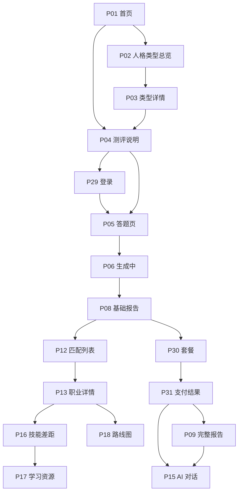
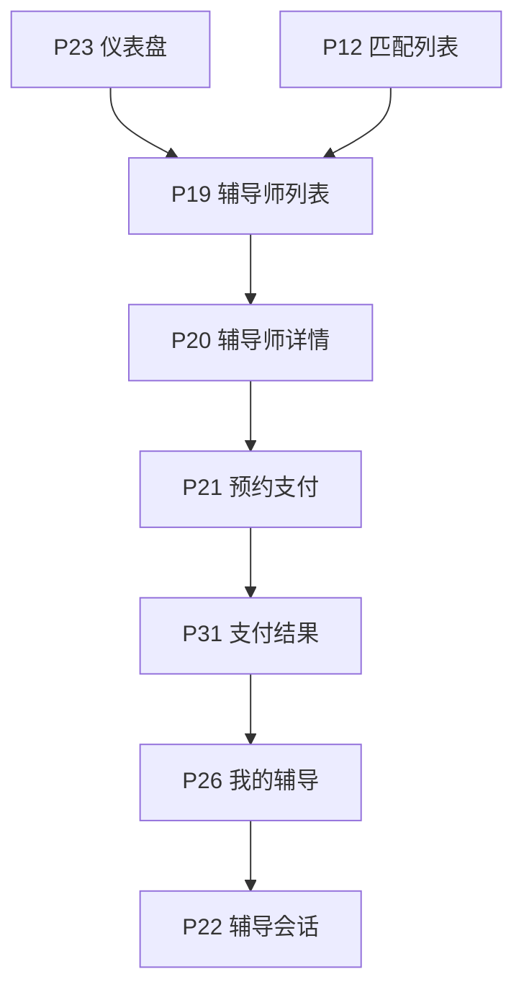
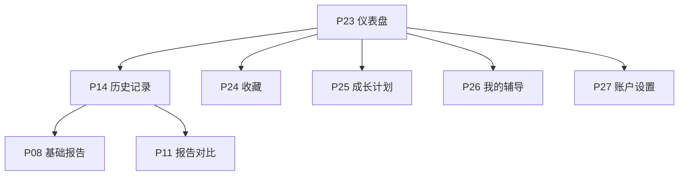
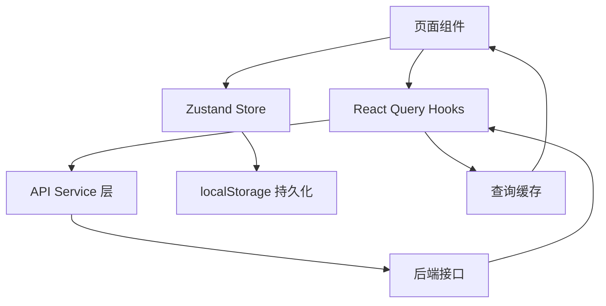

# InnerQuest 向内求索 — 前端页面清单与路由文档

> **产品**: InnerQuest 向内求索（基于 AI 的 MBTI 职业规划与辅导平台）
> **定位**: 测评 + 规划 + 辅导 三位一体
> **技术栈**: React 18 + React Router v6 + TypeScript + Vite + Tailwind CSS
> **版本**: v1.0  ·  **日期**: 2026-07-04  ·  **状态**: 设计稿
> **配套文件**: `产品分析报告-MBTI职业规划网页产品.md`、`index.html`（单页原型）、`design-tokens.css`

---

## 目录

1. [页面清单总览表](#1-页面清单总览表)
2. [页面清单（按功能模块分组）](#2-页面清单按功能模块分组)
3. [完整前端路由表设计](#3-完整前端路由表设计)
4. [页面状态设计矩阵](#4-页面状态设计矩阵)
5. [页面间导航关系图](#5-页面间导航关系图)
6. [现有 index.html 拆分映射](#6-现有-indexhtml-拆分映射)
7. [响应式 / 移动端适配策略](#7-应式--移动端适配策略)
8. [数据流设计](#8-数据流设计)

---

## 1. 页面清单总览表

### 1.1 分期统计

| 版本 | 页面数量 | 核心目标 | 页面编号范围 |
|------|:--------:|----------|--------------|
| **MVP (P0)** | 16 | 测评闭环 + 基础职业推荐 + 登录 + 支付最小闭环 | P01 ~ P14、P29 ~ P31 |
| **V1.1 (P1)** | 11 | AI 深度规划 + 辅导 + 个人中心 | P15 ~ P27 |
| **V2.0 (P2/P3)** | 8| 企业版 + 社区 + 国际化 | P28、P32 ~ P35 |
| **系统/公共页** | 5 | 错误页/协议页等 | S01 ~ S05 |
| **合计** | **40** | — | — |

> **MVP 支付最小闭环**：P08 基础报告 →（引导）P30 套餐选购 → 支付 → P31 支付结果 → P09 完整报告解锁。因此 P30、P31 提前至 MVP 落地；P09 完整报告本身分期不变，但其解锁依赖上述闭环，需在 MVP 完成付费链路。

### 1.2 按功能模块统计

| 功能模块 | 页面数 | 说明 |
|----------|:------:|------|
| 首页 / 营销 | 4 | Landing、人格类型总览、类型详情、职业百科 |
| 测评 | 4 | 测评说明、答题、生成中、断点续答 |
| 结果 / 报告 | 4 |础报告、完整报告、报告对比、报告详情章节 |
| 职业规划 | 6 | 职业匹配、职业详情、AI 对话、技能差距、学习资源、发展路线图 |
| 辅导 | 4 | 辅导师列表、辅导师详情、预约支付、辅导会话 |
| 用户中心 | 6 | 仪表盘、历史记录、收藏、成长计划、账户设置、我的辅导 |
| 认证 / 支付 | 3 | 登录、套餐选购、支付结果 |
| 运营后台 | 4 | 后台首页、题库管理、职业库管理、数据看板 |
| 系统 / 公共 | 5 | 404、错误页、隐私政策、用户协议、关于我们 |

---

## 2. 页面清单（按功能模块分组）

> 字段说明：**编号 · 页面名称 · 路由路径 · 版本 · 优先级 · 页面描述  核心功能 · 所属用户角色**
> 角色缩写：**测**=测评用户，**规**=规划用户，**辅**=辅导用户，**运**=运营/管理用户，**游**=游客/未登录

### 2.1 首页 / 营销模块

| 编号 | 页面名称 | 路由 | 版本 | 优先级 | 描述 | 核心功能 | 角色 |
|------|----------|------|:----:|:------:|------|----------|------|
| P01 | 首页 Landing | `/` | MVP | P0 | 产品价值主张 + 测评入口 | Hero、社交证明、CTA、免费测评引导 | 游/测 |
| P02 | 人格类型总览 | `/personality-types` | MVP | P0 | 16 型 4 大类展示 | 分类卡片、类型网格、筛选 | 游/测 |
| P03 | 人格类型详情 | `/personality-types/:typeCode` | MVP | P1 | 单一类型深度介绍（如 ENFJ） | 特质/优劣势/职业倾向/名人案例 | 游/测/规 |
| P28 | 职业百科 | `/app/careers/wiki` | V1.1 | P1 | 200+ 职业检索库 | 搜索、分类筛选、职业卡片 | 规/游 |

### 2.2 测评模块

| 编号 | 页面名称 | 路由 | 版本 | 优先级 | 描述 | 核心功能 | 角色 |
|------|----------|------|:----:|:------:|------|----------|------|
| P04 | 测评说明页 | `/assessment/intro` | MVP | P0 | 测评前引导与说明 | 题量/耗时说明、注意事项、开始按钮 | 测 |
| P05 | 测评答题页 | `/assessment/quiz` | MVP | P0 | 60 题逐题作答 | 分页 10 题/页、进度条、断点自动保存 | 测 |
| P06 | 结果生成中 | `/assessment/generating` | MVP | P0 | AI 计算过渡页 | 加载动画、进度反馈、超时重试 | 测 |
| P07 | 断点续答页 | `/assessment/resume` | MVP | P1 | 恢复未完成测评 | 读取本地/云端进度、续答或重测 | 测 |

### 2.3 结果 / 报告模块

| 编号 | 页面名称 | 路由 | 版本 | 优先级 | 描述 | 核心功能 | 角色 |
|------|----------|------|:----:|:------:|------|----------|------|
| P08 | 基础报告页 | `/report/:reportId` | MVP | P0 | 免费基础性格报告 | 类型徽章、雷达图、维度条、性格解读、海报入口 | 测/规 |
| P09 | 完整报告页 | `/report/:reportId/full` | V1.1 | P0 | 付费 16 页深度报告 | 完整解读、TOP20 职业、路线图（付费守卫） | 规 |
| P10 | 报告章节详情 | `/app/report/:reportId/section/:sectionId` | V1.1 | P1 | 报告单章节深读 | 章节内容、图表、跳转导航 | 规 |
| P11 | 报告对比页 | `/app/report/compare` | V1.1 | P1 | 多次测评结果对比 | 多报告选择、维度变化趋势图 | 测/规 |

### 2.4 职业规划模块

| 编号 | 页面名称 | 路由 | 版本 | 优先级 | 描述 | 核心功能 | 角色 |
|------|----------|------|:----:|:------:|------|----------|------|
| P12 | 职业匹配列表 | `/career-match` | MVP | P0 | AI 推荐 TOP10 职业 | 匹配度排序、卡片、收藏、手动搜索 | 规 |
| P13 | 职业详情页 | `/career/:careerId` | MVP | P0 | 单一职业详情 | 职责/要求/薪资/前景、匹配度分析 | 规 |
| P15 | AI 深度对话 | `/ai-chat` | V1.1 | P0 | 多轮职业探索对话 | 对话流、上下文加载、50 轮上限、小结生成 | 规/辅 |
| P16 | 技能差距分析 | `/app/skills-gap/:careerId` | V1.1 | P0 | 目标职业能力对比 | 雷达图、差距列表、提升建议 | 规 |
| P17 | 学习资源推荐 | `/learning/resources` | V1.1 | P0 | 个性化学习路径 | 资源卡片、加入计划、进度 | 规 |
| P18 | 职业发展路线图 | `/app/career/:careerId/roadmap` | V1.1 | P1 | 分阶段发展路径 | 阶段时间轴、里程碑、行动项 | 规 |

### 2.5 辅导模块

| 编号 | 页面名称 | 路由 | 版本 | 优先级 | 描述 | 核心功能 | 角色 |
|------|----------|------|:----:|:------:|------|----------|------|
| P19 | 辅导师列表 | `/coaching/coaches` | V1.1 | P1 | 浏览与筛选辅导师 | 领域/价格/评分/时间筛选、卡片列表 | 辅 |
| P20 | 辅导师详情 | `/coaching/coaches/:coachId` | V1.1 | P1 | 辅导师资料与评价 | 简介、擅长领域、评价、可约时间 | 辅 |
| P21 | 预约与支付 | `/coaching/booking/:coachId` | V1.1 | P1 | 选时段并支付 | 时段选择、诉求填写、支付确认 | 辅 |
| P22 | 辅导会话 | `/coaching/session/:sessionId` | V1.1 | P1 | 1v1 在线咨询 | 文字/语音、要点记录、小结报告 | 辅 |

### 2.6 用户中心模块

| 编号 | 页面名称 | 路由 | 版本 | 优先级 | 描述 | 核心功能 | 角色 |
|------|----------|------|:----:|:------:|------|----------|------|
| P14 | 历史测评记录 | `/me/records` | MVP | P0 | 查看历史测评 | 记录列表、重测、查看、对比入口 | 测/规 |
| P23 | 个人成长仪表盘 | `/me/dashboard` | V1.1 | P1 | 职业发展进度总览 | 进度卡、图表、待办、快捷入口 | 规/辅 |
| P24 | 我的收藏 | `/me/favorites` | V1.1 | P1 | 收藏的职业/资源 | 收藏列表、分类、取消收藏 | 规 |
| P25 | 我的成长计划 | `/me/plan` | V1.1 | P1 | 学习/行动计划管理 | 计划任务、完成打卡、进度 | 规 |
| P26 | 我的辅导 | `/me/coaching` | V1.1 | P1 | 辅导订单与记录 | 预约订单、会话回溯、评价 | 辅 |
| P27 | 账户设置 | `/me/settings` | V1.1 | P1 | 个人信息与隐私 | 资料编辑、隐私、注销（30 天删除） | 全部登录用户 |

### 2.7 认证 / 支付模块

| 编号 | 页面名称 | 路由 | 版本 | 优先级 | 描述 | 核心功能 | 角色 |
|------|----------|------|:----:|:------:|------|----------|------|
| P29 | 登录页 | `/login` | MVP | P0 | 微信授权登录 | 微信扫码、手机号降级登录 | 游 |
| P30 | 套餐选购页 | `/pricing` | MVP | P0 | 付费套餐展示与选购 | 套餐对比、限时优惠、试用引导 | 规/辅 |
| P31 | 支付结果页 | `/payment/result` | MVP | P0 | 支付成功/失败反馈 | 结果状态、重试、订单保留 15 分钟 | 规/辅 |

### 2.8 运营后台模块

| 编号 | 页面名称 | 路由 | 版本 | 优先级 | 描述 | 核心功能 | 角色 |
|------|----------|------|:----:|:------:|------|----------|------|
| P32 | 后台首页 | `/admin` | V1.1 | P1 | 管理端总览 | 关键指标、快捷入口 | 运 |
| P33 | 题库管理 | `/admin/questions` | V1.1 | P1 | 测评题库维护 | 增删改查、题目上下架 | 运 |
| P34 | 职业库管理 | `/admin/careers` | V1.1 | P1 | 职业数据库维护 | 职业增删改、数据导入 | 运 |
| P35 | 数据看板 | `/admin/analytics` | V1.1 | P2 | 运营数据分析 | 转化漏斗、留存、辅导师审核 | 运 |

### 2.9 系统 / 公共页

| 编号 | 页面名称 | 路由 | 版本 | 优先级 | 描述 | 角色 |
|------|----------|------|:----:|:------:|------|------|
| S01 | 404 未找到 | `*` | MVP | P0 | 路由兜底页 | 全部 |
| S02 | 通用错误页 | `/error` | MVP | P0 | 500/网络异常兜底 | 全部 |
| S03 | 隐私政策 | `/legal/privacy` | MVP | P0 | 隐私条款 | 全部 |
| S04 | 用户协议 | `/legal/terms` | MVP | P0 | 服务条款 | 全部 |
| S05 | 关于我们 | `/about` | MVP | P1 | 品牌介绍 | 全部 |

> 角色缩写：**测**=测评用户 / **规**=规划用户 / **辅**=辅导用户 / **运**=运营管理员 / **游**=游客（未登录）

---

## 3. 完整前端路由表设计

### 3.1 路由分层结构

采用 **三层布局 + 嵌套路由** 架构：

```
RootLayout（全局 Provider / 主题 / Toast 容器）
├── PublicLayout（含营销顶栏 + 页脚）       → 游客可访问
│   ├── /                    P01 首页
│   ├── /personality-types   P02 人格类型总览
│   ├── /personality-types/:typeCode  P03 类型详情
│   ├── /pricing             P30 套餐
│   ├── /about               S05 关于我们
│   └── /legal/*             S03/S04 法务页
├── AuthLayout（居中卡片、无导航栏）
│   └── /login               P29 登录
├── AssessmentLayout（沉浸式、隐藏干扰元素）
│   ├── /assessment/intro    P04 说明页
│   ├── /assessment/quiz     P05 答题页        [需登录]
│   ├── /assessment/generating P06 生成中      [需登录]
│   └── /assessment/resume   P07 断点续答      [需登录]
├── AppLayout（含侧边栏 + 顶栏，登录后主框架）  [需登录]
│   ├── /app/report/:reportId          P08 基础报告  [需测评结果]
│   ├── /app/report/:reportId/full         P09 完整报告  [需测评结果 + 付费]
│   ├── /app/report/:reportId/section/:sectionId  P10 章节详情  [需测评结果]
│   ├── /app/report/compare                P11 报告对比
│   ├── /app/report/history                P14 我的报告
│   ├── /app/career                        P12 匹配列表
│   ├── /app/careers/wiki                  P28 职业百科
│   ├── /app/career/:careerId              P13 职业详情
│   ├── /app/career/:careerId/roadmap      P18 路线图
│   ├── /app/coaching                      P15 AI 对话
│   ├── /app/skills-gap/:careerId          P16 技能差�
│   ├── /app/learning/resources            P17 学习资源
│   ├── /app/coaching/coaches              P19 辅导师列表
│   ├── /app/coaching/coaches/:coachId     P20 辅导师详情
│   ├── /app/coaching/booking/:coachId     P21 预约支付
│   ├── /app/coaching/session/:sessionId   P22 辅导会话
│   └── /app/me/*                          P23-P27 用户中心
└── AdminLayout（后台专用框架）              [需管理��]
    ├── /admin              P32 后台首页
    ├── /admin/questions    P33 题库管理
    ├── /admin/careers      P34 职业库管理
    └── /admin/analytics    P35 数据看板
* 通配 → S01 404
```

### 3.2 路由配置代码（React Router v6 + 懒加载）

```tsx
// src/router/index.tsx
import { createBrowserRouter, Navigate } from 'react-router-dom';
import { lazy, Suspense } from 'react';
import RootLayout from '@/layouts/RootLayout';
import PublicLayout from '@/layouts/PublicLayout';
import AuthLayout from '@/layouts/AuthLayout';
import AssessmentLayout from '@/layouts/AssessmentLayout';
import AppLayout from '@/layouts/AppLayout';
import AdminLayout from '@/layouts/AdminLayout';
import PageLoader from '@/components/PageLoader';
import { RequireAuth, RequireResult, RequirePaid, RequireAdmin } from '@/router/guards';

// 懒加载页面（按模块分 chunk）
const Home = lazy(() => import('@/pages/marketing/Home'));
const PersonalityTypes = lazy(() => import('@/pages/marketing/PersonalityTypes'));
const TypeDetail = lazy(() => import('@/pages/marketing/TypeDetail'));
const CareerWiki = lazy(() => import('@/pages/marketing/CareerWiki'));
const Pricing = lazy(() => import('@/pages/payment/Pricing'));
const About = lazy(() => import('@/pages/system/About'));
const Privacy = lazy(() => import('@/pages/system/Privacy'));
const Terms = lazy(() => import('@/pages/system/Terms'));
const Login = lazy(() => import('@/pages/auth/Login'));
const AssessmentIntro = lazy(() => import('@/pages/assessment/Intro'));
const AssessmentQuiz = lazy(() => import('@/pages/assessment/Quiz'));
const Generating = lazy(() => import('@/pages/assessment/Generating'));
const Resume = lazy(() => import('@/pages/assessment/Resume'));
const ReportBasic = lazy(() => import('@/pages/report/ReportBasic'));
const ReportFull = lazy(() => import('@/pages/report/ReportFull'));
const ReportSection = lazy(() => import('@/pages/report/ReportSection'));
const ReportCompare = lazy(() => import('@/pages/report/ReportCompare'));
const CareerMatch = lazy(() => import('@/pages/career/CareerMatch'));
const CareerDetail = lazy(() => import('@/pages/career/CareerDetail'));
const Roadmap = lazy(() => import('@/pages/career/Roadmap'));
const AiChat = lazy(() => import('@/pages/career/AiChat'));
const SkillsGap = lazy(() => import('@/pages/career/SkillsGap'));
const LearningResources = lazy(() => import('@/pages/career/LearningResources'));
const CoachList = lazy(() => import('@/pages/coaching/CoachList'));
const CoachDetail = lazy(() => import('@/pages/coaching/CoachDetail'));
const Booking = lazy(() => import('@/pages/coaching/Booking'));
const Session = lazy(() => import('@/pages/coaching/Session'));
const PaymentResult = lazy(() => import('@/pages/payment/PaymentResult'));
const Records = lazy(() => import('@/pages/me/Records'));
const Dashboard = lazy(() => import('@/pages/me/Dashboard'));
const Favorites = lazy(() => import('@/pages/me/Favorites'));
const GrowthPlan = lazy(() => import('@/pages/me/GrowthPlan'));
const MyCoaching = lazy(() => import('@/pages/me/MyCoaching'));
const Settings = lazy(() => import('@/pages/me/Settings'));
const AdminHome = lazy(() => import('@/pages/admin/AdminHome'));
const AdminQuestions = lazy(() => import('@/pages/admin/Questions'));
const AdminCareers = lazy(() => import('@/pages/admin/Careers'));
const AdminAnalytics = lazy(() => import('@/pages/admin/Analytics'));
const NotFound = lazy(() => import('@/pages/system/NotFound'));
const ErrorPage = lazy(() => import('@/pages/system/ErrorPage'));

const wrap = (el: React.ReactNode) => <Suspense fallback={<PageLoader />}>{el}</Suspense>;

export const router = createBrowserRouter([
  {
    element: <RootLayout />,
    errorElement: wrap(<ErrorPage />),
    children: [
      // ---------- 公共层（游客可访问）----------
      {
        element: <PublicLayout />,
        children: [
          { index: true, element: wrap(<Home />) },
          { path: 'personality-types', element: wrap(<PersonalityTypes />) },
          { path: 'personality-types/:typeCode', element: wrap(<TypeDetail />) },
          { path: 'careers/wiki', element: wrap(<CareerWiki />) },
          { path: 'pricing', element: wrap(<Pricing />) },
          { path: 'about', element: wrap(<About />) },
          { path: 'legal/privacy', element: wrap(<Privacy />) },
          { path: 'legal/terms', element: wrap(<Terms />) },
          { path: 'error', element: wrap(<ErrorPage />) },
        ],
      },
      // ---------- 认证层 ----------
      {
        element: <AuthLayout />,
        children: [{ path: 'login', element: wrap(<Login />) }],
      },
      // ---------- 测评层（沉浸式，需登录）----------
      {
        element: <AssessmentLayout />,
        children: [
          { path: 'assessment/intro', element: wrap(<AssessmentIntro />) },
          {
            element: <RequireAuth />,
            children: [
              { path: 'assessment/quiz', element: wrap(<AssessmentQuiz />) },
              { path: 'assessment/generating', element: wrap(<Generating />) },
              { path: 'assessment/resume', element: wrap(<Resume />) },
            ],
          },
        ],
      },
      // ---------- 主应用层（需登录）----------
      {
        element: <RequireAuth />,
        children: [
          {
            element: <AppLayout />,
            children: [
              // 报告（需测评结果）
              {
                element: <RequireResult />,
                children: [
                  { path: 'report/:reportId', element: wrap(<ReportBasic />) },
                  { path: 'report/:reportId/section/:sectionId', element: wrap(<ReportSection />) },
                  { path: 'report/compare', element: wrap(<ReportCompare />) },
                  { path: 'career-match', element: wrap(<CareerMatch />) },
                ],
              },
              // 完整报告 + AI 对话（需付费）
              {
                element: <RequirePaid />,
                children: [
                  { path: 'report/:reportId/full', element: wrap(<ReportFull />) },
                  { path: 'ai-chat', element: wrap(<AiChat />) },
                ],
              },
              // 职业规划（登录即可）
              { path: 'career/:careerId', element: wrap(<CareerDetail />) },
              { path: 'career/:careerId/roadmap', element: wrap(<Roadmap />) },
              { path: 'skills-gap/:careerId', element: wrap(<SkillsGap />) },
              { path: 'learning/resources', element: wrap(<LearningResources />) },
              // 辅导
              { path: 'coaching/coaches', element: wrap(<CoachList />) },
              { path: 'coaching/coaches/:coachId', element: wrap(<CoachDetail />) },
              { path: 'coaching/booking/:coachId', element: wrap(<Booking />) },
              { path: 'coaching/session/:sessionId', element: wrap(<Session />) },
              // 支付
              { path: 'payment/result', element: wrap(<PaymentResult />) },
              // 用户中心
              { path: 'me', element: <Navigate to="/me/dashboard" replace /> },
              { path: 'me/dashboard', element: wrap(<Dashboard />) },
              { path: 'me/records', element: wrap(<Records />) },
              { path: 'me/favorites', element: wrap(<Favorites />) },
              { path: 'me/plan', element: wrap(<GrowthPlan />) },
              { path: 'me/coaching', element: wrap(<MyCoaching />) },
              { path: 'me/settings', element: wrap(<Settings />) },
            ],
          },
        ],
      },
      // ---------- 后台层（需管理员）----------
      {
        element: <RequireAdmin />,
        children: [
          {
            element: <AdminLayout />,
            children: [
              { path: 'admin', element: wrap(<AdminHome />) },
              { path: 'admin/questions', element: wrap(<AdminQuestions />) },
              { path: 'admin/careers', element: wrap(<AdminCareers />) },
              { path: 'admin/analytics', element: wrap(<AdminAnalytics />) },
            ],
          },
        ],
      },
      // ---------- 兜底 ----------
      { path: '*', element: wrap(<NotFound />) },
    ],
  },
]);
```

### 3.3 路由守卫实现（4 类）

```tsx
// src/router/guards.tsx
import { Navigate, Outlet, useLocation } from 'react-router-dom';
import { useAuth } from '@/hooks/useAuth';
import { useAssessment } from '@/hooks/useAssessment';

// 1) 登录守卫：未登录跳登录页并回填 redirect
export function RequireAuth() {
  const { isLoggedIn, loading } = useAuth();
  const location = useLocation();
  if (loading) return null; // 由外层 Suspense/PageLoader 兜底
  if (!isLoggedIn) {
    return <Navigate to="/login" state={{ from: location }} replace />;
  }
  return <Outlet />;
}

// 2) 测评结果守卫：无有效报告引导去做测评
export function RequireResult() {
  const { hasResult, loading } = useAssessment();
  if (loading) return null;
  if (!hasResult) return <Navigate to="/assessment/intro" replace />;
  return <Outlet />;
}

// 3) 付费守卫：未付费引导至套餐页
export function RequirePaid() {
  const { isPaid } = useAuth();
  const location = useLocation();
  if (!isPaid) {
    return <Navigate to="/pricing" state={{ from: location, reason: 'paid_feature' }} replace />;
  }
  return <Outlet />;
}

// 4) 管理员守卫：非管理员一律 404（不暴露后台存在）
export function RequireAdmin() {
  const { role } = useAuth();
  if (role !== 'admin') return <Navigate to="/404" replace />;
  return <Outlet />;
}
```

### 3.4 守卫规则速查表

| 路由前缀 | 登录守卫 | 结果守卫 | 付费守卫 | 管理员守卫 | 说明 |
|----------|:--------:|:--------:|:--------:|:----------:|------|
| `/`、`/personality-types`、`/about`、`/legal/*`、`/pricing` | — | — | — | — | 游客可访问，利于 SEO 与拉新 |
| `/login` | 反向（已登录跳 /me） | — | — | — | 已登录用户重定向 |
| `/assessment/quiz`、`/generating`、`/resume` | ✅ | — | — | — | 需登录才能作答与存档 |
| `/report/:id`、`/career-match` | ✅ | ✅ | — | — | 需已有测评结果 |
| `/report/:id/full`、`/ai-chat` | ✅ | ✅ | ✅ | — | 完整报告与 AI 对话为付费功能 |
| `/coaching/*`、`/career/*`、`/careers/wiki`、`/me/*` | ✅ | — | — | — | 登录后可访问 |
| `/admin/*` | ✅ | — | — | ✅ | 仅管理员，非法访问返回 404 |

---

## 4. 页面状态设计矩阵

每个页面需覆盖 **加载态 / 空态 / 错误态 / 边界情况** 四种状态，确保用户体验完整。

### 4.1 核心页面状态矩阵

| 页面 | 加载态 | 空态 | 错误态 | 边界情况 |
|------|--------|------|--------|----------|
| P01 首页 | 骨架屏（Hero + 卡片区） | — | 静态兜底文案 | 已登录用户显示"进入我的空间"CTA |
| P05 答题页 | 首题加载 Spinner | — | 保存失败 Toast + 重试 | 题量上限 150 题；每页 10 题分页；断网自动本地缓存 |
| P06 生成中 | 进度动画 + 阶段文案 | — | 生成超时（>30s）转错误页 | 轮询失败重试 3 次后降级为手动刷新 |
| P08 基础报告 | 报告骨架屏 | 无报告 → 引导测评 | 报告 ID 不存在 → 404 | 报告生成中 → 跳 P06；已过期报告提示重测 |
| P09 完整报告 | 分段渐进加载 | — | 付费校验失败 → 跳套餐 | 未付费 → RequirePaid 拦截 |
| P12 匹配列表 | 卡片骨架屏 ×10 | 无匹配结果引导页 | AI 匹配失败 + 重试 | TOP10 固定；结果可筛选/排序 |
| P15 AI 对话 | 消息气泡 typing 动画 | 首次进入显示引导语 | 消息发送失败可重发 | 对话上限 50 轮，达上限提示升级/开新会话 |
| P14 历史记录 | 列表骨架屏 | 空记录引导测评 | 加载失败重试 | 每日完整报告上限 3 份，超限提示 |
| P19 辅导师列表 | 卡片骨架屏 | 无可约辅导师 | 加载失败 | 分页/筛选（领域、价格、评分） |
| P21 预约支付 | 时段加载 | 无可约时段 | 支付发起失败 | 时段冲突校验；支付超时（15min）释放 |
| P22 辅导会话 | 连接中 | — | 连接断开重连 | 会话到期提醒；网络抖动降级 |
| P29 登录 | 二维码加载 | — | 二维码过期刷新 | 微信授权失败提示；已登录直接跳转 |
| P31 支付结果 | 结果轮询中 | — | 支付失败引导重试 | 支付成功/失败/处理中三态；对账延迟提示 |
| P33 题库管理 | 表格骨架屏 | 无题目引导新增 | 保存冲突提示 | 批量操作确认；上/下线校验 |
| P35 数据看板 | 图表骨架屏 | 无数据区间提示 | 数据接口失败 | 时间范围选择；大数据量分页/聚合 |

### 4.2 全局状态处理规范

- **加载态**：列表/卡片用骨架屏（Skeleton），操作类用按钮内联 Spinner，页面级用 `PageLoader`
- **空态**：统一 `EmptyState` 组件（插画 + 文案 + 引导 CTA）
- **错误态**：`ErrorBoundary` 捕获渲染错误 → S02 错误页；接口错误用 Toast + 局部重试
- **边界情况**：题量/对话轮次/每日报告等上限，统一在业务 Hook 中拦截并给出升级引导

---

## 5. 页面间导航关系图（核心用户旅程）

### 5.1 主转化旅程：游客 → 测评 → 报告 → 职业规划 → 付费



### 5.2 辅导服务旅程



### 5.3 用户中心导航



---

## 6. index.html 原型拆分映射

现有单页原型 `index.html` 的各 section 与目标多页应用的映射关系：

| index.html section | 目标页面 | 拆分说明 |
|--------------------|----------|----------|
| `#hero` Hero 区 | P01 首页 | 保留主视觉 + 主 CTA「开始测评」 |
| `#personality-types` 人格类型 | P02 总览 / P03 详情 | 卡片列表 → P02；单卡点击 → P03 详情页 |
| `#assessment` 测评区 | P04 说明 + P05 答题 | 说明拆为 P04；题目交互迁移至 P05 独立沉浸式布局 |
| `#results` 结果区 | P08 基础报告 | 维度雷达图 / 型格解读迁至报告页 |
| `#career-match` 职业匹配 | P12 匹配列表 + P13 详情 | 匹配卡片 → P12；点击进入 P13 |
| `#share` 分享区 | 组件化 `ShareCard` | 作为报告页/结果页的可复用分享组件 |
| 全局 `appState` 对象 | Zustand Store + React Query | 客户端状态迁 Zustand；服务端数据迁 React Query |
| `questions` 题库数组 | 后端 API `/api/questions` | 由 P33 题库管理维护，前端按需拉取 |
| MBTI 维度配色 config | `tailwind.config` + `design-tokens.css` | 沿用现有维度专用色（NT/NF/SJ/SP） |
| Chart.js 雷达图 | `RadarChart` 组件 | 封装为报告页可复用图表组件 |

**拆分原则**：静态展示区（Hero / 类型 / 分享）优先做 SEO 友好的公共页；交互密集区（答题 / AI 对话）独立沉浸式布局；数据可视化统一组件化复用。

---

## 7. 响应式适配策略

### 7.1 断点定义（沿用 Tailwind 默认）

| 断点 | 宽度 | 目标设备 | 布局策略 |
|------|------|----------|----------|
| 默认 | < 640px | 手机竖屏 | 单列、底部 Tab 导航、全屏答题 |
| `sm` | ≥ 640px | 大屏手机 / 竖平板 | 单列 + 更宽留白 |
| `md` | ≥ 768px | 平板 | 双列卡片、侧边抽屉导航 |
| `lg` | ≥ 1024px | 笔记本 | 固定侧边栏 + 主内容区 |
| `xl` | ≥ 1280px | 桌面 | 三栏（侧栏 + 内容 + 辅助面板） |

### 7.2 关键页面适配要点

- **P01 首页**：Hero 移动端垂直堆叠、桌面左右分栏；类型卡片 `grid-cols-1 md:grid-cols-2 lg:grid-cols-4`
- **P05 答题页**：移动端全屏单题聚焦、大按钮触控；桌面居中卡片 + 侧边进度条
- **P08/P09 报告**：移动端章节手风琴折叠；桌面左侧目录锚点 + 右侧内容
- **AppLayout**：移动端侧边栏转底部 Tab（首页/记录/匹配/我的）；桌面固定侧栏
- **P15 AI 对话**：移动端全屏聊天；桌面右侧固定输入区 + 历史滚动
- **P35 数据看板**：移动端图表纵向堆叠 + 横向滚动表格；桌面网格布局

### 7.3 移动端专项优化

- 触控目标 ≥ 44×44px；表单元素避免 iOS 缩放（`font-size: 16px`）
- 长列表虚拟滚动（历史记录 / 职业库）
- 图片响应式 `srcset` + 懒加载；首屏关键资源预加载
- 底部安全区适配（`env(safe-area-inset-bottom)`）

---

## 8. 数据流设计

### 8.1 状态分层

| 层级 | 方案 | 存储内容 | 生命周期 |
|------|------|----------|----------|
| 全局客户端状态 | Zustand | 用户信息、登录态、主题、当前测评进度 | 会话级 |
| 服务端状态 | React Query (TanStack) | 报告、职业匹配、辅导师、历史记录 | 缓存 + 自动重验证 |
| 表单状态 | React Hook Form | 答题作答、预约表单、设置表单 | 页面级 |
| 本地持久化 | localStorage / IndexedDB | 答题草稿（断点续答）、主题偏好 | 持久 |
| 路由状态 | React Router `state` | 登录 redirect 来源、付费拦截来源 | 导航级 |

### 8.2 关键数据流



### 8.3 断点续答数据流（P05 ↔ P07）

1. 作答时每题变更 → 防抖写入 `localStorage`（草稿）+ 异步同步后端
2. 中断后重进 → P07 检测草稿 → 提示「继续上次作答」
3. 恢复 → 从草稿/后端合并进度 → 跳回 P05 对应题号
4. 提交成功 → 清除草稿 → 进入 P06 生成中

### 8.4 缓存与失效策略

- **报告数据**：长缓存（`staleTime: 5min`），生成成功后主动失效历史列表
- **职业匹配**：依赖报告 ID 缓存，报告更新后失效
- **辅导师列表**：短缓存（`staleTime: 1min`），预约后失效可约时段
- **用户信息**：登录后缓存，付费/设置变更后失效重取

---

> **文档版本** v1.0 ｜ 覆盖 40 个页面（P01–P35 业务页 + S01–S05 系统页）｜ 9 大功能模块 ｜ MVP 14 页优先落地


