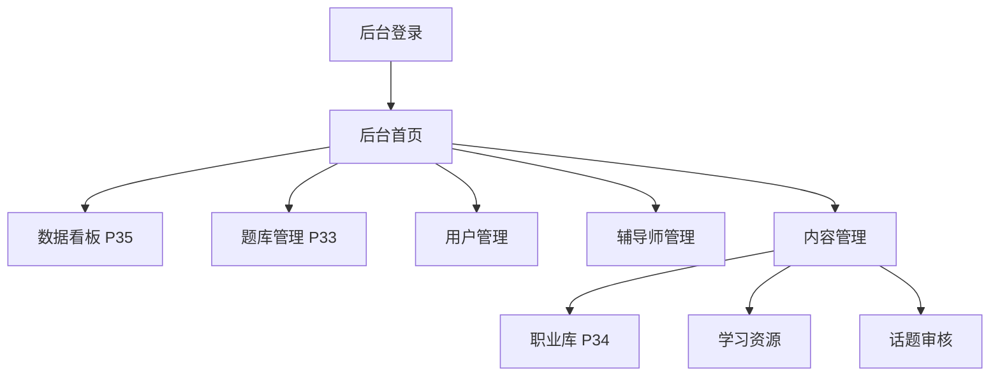
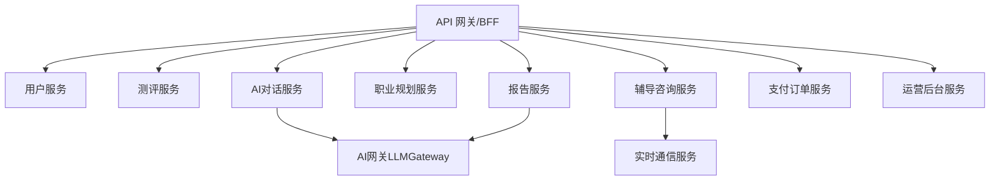
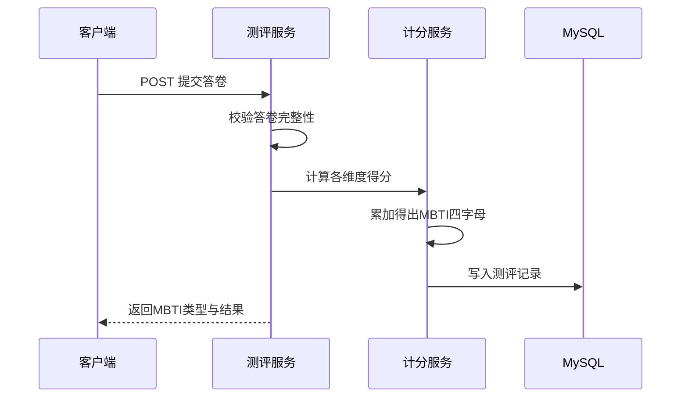
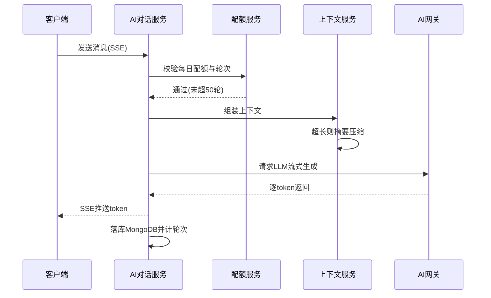
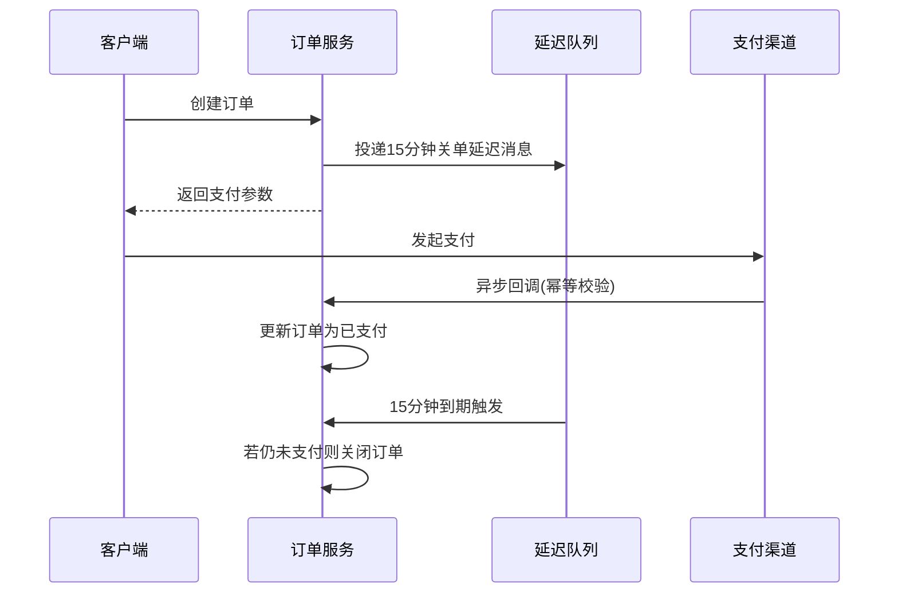
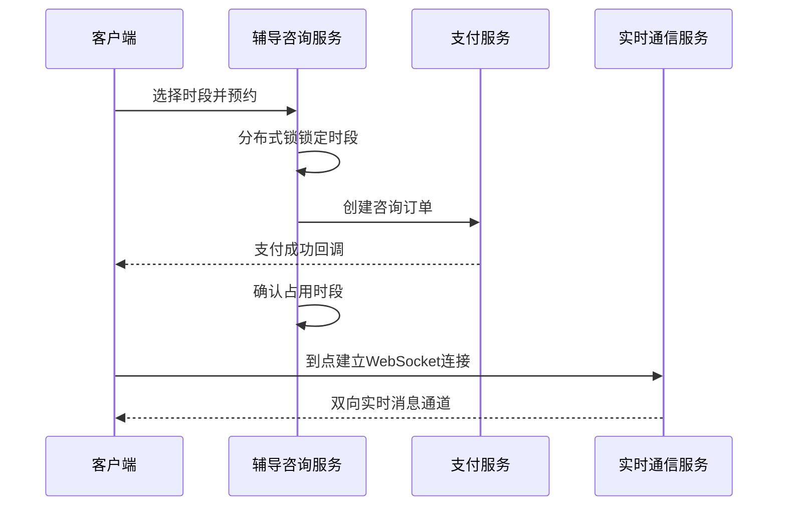
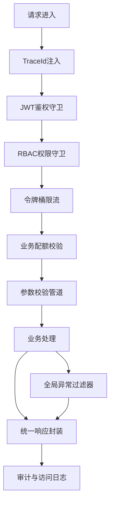

# InnerQuest 向内求索 — 后端设计文档

> **产品**: InnerQuest 向内求索（基于 AI 的 MBTI 职业规划与辅导平台）
> **定位**: 测评 + 规划 + 辅导 三位一体
> **版本**: v1.0  ·  **日期**: 2026-07-05  ·  **状态**: 设计稿
> **配套文件**: `产品分析报告-MBTI职业规划网页产品.md`、`前端页面清单与路由文档.md`、`数据库设计文档.md`、`技术架构设计文档.md`
> **技术栈**: Node.js 20 LTS + NestJS 10 + TypeScript 5 + Prisma/TypeORM ｜ MySQL 8.0 / Redis 7 / MongoDB 6 / ClickHouse / Elasticsearch / OSS ｜ RESTful + SSE + WebSocket

---

## 目录

### 第一部分：管理后台页面设计
- [1. 后台设计总览与 RBAC 权限模型](#1-后台设计总览与-rbac-权限模型)
- [2. 数据看板（P35）](#2-数据看板p35)
- [3. 题库管理（P33）](#3-题库管理p33)
- [4. 用户管理](#4-用户管理)
- [5. 辅导师管理](#5-辅导师管理)
- [6. 内容管理（职业库 P34 / 学习资源 / 话题审核）](#6-内容管理职业库-p34--学习资源--话题审核)

### 第二部分：后端 API 接口设计文档
- [7. 接口通用约定](#7-接口通用约定)
- [8. 认证与用户接口](#8-认证与用户接口)
- [9. 测评接口](#9-测评接口)
- [10. 报告接口](#10-报告接口)
- [11. 职业规划接口](#11-职业规划接口)
- [12. AI 对话接口](#12-ai-对话接口)
- [13. 辅导咨询接口](#13-辅导咨询接口)
- [14. 支付订单接口](#14-支付订单接口)
- [15. 管理后台接口](#15-管理后台接口)
- [16. 边界约束覆盖对照](#16-边界约束覆盖对照)

### 第三部分：后端服务详细设计
- [17. 服务模块划分总览](#17-服务模块划分总览)
- [18. 各服务详细设计](#18-各服务详细设计)
- [19. 关键业务流程时序图](#19-关键业务流程时序图)
- [20. 关键中间件链路](#20-关键中间件链路)

---

## 说明

本文档是 InnerQuest 后端开发蓝图，聚焦三大部分：**管理后台页面设计**、**API 接口设计**、**后端服务详细设计**。所有技术选型、表名、服务名严格复用已有四份文档，不重新选型。

- **服务/模块**：共 10 个（用户、测评、报告、职业规划、AI 对话、辅导咨询、支付订单、运营后台、AI 网关、实时通信）。
- **数据表**：复用数据库设计文档的 32 张表，本文不重复 DDL，仅引用表名。
- **接口版本前缀**：`/api/v1`；管理后台前缀 `/api/v1/admin`。
- **Mermaid 图**：仅用基础语法，无任何样式定义。

---

# 第一部分：管理后台页面设计

## 1. 后台设计总览与 RBAC 权限模型

运营后台对应前端「运营后台模块」（P33 题库管理、P34 职业库管理、P35 数据看板），本文档在其基础上补齐**用户管理、辅导师管理、内容管理**等完整运营界面，统一挂载于 `/admin/*` 路由，由 `AdminLayout` 承载，后端接口前缀 `/api/v1/admin`，全部经 `RequireAdmin` 守卫。

### 1.1 后台整体导航结构



### 1.2 RBAC 权限模型

复用 `user.role`（1 普通用户 / 2 辅导师 / 3 管理员）作为顶层角色位。后台内部按功能域细分**权限点（permission）**，采用「角色-权限点」映射，接口层用 NestJS 守卫 + 装饰器 `@RequirePermission('question:write')` 校验。

| 后台角色 | 说明 | 权限点示例 |
|---------|------|-----------|
| 超级管理员 | 全部权限 | `*` |
| 内容运营 | 题库/职业库/资源/话题 | `question:*`、`career:*`、`resource:*`、`topic:review` |
| 用户运营 | 用户查询/封禁 | `user:read`、`user:ban` |
| 辅导师运营 | 辅导师审核/上下架 | `coach:audit`、`coach:shelf`、`review:manage` |
| 数据分析 | 只读看板 | `analytics:read` |

- **鉴权**：后台登录签发独立作用域 JWT（`scope=admin`），Access Token + Refresh Token，登出写 Redis 黑名单。
- **审计**：所有写操作记录操作人、IP、前后值快照至 `event_log`（`event_type=admin_op`）。
- **敏感操作二次确认**：封禁、退款、批量删除需二次确认 + 操作理由。

---

## 2. 数据看板（P35）

- **对应路由**：`/admin/analytics`  ·  **权限**：`analytics:read`
- **功能定位**：运营核心指标监控、用户增长与转化分析、辅导师审核入口。

### 2.1 功能点
1. 核心指标卡片：累计用户、日活/月活、付费用户数、付费转化率、累计营收、今日新增。
2. 用户增长趋势：按日/周/月折线，可选时间范围。
3. 转化漏斗：访问 → 开始测评 → 完成测评 → 查看报告 → 解锁完整报告 → 咨询下单。
4. 测评完成率：开始测评数 vs 完成测评数，中途放弃率。
5. 营收概览：报告解锁/咨询/会员分类营收占比、退款率。
6. 辅导师审核入口：待审辅导师/资质数量角标，跳转辅导师管理。

### 2.2 界面布局要点
- 顶部时间范围选择器（今日/7 日/30 日/自定义）+ 刷新。
- 第一屏 6 张指标卡片网格；第二屏左侧增长折线、右侧转化漏斗；第三屏营收饼图 + 测评完成率仪表。
- 移动端图表纵向堆叠 + 横向滚动表格，桌面网格布局。
- 大数据量：聚合结果分页/预聚合；图表骨架屏加载，无数据区间提示，接口失败降级为「重试」。

### 2.3 关键交互
- 卡片点击下钻到明细列表；漏斗某环节点击查看该环节用户。
- 时间范围切换触发全页图表联动刷新（防抖）。

### 2.4 涉及数据表
`event_log`（ClickHouse 埋点聚合）、`user`、`payment_order`、`payment_refund`、`assessment_record`、`report`、`coaching_order`、`coach`。

### 2.5 所需接口
`GET /api/v1/admin/analytics/overview`、`/analytics/growth`、`/analytics/funnel`、`/analytics/revenue`、`/analytics/assessment-rate`。

### 2.6 权限控制
`RequireAdmin` + `analytics:read`；数据分析角色只读，无下钻用户明细中的敏感字段（手机号脱敏）。

---

## 3. 题库管理（P33）

- **对应路由**：`/admin/questions`  ·  **权限**：`question:read` / `question:write`
- **功能定位**：MBTI 测评题库的 CRUD、分类、维度映射、上下架、批量导入。

### 3.1 功能点
1. 题目列表：按题库版本、维度（EI/SN/TF/JP）、状态（上架/下架）筛选，分页 10/页。
2. 题目 CRUD：新增/编辑题干、排序、是否反向计分；管理选项（选项文案、极性、权重分）。
3. 维度映射：题目绑定维度 `dimension`，选项绑定极性 `polarity`（正向 E/S/T/J、负向 I/N/F/P）。
4. 上下架：单个/批量切换 `status`；下架校验是否影响进行中测评（按 `question_version` 隔离）。
5. 批量导入：Excel/CSV 模板导入题目+选项，导入前校验维度/极性合法性，返回失败明细。
6. 版本管理：新版本题库灰度，历史版本只读。

### 3.2 界面布局要点
- 顶部筛选栏 + 「新增题目」「批量导入」按钮；表格列：题号、维度、题干、是否反向、状态、操作。
- 编辑弹窗：题干 + 选项子表格（A/B 选项）；表格骨架屏加载。
- 无题目引导新增；批量操作确认弹窗；保存冲突（并发编辑）提示。

### 3.3 关键交互
- 批量选择 → 批量上/下架/删除（二次确认）。
- 导入进度条 + 结果报告下载。
- 上/下线校验：确保每维度题量满足计分最小要求，否则拦截下架。

### 3.4 涉及数据表
`assessment_question`、`assessment_option`、`file_upload`（导入文件）。

### 3.5 所需接口
`GET/POST/PUT/DELETE /api/v1/admin/questions`、`/questions/:id/options`、`POST /questions/import`、`PATCH /questions/batch-status`。

### 3.6 权限控制
`RequireAdmin` + `question:read`（列表）/`question:write`（增删改/导入/上下架）。

---

## 4. 用户管理

- **对应路由**：`/admin/users`  ·  **权限**：`user:read` / `user:ban`
- **功能定位**：用户检索、详情查看、行为日志追溯、封禁/解封。

### 4.1 功能点
1. 搜索筛选：按 `user_no`、昵称、手机号（脱敏后匹配）、角色、状态、注册时间范围。
2. 用户详情：基础资料、付费状态、测评记录数、报告数、订单数、隐私设置。
3. 行为日志：分页展示 `event_log` 关键行为（登录、测评、支付、对话）。
4. 封禁/解封：切换 `user.status`（2 禁用），封禁写入理由；封禁后 JWT 黑名单强制下线。
5. 注销处理：查看 `user_deactivation` 冷静期状态，支持人工干预。

### 4.2 界面布局要点
- 左侧筛选表单，右侧结果表格（分页 20/页），列含脱敏手机号、状态标签。
- 详情抽屉/详情页：Tab 分「基础信息 / 测评报告 / 订单支付 / 行为日志 / 隐私」。

### 4.3 关键交互
- 手机号默认脱敏，仅有 `user:pii` 权限点可申请查看明文（记录审计）。
- 封禁二次确认 + 理由必填；解封同理。

### 4.4 涉及数据表
`user`、`user_oauth`、`user_privacy_setting`、`user_deactivation`、`event_log`、`assessment_record`、`report`、`payment_order`、`coaching_order`。

### 4.5 所需接口
`GET /api/v1/admin/users`、`/users/:id`、`/users/:id/events`、`PATCH /users/:id/status`（封禁/解封）。

### 4.6 权限控制
`RequireAdmin` + `user:read`；封禁 `user:ban`；查看手机号明文 `user:pii`。

---

## 5. 辅导师管理

- **对应路由**：`/admin/coaches`  ·  **权限**：`coach:audit` / `coach:shelf` / `review:manage`
- **功能定位**：辅导师入驻申请审核、资质验证、上下架、评价管理。

### 5.1 功能点
1. 申请审核：待审辅导师列表（`coach.audit_status=0`），查看简介/擅长领域/定价，通过/驳回。
2. 资质验证：查看 `coach_qualification` 证书文件（OSS 预览），逐项审核，驳回填备注。
3. 上下架：切换 `coach.status`（1 在职 / 2 停接单 / 3 下线）；下线校验是否有进行中订单。
4. 评价管理：查看 `coaching_review`，处理违规评价（删除/隐藏），支持辅导师申诉。
5. 数据概览：接单数、评分、完成率、退款率。

### 5.2 界面布局要点
- 顶部审核状态 Tab（待审/已通过/已驳回）+ 状态筛选。
- 审核弹窗：辅导师信息 + 资质文件缩略图列表（点击放大预览）+ 审核意见输入。
- 评价管理列表含举报标记、快捷处理按钮。

### 5.3 关键交互
- 审核通过后同步开放排期能力；驳回通知辅导师。
- 下线操作校验 `coaching_order` 是否存在待咨询/进行中订单，存在则阻断并提示。

### 5.4 涉及数据表
`coach`、`coach_qualification`、`coach_schedule`、`coaching_order`、`coaching_review`、`file_upload`。

### 5.5 所需接口
`GET /api/v1/admin/coaches`、`/coaches/:id`、`PATCH /coaches/:id/audit`、`PATCH /coaches/:id/status`、`GET/DELETE /admin/reviews`。

### 5.6 权限控制
`RequireAdmin` + `coach:audit`（审核）/`coach:shelf`（上下架）/`review:manage`（评价）。

---

## 6. 内容管理（职业库 P34 / 学习资源 / 话题审核）

- **对应路由**：`/admin/careers`（P34）、`/admin/resources`、`/admin/topics`
- **功能定位**：职业百科、学习资源维护，社区话题审核（V2.0 预留）。

### 6.1 职业百科（P34）
- **功能点**：职业 CRUD（名称、分类、职责、薪资区间、前景、适配 MBTI 类型）；技能要求维护（`career_skill`）；发展路线图维护（`career_roadmap`）；数据批量导入；上下架；ES 索引同步。
- **界面布局**：列表按分类/状态筛选；编辑页分「基础信息 / 技能要求 / 路线图」多 Tab；导入向导。
- **关键交互**：保存后触发 ES 增量索引；上架前校验必填与适配类型合法性；数据接口失败重试。
- **涉及表**：`career`、`career_skill`、`career_roadmap`、`file_upload`。
- **接口**：`GET/POST/PUT/DELETE /api/v1/admin/careers`、`/careers/:id/skills`、`/careers/:id/roadmap`、`POST /careers/import`。
- **权限**：`career:read` / `career:write`。

### 6.2 学习资源
- **功能点**：资源 CRUD（标题、类型：课程/书籍/文章/视频、链接、技能标签、关联职业、提供方）；上下架。
- **涉及表**：`learning_resource`。
- **接口**：`GET/POST/PUT/DELETE /api/v1/admin/resources`。
- **权限**：`resource:read` / `resource:write`。

### 6.3 话题审核（V2.0 预留）
- **功能点**：社区话题/评论审核，违规下架，敏感词过滤。
- **接口**：`GET /api/v1/admin/topics`、`PATCH /topics/:id/review`。
- **权限**：`topic:review`。

---

# 第二部分：后端 API 接口设计文档

## 7. 接口通用约定

### 7.1 基础规范
- **基础路径**：C 端 `/api/v1`，管理后台 `/api/v1/admin`。
- **协议**：HTTPS；请求/响应体统一 `application/json`（文件上传 `multipart/form-data`；AI 流式 `text/event-stream`）。
- **命名**：路径小写短横线，资源名复数；字段 `camelCase`。

### 7.2 统一响应结构
```json
{ "code": 0, "message": "success", "data": {}, "traceId": "req-uuid" }
```
- `code=0` 成功；非 0 为业务错误码；HTTP 状态码同步语义（200/201/400/401/403/404/409/429/500）。
- 列表响应 `data`：`{ "list": [], "total": 100, "page": 1, "pageSize": 20 }`。

### 7.3 鉴权与请求头
- `Authorization: Bearer <accessToken>`；Access 30 分钟、Refresh 30 天，双 Token 刷新；登出写 Redis 黑名单。
- `X-Trace-Id` 全链路追踪；`X-Client` 客户端标识。

### 7.4 错误码规范（分段）
| 段 | 模块 | 示例 |
|----|------|------|
| 1xxxx | 通用/鉴权 | 10001 未登录、10003 Token 失效、10009 无权限 |
| 2xxxx | 用户 | 20001 用户不存在、20002 已被封禁 |
| 3xxxx | 测评 | 30001 题库版本失效、30002 答卷不完整 |
| 4xxxx | 报告 | 40001 报告未生成、40002 未解锁 |
| 5xxxx | AI对话 | 50001 超出每日配额、50002 会话超50轮 |
| 6xxxx | 辅导 | 60001 时段已被占、60002 辅导师停接单 |
| 7xxxx | 支付 | 70001 订单已关闭、70002 重复支付、70003 金额不符 |
| 9xxxx | 限流/系统 | 90001 请求过于频繁、90002 系统繁忙 |

### 7.5 分页 / 幂等 / 限流约定
- **分页**：`page` 默认 1，`pageSize` 默认 20，搜索结果最多返回 200 条（`total` 上限 200）。
- **幂等**：写接口支持 `Idempotency-Key` 头；支付回调按 `channelTradeNo` 唯一约束幂等。
- **限流**：全局 100 次/分钟/用户（令牌桶，Redis+Lua），超限返回 429 + `Retry-After`；AI 对话与文件上传单独更严格配额。

---

## 8. 认证与用户接口

| 方法 | 路径 | 说明 | 鉴权 | 限流 |
|------|------|------|------|------|
| POST | `/auth/sms/send` | 发送短信验证码 | 否 | 1 次/60s |
| POST | `/auth/login` | 手机号/验证码或密码登录 | 否 | 5 次/分 |
| POST | `/auth/oauth/:provider` | 第三方登录(微信/QQ) | 否 | - |
| POST | `/auth/refresh` | 刷新 Token | Refresh | - |
| POST | `/auth/logout` | 登出(加黑名单) | 是 | - |
| GET | `/users/me` | 当前用户资料 | 是 | - |
| PUT | `/users/me` | 更新资料 | 是 | - |
| GET/PUT | `/users/me/privacy` | 隐私设置 | 是 | - |
| POST | `/users/me/deactivate` | 申请注销(冷静期) | 是 | - |

- 登录成功返回 `{ accessToken, refreshToken, user }`；封禁用户返回 403 + 20002。

---

## 9. 测评接口

| 方法 | 路径 | 说明 | 鉴权 |
|------|------|------|------|
| GET | `/assessments/questions` | 拉取当前版本题库(按维度) | 是 |
| POST | `/assessments/records` | 创建测评记录(开始) | 是 |
| PATCH | `/assessments/records/:id/answers` | 分段暂存答案 | 是 |
| POST | `/assessments/records/:id/submit` | 提交答卷,计算MBTI类型 | 是 |
| GET | `/assessments/records/:id/result` | 获取测评结果 | 是 |
| GET | `/assessments/records` | 我的测评历史 | 是 |

- 提交校验答卷完整性(每维度题量达标),不完整返回 30002;题库版本失效返回 30001。

---

## 10. 报告接口

| 方法 | 路径 | 说明 | 鉴权 |
|------|------|------|------|
| POST | `/reports` | 基于测评记录生成报告(免费预览版) | 是 |
| GET | `/reports/:id` | 获取报告(未解锁仅返回预览段) | 是 |
| POST | `/reports/:id/unlock` | 解锁完整报告(创建订单) | 是 |
| GET | `/reports/:id/export` | 导出PDF(已解锁) | 是 |
| GET | `/reports` | 我的报告列表 | 是 |

- 每日报告生成上限 3 份,超限返回 40003;未解锁访问付费段返回 40002。

---

## 11. 职业规划接口

| 方法 | 路径 | 说明 | 鉴权 |
|------|------|------|------|
| GET | `/careers` | 职业列表(分页,支持MBTI适配筛选) | 是 |
| GET | `/careers/search` | 职业搜索(ES,最多200条/20条页) | 是 |
| GET | `/careers/:id` | 职业详情(职责/薪资/技能/路线) | 是 |
| GET | `/careers/recommend` | 基于MBTI的职业推荐 | 是 |
| GET | `/resources` | 学习资源列表(按技能/职业筛选) | 是 |
| GET | `/plans` / POST | 我的职业规划(目标/路径) | 是 |

---

## 12. AI 对话接口

| 方法 | 路径 | 说明 | 鉴权 |
|------|------|------|------|
| POST | `/ai/conversations` | 创建AI会话 | 是 |
| GET | `/ai/conversations` | 会话列表 | 是 |
| GET | `/ai/conversations/:id/messages` | 历史消息 | 是 |
| POST | `/ai/conversations/:id/messages` | 发送消息(SSE流式返回) | 是 |
| DELETE | `/ai/conversations/:id` | 删除会话 | 是 |

- **流式**：`Accept: text/event-stream`,逐 token 推送 `data:` 事件,结束 `event: done`。
- **约束**：单会话最多 50 轮,超限返回 50002;每日对话配额受限,超出返回 50001;超长上下文自动摘要压缩。

---

## 13. 辅导咨询接口

| 方法 | 路径 | 说明 | 鉴权 |
|------|------|------|------|
| GET | `/coaches` | 辅导师列表(领域/评分筛选) | 是 |
| GET | `/coaches/:id` | 辅导师详情 | 是 |
| GET | `/coaches/:id/schedule` | 可预约时段 | 是 |
| POST | `/coaching/orders` | 创建辅导预约(锁定时段+下单) | 是 |
| GET | `/coaching/orders` | 我的咨询订单 | 是 |
| POST | `/coaching/orders/:id/review` | 咨询后评价 | 是 |
| WS | `/ws/coaching/:orderId` | 实时会话(Socket.IO) | 是 |

- 时段已占返回 60001;辅导师停接单返回 60002;下单锁定时段,支付成功后确认占用。

---

## 14. 支付订单接口

| 方法 | 路径 | 说明 | 鉴权 |
|------|------|------|------|
| POST | `/payments/orders` | 创建订单(多态:报告解锁/咨询/会员) | 是 |
| GET | `/payments/orders/:id` | 订单详情/状态 | 是 |
| POST | `/payments/orders/:id/pay` | 发起支付(返回支付参数) | 是 |
| POST | `/payments/callback/:channel` | 支付渠道异步回调 | 签名 |
| POST | `/payments/orders/:id/refund` | 申请退款 | 是 |
| GET | `/payments/orders` | 我的订单列表 | 是 |

- 订单 **15 分钟未支付自动关单**(延迟队列);回调按 `channelTradeNo` 唯一幂等,重复回调返回成功;金额不符返回 70003;已关闭订单支付返回 70001。

### 14.1 套餐/会员商品接口（C 端，游客可访问）

| 方法 | 路径 | 说明 | 鉴权 |
|------|------|------|------|
| GET | `/membership/plans` | 获取上架套餐列表(P30套餐页) | 否 |
| GET | `/membership/plans/:code` | 套餐详情(按 code 查询) | 否 |

- 套餐数据源自 `membership_plan` 表；列表仅返回 `status=1上架` 记录，按 `sort_order` 排序。
- 会员/套餐类订单下单时 `bizType=membership`（对应 `payment_order.biz_type=3`），`bizId` 指向 `membership_plan.id`；创建订单前校验对应套餐 `status=上架`，下架套餐下单返回 70004。

---

## 15. 管理后台接口

后台接口统一前缀 `/api/v1/admin`,经 `RequireAdmin` + `@RequirePermission`。汇总(详见第一部分各页面「所需接口」):
- 认证：`POST /admin/auth/login`、`/admin/auth/logout`
- 数据看板：`/admin/analytics/{overview,growth,funnel,revenue,assessment-rate}`
- 题库：`/admin/questions`、`/questions/import`、`/questions/batch-status`
- 用户：`/admin/users`、`/users/:id/events`、`/users/:id/status`
- 辅导师：`/admin/coaches`、`/coaches/:id/audit`、`/coaches/:id/status`、`/admin/reviews`
- 内容：`/admin/careers`、`/admin/resources`、`/admin/topics`
- 套餐：`GET/POST/PUT/DELETE /api/v1/admin/membership-plans`、`PATCH /admin/membership-plans/:id/status`（上/下架）

---

## 16. 边界约束覆盖对照

| PRD 约束 | 落地接口/机制 | 错误码 |
|----------|--------------|--------|
| 全局限流 100 次/分 | 令牌桶(Redis+Lua) | 90001 / 429 |
| 支付 15 分钟关单 | 延迟队列 + 定时兜底扫描 | 70001 |
| 对话 ≤ 50 轮 | 会话轮次计数校验 | 50002 |
| 每日 ≤ 3 份报告 | Redis 日计数器 | 40003 |
| 文件 ≤10MB(PDF/DOCX) | 上传中间件大小/类型校验 | 90003 |
| 搜索最多 200 条/页 20 | ES 分页上限 + pageSize 限制 | - |
| AI 每日配额 | Redis 配额扣减 | 50001 |
| 支付回调幂等 | `uk_channel_trade_no` 唯一约束 | 70002 |

---

# 第三部分：后端服务详细设计

## 17. 服务模块划分总览

采用 NestJS 模块化单体（Modular Monolith），可平滑演进为微服务。10 个业务模块 + 2 个基础设施模块。



| # | 服务模块 | 核心职责 | 关键依赖 |
|---|---------|---------|---------|
| 1 | 用户服务 | 认证、资料、隐私、注销 | MySQL、Redis |
| 2 | 测评服务 | 题库、答卷、MBTI 计分 | MySQL、Redis |
| 3 | 报告服务 | 报告生成、解锁、导出 | MySQL、LLM、OSS |
| 4 | 职业规划服务 | 职业库、推荐、资源、规划 | MySQL、ES |
| 5 | AI对话服务 | 会话、消息、SSE、上下文摘要 | MongoDB、Redis、LLM |
| 6 | 辅导咨询服务 | 辅导师、排期、预约、评价 | MySQL、Redis、RTC |
| 7 | 支付订单服务 | 多态下单、支付、关单、退款 | MySQL、Redis、渠道 |
| 8 | 运营后台服务 | 后台各页面、RBAC、审计 | MySQL、ClickHouse |
| 9 | AI网关 LLMGateway | LLM 调用、Prompt、限流降级 | Redis、外部LLM |
| 10 | 实时通信服务 | WebSocket/Socket.IO 会话 | Redis Adapter |

---

## 18. 各服务详细设计

### 18.1 用户服务
- **Controller**：`AuthController`、`UserController`。
- **Service**：`AuthService`（签发/刷新/黑名单）、`UserService`、`SmsService`、`OAuthService`。
- **关键方法**：`login()`、`refreshToken()`、`logout()`（Redis 黑名单）、`deactivate()`（冷静期）。

### 18.2 测评服务
- **Service**：`QuestionService`（版本题库）、`AssessmentService`（答卷）、`ScoringService`（维度累加计分 → 4 字母类型）。
- **关键方法**：`submit()` 校验完整性 + 计分 + 落 `assessment_record`；`getResult()`。

### 18.3 报告服务
- **Service**：`ReportService`、`ReportGeneratorService`（调 LLMGateway 生成分段内容）、`UnlockService`（创建订单）、`ExportService`（PDF）。
- **关键方法**：`generate()`（免费预览段）、`unlock()`、`export()`；每日 3 份配额校验。

### 18.4 AI对话服务
- **Service**：`ConversationService`、`ChatService`（SSE 流式）、`ContextService`（历史裁剪 + 摘要压缩）、`QuotaService`。
- **关键方法**：`sendMessage()` → 组装上下文 → 调 LLMGateway 流式 → 落 MongoDB；轮次/配额校验。

### 18.5 支付订单服务
- **Service**：`OrderService`（多态 `bizType`+`bizId`）、`MembershipPlanService`（套餐 CRUD / 上下架 / 上架列表查询）、`PaymentService`（渠道适配）、`CallbackService`（幂等）、`CloseOrderJob`（15 分钟延迟关单）、`RefundService`。
- **关键方法**：`createOrder()`、`handleCallback()`（唯一约束幂等 + 状态机）、`closeExpired()`。

### 18.6 辅导咨询服务
- **Service**：`CoachService`、`ScheduleService`（时段锁定）、`CoachingOrderService`、`ReviewService`。
- **关键方法**：`book()` 锁定时段（Redis 分布式锁）+ 下单；`confirmAfterPaid()`。

### 18.7 其余服务
- **职业规划**：`CareerService`、`SearchService`（ES）、`RecommendService`、`PlanService`。
- **运营后台**：各页面 `Admin*Controller` + `PermissionGuard` + `AuditInterceptor`。
- **AI网关**：`LlmGatewayService`（多模型路由、限流降级、Prompt 模板）。
- **实时通信**：`CoachingGateway`（Socket.IO + Redis Adapter 多实例广播）。

---

## 19. 关键业务流程时序图

### 19.1 测评提交与结果生成


### 19.2 AI 深度对话（摘要压缩 + SSE + 50 轮约束）


### 19.3 支付下单到 15 分钟关单


### 19.4 辅导预约到 WebSocket 会话


---

## 20. 关键中间件链路

请求进入到响应的统一处理链路（NestJS 全局管道/守卫/拦截器）：



| 层 | 组件 | 职责 |
|----|------|------|
| 1 | TraceMiddleware | 注入 `X-Trace-Id`,全链路追踪 |
| 2 | JwtAuthGuard | 校验 Token + Redis 黑名单 |
| 3 | PermissionGuard | RBAC 权限点校验(后台) |
| 4 | RateLimitGuard | 令牌桶 100 次/分,超限 429 |
| 5 | QuotaGuard | 报告/对话每日配额 |
| 6 | ValidationPipe | DTO 参数校验 |
| 7 | ResponseInterceptor | 统一响应 `{code,message,data,traceId}` |
| 8 | AllExceptionsFilter | 错误码映射 + 统一异常输出 |
| 9 | AuditInterceptor | 后台写操作审计落 `event_log` |

---

> **文档完** ｜ 本文档覆盖三大部分，与《技术架构设计文档》《数据库设计文档》《前端页面清单与路由文档》《产品分析报告》技术选型完全一致，可直接作为后端开发蓝图。