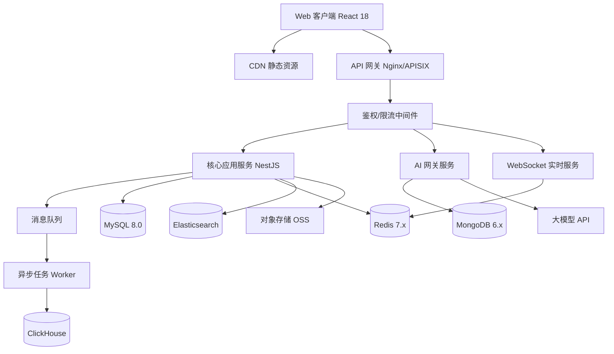
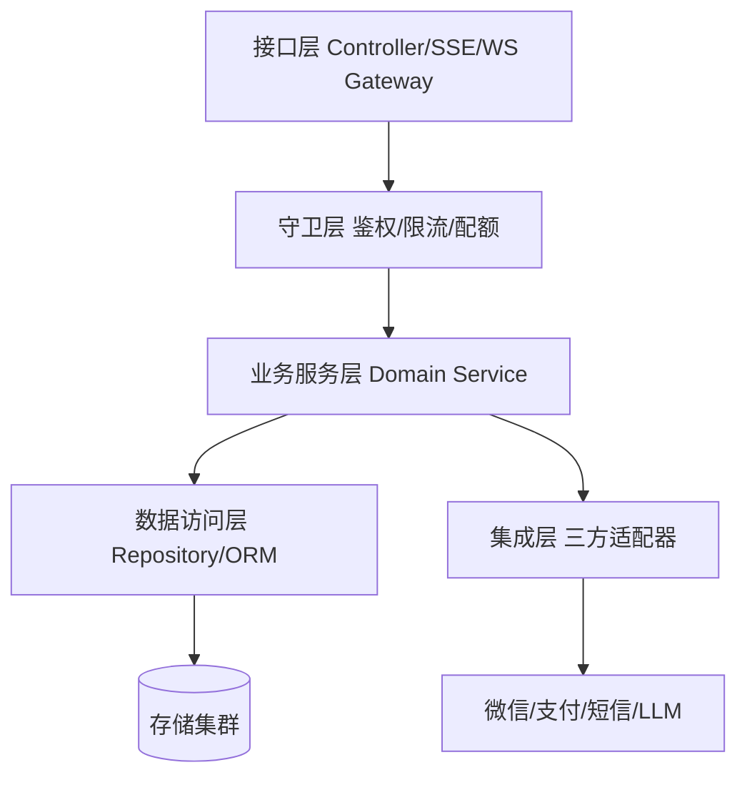
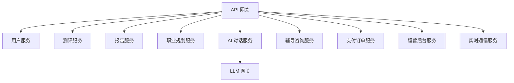
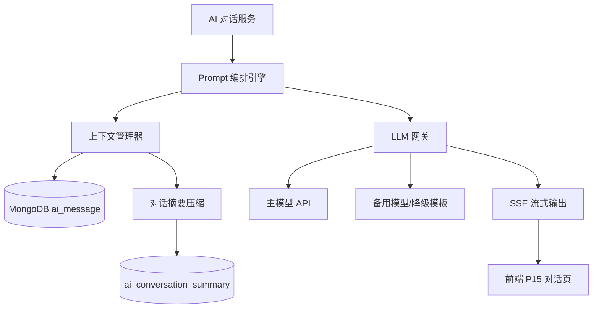
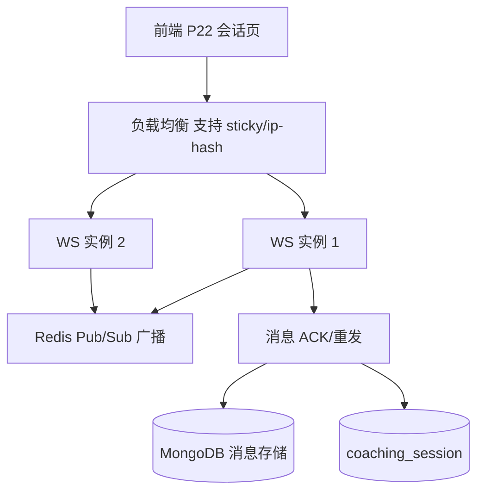
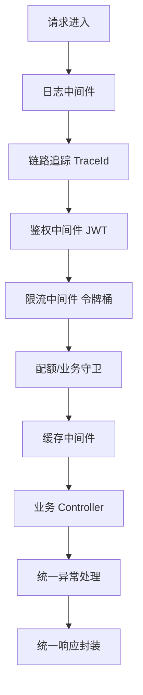
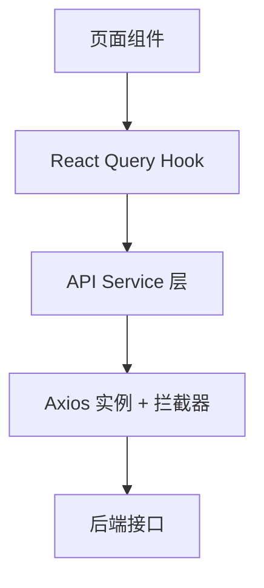
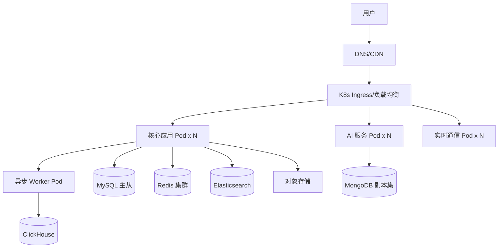

# InnerQuest 向内求索 — 技术架构设计文档

> **产品**: InnerQuest 向内求索（基于 AI 的 MBTI 职业规划与辅导平台）
> **定位**: 测评 + 规划 + 辅导 三位一体
> **版本**: v1.0  ·  **日期**: 2026-07-05  ·  **状态**: 设计稿
> **配套文件**: `产品分析报告-MBTI职业规划网页产品.md`、`数据库设计文档.md`、`前端页面清单与路由文档.md`

---

## 目录

1. [技术选型总览](#1-技术选型总览)
2. [分层架构图](#2-分层架构图)
3. [服务拆分设计](#3-服务拆分设计)
4. [AI 大模型集成方案](#4-ai-大模型集成方案)
5. [WebSocket 实时通信方案](#5-websocket-实时通信方案)
6. [中间件栈设计](#6-中间件栈设计)
7. [第三方集成方案](#7-第三方集成方案)
8. [API 接口设计](#8-api-接口设计)
9. [前端架构设计](#9-前端架构设计)
10. [非功能性设计](#10-非功能性设计)
11. [部署架构](#11-部署架构)
12. [技术栈汇总表](#12-技术栈汇总表)

---

## 1. 技术选型总览

### 1.1 选型原则

- **MVP 快速交付**：初期采用「模块化单体（Modular Monolith）+ 独立 AI 网关」，避免过早微服务化带来的运维复杂度；服务内部按业务域清晰分包，为后续拆分预留边界。
- **演进式架构**：V1.1 引入 AI 对话、辅导等重负载功能时，将高耦合/高负载域（AI 服务、实时通信服务）率先独立部署。
- **存储选型严格复用**：完全遵循 `数据库设计文档.md` 已确定的存储矩阵，不重新选型。

### 1.2 后端主技术栈

| 维度 | 选型 | 说明 |
|------|------|------|
| 语言/运行时 | **Node.js 20 LTS + TypeScript 5** | 与前端 TS 技术栈统一，全栈同构；高 IO 场景（AI 流式、WS）表现优异 |
| Web 框架 | **NestJS 10** | 模块化/依赖注入天然契合业务域拆分，内置管道/守卫/拦截器对接中间件栈 |
| API 风格 | **RESTful（主）** | 遵循资源化 URL + 标准 HTTP 语义；AI 流式采用 SSE，实时会话采用 WebSocket |
| ORM | **Prisma / TypeORM** | 对接 MySQL 8.0，类型安全；复杂报表走原生 SQL |
| 进程管理 | **PM2 / K8s Deployment** | 多实例负载 + 自动重启 |

### 1.3 存储选型（引用自数据库设计文档，不重选）

| 存储 | 版本 | 承载职责 |
|------|------|----------|
| **MySQL** | 8.0 (InnoDB, utf8mb4) | 主库、事务、32 张表核心结构 |
| **Redis** | 7.x | 令牌桶限流、排队、答题草稿、每日报告配额、会话缓存、JWT 黑名单 |
| **MongoDB** | 6.x | AI 消息流、报告 JSON 大文档 |
| **ClickHouse** | — | 埋点 `event_log`（按天分区，90 天 TTL） |
| **对象存储 OSS/S3** | — | 简历/海报/语音文件（≤10MB） |
| **Elasticsearch** | — | V1.1 职业百科检索（≤200 条分页） |

### 1.4 基础设施与中间件

| 类别 | 选型 |
|------|------|
| API 网关 | Nginx / APISIX（TLS 卸载、路由、限流兜底） |
| 消息队列 | RabbitMQ / Redis Stream（异步报告生成、通知、埋点写入） |
| 定时任务 | BullMQ（基于 Redis）+ 分布式锁 |
| 配置中 | Nacos / 环境变量 + K8s ConfigMap |
| 可观测性 | Prometheus + Grafana、OpenTelemetry、ELK |
| 容器编排 | Docker + Kubernetes |

---

## 2. 分层架构图

### 2.1 整体分层架构



### 2.2 应用内部分层



---

## 3. 服务拆分设计

### 3.1 拆分策略

对齐数据库设计文档的 **8 大业务域**，MVP 阶段以模块化单体承载，V1.1 将 **AI 服务** 与 **实时通信服务** 优先独立。共规划 **10 个服/模块**（8 业务域 + AI 网关 + 实时通信）。

### 3.2 服务清单



| # | 服务/模块 | 对应业务域 | 核心表 | 关键职责 |
|---|-----------|-----------|--------|----------|
| 1 | 用户服务 | 用户体系 | user / user_oauth / user_privacy_setting / user_deactivation | 微信 OAuth、手机号降级登录、JWT 签发、隐私设置、注销 T+30 |
| 2 | 测评服务 | 测评体系 | assessment_question/option/record/answer/progress/result | 题库下发、分页答题、草稿续答、排队、计分引擎、16 型判定 |
| 3 | 报告服务 | 报告体系 | report / report_section / report_share | 报告生成编排、章节存储(Mongo)、海报分享、每日 3 份配额 |
| 4 | 职业规划服务 | 职业规划 | career/career_match/skill_gap/learning_resource/roadmap/favorite/growth_plan | TOP10 匹配、技能差距、学习资源、路线图、收藏、成长计划 |
| 5 | AI 对话服务 | AI 对话 | ai_conversation / ai_message / ai_conversation_summary | 多轮对话(≤50)、SSE 流式、上下文压缩、超时降级 |
| 6 | 辅导咨询服务 | 辅导咨询 | coach/qualification/schedule/coaching_order/session/review | 辅导师、排期锁定、下单、会话、评价 |
| 7 | 支付订单服务 | 支付订单 | payment_order / payment_transaction / payment_refund | 多态订单、微信支付、回调幂等、15 分钟关单、退款 |
| 8 | 运营后台服务 | 运营数据 | event_log / file_upload + 各业务表读 | 题库/职业库管理、数据看板、辅导师审核 |
| 9 | AI 网关（LLM Gateway） | 横切 | — | LLM 调用统一入口、限流、成本控制、故障切换 |
| 10 | 实时通信服务 | 横切 | — | WebSocket 辅导会话、断线重连、消息可靠投递 |

### 3.3 服务间通信

- **同步**：网关内 REST / 服务内方法调用；跨服务用轻量 HTTP + 熔断（拆分后）。
- **异步**：报告生成、埋点写入、通知发送经消息队列解耦；保证测评提交后快速返回、后台异步生成。
- **事务一致性**：支付与订单状态用本地事务 + 对账兜底；跨域最终一致（如报告生成失败重试队列）。

---

## 4. AI 大模型集成方案

### 4.1 集成架构

所有 LLM 调用统一经 **AI 网关（LLM Gateway）** 出口，业务侧不直连模型厂商，便于统一限流、成本核算与故障切换。



### 4.2 关键能力落地

| 能力 | 方案 |
|------|------|
| **Prompt 工程** | 分层 Prompt：系统角色（职业规划师人设）+ 用户 MBTI 画像注入 + 少样本示例 + 用户输入；模板版本化管理 |
| **上下文窗口管理** | 结合 `ai_conversation.round_count`，超阈值触发摘要：将历史消息压缩为 `ai_conversation_summary`，仅携带「摘要 + 最近 N 轮」入模，控制 token |
| **SSE 流式输出** | 采用 `text/event-stream`，逐 token 推送前端 typing 效果；断流可重连续传 |
| **多轮对话上限** | 硬约束 `max_round = 50`，达上限返回引导「开新会话/升级」，与前端 P15 状态矩阵一致 |
| **超时降级** | 首 token >10s 未返回：提示重试；单次调用 >30s 熔断，降级为预置模板回复（对齐 PRD 异常处理） |
| **成本控制** | LLM 网关按用户/接口维度统计 token 消耗；结合 Redis 令牌桶限制单用户调用频次；缓存高频通用问答 |
| **消息持久化** | AI 消息流写 MongoDB（读写快、schema 灵活），会话元数据写 MySQL `ai_conversation` |

### 4.3 报告生成中的 AI 应用

测评提交后，报告服务将 16 型结果 + 职业库特征投喂 LLM，异步生成 TOP10 职业匹配解读与深度报告章节，经消息队列削峰；生成中前端轮询 P06 状态，超时降级手动刷新。

---

## 5. WebSocket 实时通信方案

### 5.1 应用场景

1v1 辅导会话（P22）的实时文字/语音消息、要点记录同步、在线状态。

### 5.2 通信架构



### 5.3 关键能力

| 能力 | 方案 |
|------|------|
| **协议** | Socket.IO / 原生 WebSocket，NestJS Gateway 承载；鉴权走连接握手阶段 JWT 校验 |
| **多实例扩展** | Redis Pub/Sub（或 Redis Adapter）跨实例广播消息，LB 采用 ip-hash 保持会话粘性 |
| **消息可靠性** | 客户端 msgId + 服务端 ACK；未确认消息重发；离线消息落库，重连后拉取增量 |
| **断线重连** | 心跳保活（ping/pong）；断开后指数退避重连，携带 last_msg_id 续传（对齐前端「网络抖动降级」） |
| **会话生命周期** | 结合 `coach_schedule` 15 分钟锁定与会话到期提醒；到期前推送提示 |
| **降级** | WS 不可用时降级为 HTTP 长轮询，保证消息不丢 |

---

## 6. 中间件栈设计

### 6.1 请求处理链



### 6.2 各中间件方案

| 中间件 | 方案与落地 |
|--------|-----------|
| **日志** | NestJS Logger + Winston/Pino，结构化 JSON 日志，注入 TraceId；访问日志与业务日志分离，输出至 ELK |
| **鉴权** | JWT（Access Token + Refresh Token）；登出/注销写 Redis **JWT 黑名单**；WS 握手同校验；`RequireAuth/Paid/Admin` 对应后端守卫 |
| **限流** | Redis **令牌桶 + Lua 原子扣减**，key=`rate:{user_id}:{api}`，默认 **100 次/分**（对齐 PRD/DB 文档）；网关层再加全局兜底限流 |
| **排队** | 测评高并发场景用 Redis List/Stream 排队 + 排队号，返回预估等待时间（对齐 PRD 测评排队） |
| **缓存** | 多级缓存：本地内存 + Redis；报告/职业库热点数据缓存；缓存击穿用互斥锁，穿透用空值缓存 |
| **配额** | 每日报告 `report:quota:{user_id}:{date}`，日切过期，超 3 份拦截提示 |
| **异常处理** | 全局 ExceptionFilter，统一错误码 + 消息；区分业务异常/系统异常/三方异常 |
| **响应封装** | 统一 `{ code, message, data, traceId }` 结构，Interceptor 自动包裹 |

### 6.3 异步任务与定时任务

| 类型 | 任务 | 触发 |
|------|------|------|
| 异步 | 报告生成、AI 匹配、埋点写 ClickHouse、通知发送 | 消息队列 |
| 定时 | 注销账号 T+30 清理 | 每日 |
| 定时 | 未支付订单 15 分钟关单 | 分钟级扫描/延时队列 |
| 定时 | 辅导排期锁定超时释放 | 延时队列 |
| 定时 | 埋点数据 90 天 TTL 清理、待清理文件对账 | 每日 |

---

## 7. 第三方集成方案

### 7.1 集成清单

| 集成 | 用途 | 关键设计 | 降级策略 |
|------|------|----------|----------|
| **��信 OAuth** | 扫码登录（P29） | 授权码换 token → 绑定 `user_oauth`；state 防 CSRF | 不可用时降级手机号登录 |
| **微信支付** | 报告解锁/咨询/会员（P30/P31） | 统一下单 → 拉起支付 → 异步回调；`payment_transaction.uk_channel_trade_no` 保证**回调幂等** | 支付失败订单保留 15 分钟可重试 |
| **短信服务** | 手机号登录验证码、通知 | 验证码 Redis 存储 + TTL + 频次限制 | 多通道容灾 |
| **对象存储 OSS** | 简历/海报/语音（≤10MB） | 服务端签发临时上传凭证，前端直传；类型/大小校验（PDF/DOCX） | CDN 加速回源 |
| **招聘平台数据** | 实时职业市场数据 | 定时抓取/API 拉取 → 清洗入库 → 缓存 | 失败用最近快照数据 |
| **LLM 厂商** | AI 对话/报告生成 | 经 LLM 网关统一接入，多厂商可切换 | 主模型故障切备用/模板 |

### 7.2 集成层设计原则

- **适配器模式**：每类三方封装独立 Adapter，屏蔽厂商差异，便于替换。
- **幂等与重试**：所有回调/写操作幂等；失败进重试队列 + 死信告警。
- **凭证安全**：密钥经环境变量/密钥管理，严禁硬编码入库。
- **超时与熔断**：三方调用统一超时 + 熔断降级，避免级联故障。

---

## 8. API 接口设计

### 8.1 RESTful 规范

- **URL**：资源化、复数名词，如 `/api/v1/assessments`；版本前缀 `/api/v1`。
- **方法**：GET 查 / POST 建 / PUT 全量改 / PATCH 部分改 / DELETE 删。
- **状态码**：200/201/204、400/401/403/404/409/429、500/503。
- **分页**：`?page=1&size=20`（搜索 20/页、题目 10/页）；返回 `total`。
- **统一响应**：`{ code, message, data, traceId }`。
- **鉴权**：`Authorization: Bearer <accessToken>`。

### 8.2 核心接口（与 40 页面路由对应）

| 模块 | 方法 | 路径 | 对应页面 | 说明 |
|------|------|------|----------|------|
| 认证 | POST | `/api/v1/auth/wechat` | P29 | 微信授权码登录 |
| 认证 | POST | `/api/v1/auth/sms` | P29 | 手机号验证码登录（降级） |
| 认证 | POST | `/api/v1/auth/refresh` | — | 刷新 token |
| 认证 | POST | `/api/v1/auth/logout` | — | 登出（写黑名单） |
| 测评 | GET | `/api/v1/assessment/questions` | P05 | 拉取题库（分页 10/页） |
| 测评 | POST | `/api/v1/assessment/records` | P04 | 开始测评（排队/返回等待） |
| 测评 | PATCH | `/api/v1/assessment/records/:id/draft` | P05 | 保存答题草稿（断点续答） |
| 测评 | GET | `/api/v1/assessment/records/:id/progress` | P07 | 读取续答进度 |
| 测评 | POST | `/api/v1/assessment/records/:id/submit` | P05→P06 | 提交并触发报告生成 |
| 报告 | GET | `/api/v1/reports/:reportId` | P08 | 基础报告 |
| 报告 | GET | `/api/v1/reports/:reportId/full` | P09 | 完整报告（付费守卫） |
| 报告 | GET | `/api/v1/reports/:reportId/status` | P06 | 生成状态轮询 |
| 报告 | POST | `/api/v1/reports/:reportId/share` | P08 | 生成分享海报 |
| 报告 | GET | `/api/v1/reports/compare` | P11 | 多报告对比 |
| 职业 | GET | `/api/v1/career-match` | P12 | TOP10 匹配 |
| 职业 | GET | `/api/v1/careers/:careerId` | P13 | 职业详情 |
| 职业 | GET | `/api/v1/skills-gap/:careerId` | P16 | 技能差距 |
| 职业 | GET | `/api/v1/careers/:careerId/roadmap` | P18 | 路线图 |
| 职业 | GET | `/api/v1/learning/resources` | P17 | 学习资源 |
| 职业 | GET | `/api/v1/careers/wiki` | P28 | 职业百科检索（ES） |
| AI | POST | `/api/v1/ai/conversations` | P15 | 新建会话 |
| AI | POST(SSE) | `/api/v1/ai/conversations/:id/messages` | P15 | 发消息（SSE 流式，≤50 轮） |
| 辅导 | GET | `/api/v1/coaches` | P19 | 辅导师列表（筛选） |
| 辅导 | GET | `/api/v1/coaches/:coachId` | P20 | 辅导师详情/可约时段 |
| 辅导 | POST | `/api/v1/coaching/orders` | P21 | 预约下单（锁定时段） |
| 辅导 | WS | `/ws/coaching/:sessionId` | P22 | 实时会话 |
| 支付 | POST | `/api/v1/payments/orders` | P30 | 创建支付订单 |
| 支付 | POST | `/api/v1/payments/notify/wechat` | — | 微信支付回调（幂等） |
| 支付 | GET | `/api/v1/payments/orders/:orderNo` | P31 | 支付结果查询 |
| 用户 | GET | `/api/v1/me/records` | P14 | 历史测评 |
| 用户 | GET | `/api/v1/me/dashboard` | P23 | 仪表盘 |
| 用户 | GET/POST | `/api/v1/me/favorites` | P24 | 收藏 |
| 用户 | GET | `/api/v1/me/plan` | P25 | 成长计划 |
| 用户 | PATCH | `/api/v1/me/settings` | P27 | 设置/注销 |
| 后台 | CRUD | `/api/v1/admin/questions` | P33 | 题库管理（Admin 守卫） |
| 后台 | CRUD | `/api/v1/admin/careers` | P34 | 职业库管理 |
| 后台 | GET | `/api/v1/admin/analytics` | P35 | 数据看板（ClickHouse） |

### 8.3 请求/响应示例（提交测评）

```jsonc
// POST /api/v1/assessment/records/{id}/submit
// Request
{ "recordId": 10086, "answers": [{ "questionId": 1, "optionId": 3 }] }
// Response
{
  "code": 0,
  "message": "ok",
  "data": { "reportId": "R2026...", "status": "generating", "estimateSec": 8 },
  "traceId": "a1b2c3"
}
```

---

## 9. 前端架构设计

> 复用 `前端页面清单与路由文档.md` 的路由与状态方案，此处从架构落地视角补充分层。

### 9.1 路由与权限

- **三层布局 + 嵌套路由**：Public / Auth / Assessment / App / Admin 五大 Layout。
- **权限判断位置**：路由守卫组件（`RequireAuth/RequireResult/RequirePaid/RequireAdmin`）在路由层拦截，与后端守卫一一对应，双端校验。

### 9.2 状态管理

| 类型 | 方案 | 内容 |
|------|------|------|
| 全局客户端态 | Zustand | 登录态、用户信息、主题、测评进度 |
| 服务端态 | React Query | 报告、匹配、辅导师、历史（缓存 + 重验证） |
| 表单态 | React Hook Form | 答题、预约、设置 |
| 本地持久 | localStorage/IndexedDB | 答题草稿、偏好 |

### 9.3 API 封装模式



- **请求拦截器**：注入 `Authorization`、TraceId、语言头。
- **响应拦截器**：统一解包 `data`；401 自动刷新 token 或跳登录；429 提示限流；统一错误 Toast。
- **重试与取消**：GET 幂等重试；路由切换取消未完成请求。

### 9.4 组件分层

| 层级 | 说明 | 示例 |
|------|------|------|
| 基础组件 | 无业务、纯 UI | Button、Modal、Skeleton、EmptyState |
| 业务组件 | 含领域逻辑，可复用 | RadarChart、ShareCard、QuestionCard、CoachCard |
| 页面组件 | 组合业务组件 + 数据编排 | Home、AiChat、ReportFull |
| 布局组件 | 框架骨架 | PublicLayout、AppLayout、AdminLayout |

---

## 10. 非功能性设计

### 10.1 安全

- **传输**：全站 HTTPS/TLS；HSTS。
- **鉴权授权**：JWT 双 token + Redis 黑名单；RBAC（游客/测评/规划/辅导/管理员）。
- **防护**：入参校验（class-validator）、SQL 注入防护（ORM 参数化）、XSS/CSRF 防护、接口签名（支付回调）。
- **数据保护**：手机号等敏感字段加密存储；对外 `*_no` 防遍历；隐私设置 + 注销 T+30 删除。
- **限流防刷**：令牌桶 100 次/分 + 验证码频次限制。

### 10.2 性能

- **缓存**：多级缓存 + 热点数据 Redis；报告/职业库长缓存。
- **异步化**：报告生成、埋点、通知异步削峰。
- **读写分离**：MySQL 主从（读多写少的报告/职业查询走从库）。
- **分库分表预留**：分片键优先 `user_id`（对齐 DB 文档）。
- **前端**：路由懒加载分 chunk、CDN、图片懒加载、虚拟滚动。

### 10.3 高可用

- 服务多实例 + 负载均衡；无状态设计（状态入 Redis）。
- 三方调用熔断降级；核心链路（登录/测评/支付）降级预案。
- 存储主从/集群；消息队列持久化 + 死信重试。

### 10.4 可观测性

| 维度 | 方案 |
|------|------|
| 日志 | 结构化日志 + ELK + TraceId 全链路串联 |
| 指标 | Prometheus 采集 QPS/延迟/错误率/token 消耗，Grafana 看板 |
| 链路 | OpenTelemetry 分布式追踪 |
| 告警 | 错误率/延迟/队列积压/支付失败阈值告警 |

---

## 11. 部署架构

### 11.1 容器化部署拓扑



### 11.2 环境与流水线

- **环境**：dev / test / staging / prod 四环境隔离，配置经 ConfigMap/密钥管理注入。
- **CI/CD**：Git → 构建镜像 → 单测/扫描 → 推送镜像仓库 → K8s 滚动发布（金丝雀/蓝绿）。
- **扩缩容**：HPA 基于 CPU/QPS 自动扩缩；AI/WS 服务独立伸缩组（负载特征不同）。
- **灰度与回滚**：滚动更新 + 健康检查（liveness/readiness），异常自动回滚。

---

## 12. 技术栈汇总表

| 层次 | 技术选型 |
|------|----------|
| 前端 | React 18、React Router v6、TypeScript、Vite、Tailwind CSS、Zustand、React Query、React Hook Form、Chart.js |
| 后端 | Node.js 20、TypeScript、NestJS 10、Prisma/TypeORM |
| 通信 | RESTful、SSE（AI 流式）、WebSocket/Socket.IO（实时会话） |
| 数据库 | MySQL 8.0、Redis 7.x、MongoDB 6.x、ClickHouse、Elasticsearch、OSS/S3 |
| 中间件 | Nginx/APISIX 网关、RabbitMQ/Redis Stream、BullMQ 定时任务 |
| AI | LLM 网关 + 大模型 API、Prompt 编排、上下文压�� |
| 三方 | 微信 OAuth、微信支付、短信、招聘平台数据 |
| 可观测 | Prometheus、Grafana、OpenTelemetry、ELK |
| 部署 | Docker、Kubernetes、HPA、CI/CD |

### 12.1 关键边界约束覆盖对照

| 边界约束 | 落地方案 |
|----------|----------|
| API 限流 100 次/分 | Redis 令牌桶 Lua 原子扣减 + 网关兜底 |
| 测评并发排队 | Redis List/Stream 排队号 + 预估等待 |
| AI >10s 超时降级 | LLM 网关超时熔断，降级模板回复 |
| AI 对话 ≤50 轮 | `ai_conversation.max_round=50` + 摘要压缩上下文 |
| 每日 ≤3 份报告 | `report:quota:{user_id}:{date}` 日切过期拦截 |
| 上传 ≤10MB PDF/DOCX | OSS 临时凭证直传 + 类型/大小校验 |
| 支付失败保留 15 分钟 | 延时队列关单 + 回调幂等 |
| 微信不可用降级 | 手机号登录 + 剪贴板分享 |
| 注销 T+30 删除 | 定时任务清理 `user_deactivation` |
| 断点续答 | localStorage 草稿 + `draft:{record_id}` 云端同步 |

---

> **文档版本** v1.0 ｜ 10 个服务/模块 ｜ 后端 Node.js + NestJS + TypeScript ｜ 覆盖 AI 集成、实时通信、支付、限流排队全部关键边界约束