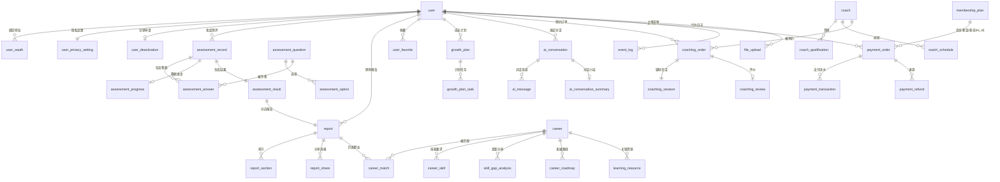

# InnerQuest 向内求索 — 数据库设计文档

> **产品**: InnerQuest 向内求索（基于 AI 的 MBTI 职业规划与辅导平台）
> **定位**: 测评 + 规划 + 辅导 三位一体
> **版本**: v1.0  ·  **日期**: 2026-07-05  ·  **状态**: 设计稿
> **配套文件**: `产品分析报告-MBTI职业规划网页产品.md`、`前端页面清单与路由文档.md`

---

## 目录

1. [技术选型建议](#1-技术选型建议)
2. [实体与关系概览（ER）](#2-实体与关系概览er)
3. [数据库设计通用约定](#3-数据库设计通用约定)
4. [用户体系表结构](#4-用户体系表结构)
5. [测评体系表结构](#5-测评体系表结构)
6. [报告体系表结构](#6-报告体系表结构)
7. [职业规划表结构](#7-职业规划表结构)
8. [AI 对话表结构](#8-ai-对话表结构)
9. [辅导咨询表结构](#9-辅导咨询表结构)
10. [支付订单表结构](#10-支付订单表结构)
11. [运营数据表结构](#11-运营数据表结构)
12. [索引与唯一约束汇总](#12-索引与唯一约束汇总)
13. [关键设计说明](#13-关键设计说明)

---

## 1. 技术选型建议

| 类别 | 选型 | 说明 |
|------|------|------|
| **主数据库** | **MySQL 8.0**（InnoDB） | 强事务/外键约束，适配用户、订单、支付等核心业务；生态成熟、运维成本低。字符集统一 `utf8mb4`，排序规则 `utf8mb4_0900_ai_ci` |
| **缓存 / 内存** | **Redis 7.x** | ①测评答题进度断点续答草稿（Hash，TTL 7天）②API 限流令牌桶（100次/分）③会话/登录态（String，JWT 黑名单）④并发排队队列（List/ZSet）⑤热点内容缓存（职业百科、题库） |
| **文档 / NoSQL** | **MongoDB 6.x**（可选） | AI 对话消息流（结构灵活、写多读多）、报告 JSON 内容（16 页富结构）；MVP 阶段可先用 MySQL JSON 字段，规模上量后迁移 |
| **时序 / 日志** | **ClickHouse** 或 **Elasticsearch** | 用户行为埋点日志（高写入、聚合分析），支撑 P35 数据看板的转化漏斗/留存分析；MySQL 仅存明细归档 |
| **对象存储** | **OSS / S3** | 简历附件（≤10MB，PDF/DOCX）、分享海报图片、辅导语音文件；数据库仅存 URL 与元数据 |
| **搜索引擎** | **Elasticsearch**（V1.1） | 职业百科全文检索（200+ 职业），支撑分类筛选与关键词搜索 |

### 边界能力落地建议

- **API 限流（100次/分）**：Redis 令牌桶（`Cell` / `Redis Cell` 模块或 Lua 脚本实现），Key 维度 `rate_limit:{user_id}` 与 `rate_limit:ip:{ip}`。
- **并发排队**：测评/AI 生成高峰用 Redis ZSet 排队 + 预估等待时间，网关层拦截。
- **文件上传（10MB / PDF·DOCX）**：应用层校验 MIME 与大小，`file_upload` 表记录元数据。
- **数据保留策略**：活跃用户永久；注销用户 T+30 天物理删除（定时任务扫描 `user.deactivated_at`）。

---

## 2. 实体与关系概览（ER）

### 2.1 核心实体清单（33 张表）

| 模块 | 表 |
|------|----|
| 用户体系 | `user`、`user_oauth`、`user_privacy_setting`、`user_deactivation` |
| 测评体系 | `assessment_question`、`assessment_option`、`assessment_record`、`assessment_answer`、`assessment_progress`、`assessment_result` |
| 报告体系 | `report`、`report_section`、`report_share` |
| 职业规划 | `career`、`career_skill`、`career_match`、`skill_gap_analysis`、`learning_resource`、`career_roadmap`、`user_favorite`、`growth_plan`、`growth_plan_task` |
| AI 对话 | `ai_conversation`、`ai_message`、`ai_conversation_summary` |
| 辅导咨询 | `coach`、`coach_qualification`、`coach_schedule`、`coaching_order`、`coaching_session`、`coaching_review` |
| 支付订单 | `payment_order`、`membership_plan`、`payment_transaction`、`payment_refund` |
| 运营数据 | `event_log`、`file_upload` |

### 2.2 ER 关系图（Mermaid）



### 2.3 关系要点

- `user` 是核心聚合根，几乎所有业务表通过 `user_id` 外键关联。
- 一次测评 `assessment_record` → 一份结果 `assessment_result` → 一份报告 `report`（1:1:1 链路）。
- `payment_order` 是支付聚合根，通过 `biz_type + biz_id` 多态关联完整报告解锁、辅导订单或会员套餐（会员类型 `biz_id` 指向 `membership_plan.id`）。
- 内容型实体（`assessment_question`、`career`、`learning_resource`）由运营后台维护，支持软删除与上下架。

---

## 3. 数据库设计通用约定

- **主键**：统一 `BIGINT UNSIGNED AUTO_INCREMENT`；对外暴露 ID 使用雪花/UUID 存于 `xxx_no`/`biz_no` 字段防遍历。
- **软删除**：业务表统一 `is_deleted TINYINT(1) DEFAULT 0`（0 正常 / 1 删除），配合 `deleted_at`。
- **审计字段**：所有表含 `created_at DATETIME DEFAULT CURRENT_TIMESTAMP`、`updated_at DATETIME DEFAULT CURRENT_TIMESTAMP ON UPDATE CURRENT_TIMESTAMP`。
- **金额**：统一 `DECIMAL(10,2)`，单位元；或 `BIGINT` 存分（订单表采用分，避免精度问题）。
- **枚举**：用 `TINYINT` + 注释而非 `ENUM`，便于扩展。
- **外键**：核心强一致场景（订单/支付）建立物理外键；高并发写入表（埋点/消息）用逻辑外键 + 应用层保证。

---

## 4. 用户体系表结构

```sql
-- 4.1 用户主表
CREATE TABLE `user` (
  `id`             BIGINT UNSIGNED NOT NULL AUTO_INCREMENT COMMENT '用户ID',
  `user_no`        CHAR(20)        NOT NULL COMMENT '对外用户编号(防遍历)',
  `nickname`       VARCHAR(64)     NOT NULL DEFAULT '' COMMENT '昵称',
  `avatar_url`     VARCHAR(512)    NOT NULL DEFAULT '' COMMENT '头像URL',
  `phone`          VARCHAR(20)              DEFAULT NULL COMMENT '手机号(绑定后填充)',
  `phone_country`  VARCHAR(8)      NOT NULL DEFAULT '+86' COMMENT '国际区号',
  `gender`         TINYINT         NOT NULL DEFAULT 0 COMMENT '性别:0未知 1男 2女',
  `role`           TINYINT         NOT NULL DEFAULT 1 COMMENT '角色:1普通用户 2辅导师 3管理员',
  `status`         TINYINT         NOT NULL DEFAULT 1 COMMENT '状态:1正常 2禁用 3注销中',
  `is_paid`        TINYINT(1)      NOT NULL DEFAULT 0 COMMENT '是否付费用户',
  `last_login_at`  DATETIME                 DEFAULT NULL COMMENT '最后登录时间',
  `deactivated_at` DATETIME                 DEFAULT NULL COMMENT '注销申请时间(T+30删除)',
  `is_deleted`     TINYINT(1)      NOT NULL DEFAULT 0 COMMENT '软删除:0正常 1已删除',
  `deleted_at`     DATETIME                 DEFAULT NULL COMMENT '删除时间',
  `created_at`     DATETIME        NOT NULL DEFAULT CURRENT_TIMESTAMP COMMENT '创建时间',
  `updated_at`     DATETIME        NOT NULL DEFAULT CURRENT_TIMESTAMP ON UPDATE CURRENT_TIMESTAMP COMMENT '更新时间',
  PRIMARY KEY (`id`),
  UNIQUE KEY `uk_user_no` (`user_no`),
  UNIQUE KEY `uk_phone` (`phone`, `phone_country`) COMMENT '手机号唯一(允许NULL多值)',
  KEY `idx_role_status` (`role`, `status`),
  KEY `idx_deactivated_at` (`deactivated_at`) COMMENT '支撑注销清理定时任务',
  KEY `idx_created_at` (`created_at`)
) ENGINE=InnoDB DEFAULT CHARSET=utf8mb4 COMMENT='用户主表';

-- 4.2 第三方授权表(微信等,支持多渠道绑定)
CREATE TABLE `user_oauth` (
  `id`          BIGINT UNSIGNED NOT NULL AUTO_INCREMENT,
  `user_id`     BIGINT UNSIGNED NOT NULL COMMENT '用户ID',
  `provider`    TINYINT         NOT NULL COMMENT '渠道:1微信 2微信小程序 3手机号',
  `open_id`     VARCHAR(128)    NOT NULL COMMENT '渠道唯一标识openid',
  `union_id`    VARCHAR(128)             DEFAULT NULL COMMENT '微信unionid',
  `access_data` JSON                     DEFAULT NULL COMMENT '授权原始数据',
  `created_at`  DATETIME        NOT NULL DEFAULT CURRENT_TIMESTAMP,
  `updated_at`  DATETIME        NOT NULL DEFAULT CURRENT_TIMESTAMP ON UPDATE CURRENT_TIMESTAMP,
  PRIMARY KEY (`id`),
  UNIQUE KEY `uk_provider_openid` (`provider`, `open_id`) COMMENT '同渠道openid唯一',
  KEY `idx_user_id` (`user_id`),
  KEY `idx_union_id` (`union_id`),
  CONSTRAINT `fk_oauth_user` FOREIGN KEY (`user_id`) REFERENCES `user` (`id`)
) ENGINE=InnoDB DEFAULT CHARSET=utf8mb4 COMMENT='用户第三方授权表';

-- 4.3 隐私设置表(与user 1:1)
CREATE TABLE `user_privacy_setting` (
  `id`                  BIGINT UNSIGNED NOT NULL AUTO_INCREMENT,
  `user_id`             BIGINT UNSIGNED NOT NULL COMMENT '用户ID',
  `profile_public`      TINYINT(1)      NOT NULL DEFAULT 0 COMMENT '资料是否公开',
  `report_shareable`    TINYINT(1)      NOT NULL DEFAULT 1 COMMENT '报告是否允许分享',
  `allow_recommend`     TINYINT(1)      NOT NULL DEFAULT 1 COMMENT '允许个性化推荐',
  `allow_data_analysis` TINYINT(1)      NOT NULL DEFAULT 1 COMMENT '允许数据分析',
  `push_notification`   TINYINT(1)      NOT NULL DEFAULT 1 COMMENT '接收推送通知',
  `created_at`          DATETIME        NOT NULL DEFAULT CURRENT_TIMESTAMP,
  `updated_at`          DATETIME    NOT NULL DEFAULT CURRENT_TIMESTAMP ON UPDATE CURRENT_TIMESTAMP,
  PRIMARY KEY (`id`),
  UNIQUE KEY `uk_user_id` (`user_id`) COMMENT '一用户一份隐私设置',
  CONSTRAINT `fk_privacy_user` FOREIGN KEY (`user_id`) REFERENCES `user` (`id`)
) ENGINE=InnoDB DEFAULT CHARSET=utf8mb4 COMMENT='用户隐私设置表';

-- 4.4 账号注销申请表
CREATE TABLE `user_deactivation` (
  `id`             BIGINT UNSIGNED NOT NULL AUTO_INCREMENT,
  `user_id`        BIGINT UNSIGNED NOT NULL COMMENT '用户ID',
  `reason`         VARCHAR(255)             DEFAULT NULL COMMENT '注销原因',
  `status`         TINYINT         NOT NULL DEFAULT 1 COMMENT '状态:1冷静期 2已撤销 3已删除',
  `apply_at`       DATETIME        NOT NULL COMMENT '申请时间',
  `purge_at`       DATETIME        NOT NULL COMMENT '计划物理删除时间(apply+30天)',
  `cancelled_at`   DATETIME                 DEFAULT NULL COMMENT '撤销时间',
  `created_at`     DATETIME        NOT NULL DEFAULT CURRENT_TIMESTAMP,
  `updated_at`     DATETIME        NOT NULL DEFAULT CURRENT_TIMESTAMP ON UPDATE CURRENT_TIMESTAMP,
  PRIMARY KEY (`id`),
  KEY `idx_user_id` (`user_id`),
  KEY `idx_status_purge` (`status`, `purge_at`) COMMENT '支撑清理任务扫描',
  CONSTRAINT `fk_deact_user` FOREIGN KEY (`user_id`) REFERENCES `user` (`id`)
) ENGINE=InnoDB DEFAULT CHARSET=utf8mb4 COMMENT='账号注销申请表';
```

---

## 5. 测评体系表结构

```sql
-- 5.1 测评题目表(运营维护,支持上下架)
CREATE TABLE `assessment_question` (
  `id`          BIGINT UNSIGNED NOT NULL AUTO_INCREMENT,
  `version`     VARCHAR(16)     NOT NULL DEFAULT 'v1' COMMENT '题库版本',
  `dimension`   TINYINT         NOT NULL COMMENT '维度:1 EI 2 SN 3 TF 4 JP',
  `content`     VARCHAR(512)    NOT NULL COMMENT '题干',
  `sort_order`  INT             NOT NULL DEFAULT 0 COMMENT '题目排序',
  `is_reverse`  TINYINT(1)      NOT NULL DEFAULT 0 COMMENT '是否反向计分题',
  `status`      TINYINT         NOT NULL DEFAULT 1 COMMENT '状态:1上架 2下架',
  `is_deleted`  TINYINT(1)      NOT NULL DEFAULT 0,
  `deleted_at`  DATETIME                 DEFAULT NULL,
  `created_at`  DATETIME        NOT NULL DEFAULT CURRENT_TIMESTAMP,
  `updated_at`  DATETIME        NOT NULL DEFAULT CURRENT_TIMESTAMP ON UPDATE CURRENT_TIMESTAMP,
  PRIMARY KEY (`id`),
  KEY `idx_version_status_sort` (`version`, `status`, `sort_order`) COMMENT '拉取上架题目',
  KEY `idx_dimension` (`dimension`)
) ENGINE=InnoDB DEFAULT CHARSET=utf8mb4 COMMENT='测评题目表';

-- 5.2 题目选项表(选项映射维度倾向)
CREATE TABLE `assessment_option` (
  `id`           BIGINT UNSIGNED NOT NULL AUTO_INCREMENT,
  `question_id`  BIGINT UNSIGNED NOT NULL COMMENT '题目ID',
  `content`      VARCHAR(255)    NOT NULL COMMENT '选项文案',
  `option_key`   VARCHAR(8)      NOT NULL COMMENT '选项标识A/B',
  `polarity`     TINYINT         NOT NULL COMMENT '倾向极性:1正向(E/S/T/J) 2负向(I/N/F/P)',
  `score`        TINYINT         NOT NULL DEFAULT 1 COMMENT '权重分',
  `sort_order`   INT             NOT NULL DEFAULT 0,
  `created_at`   DATETIME        NOT NULL DEFAULT CURRENT_TIMESTAMP,
  `updated_at`   DATETIME        NOT NULL DEFAULT CURRENT_TIMESTAMP ON UPDATE CURRENT_TIMESTAMP,
  PRIMARY KEY (`id`),
  UNIQUE KEY `uk_question_key` (`question_id`, `option_key`) COMMENT '同题选项标识唯一',
  KEY `idx_question_id` (`question_id`),
  CONSTRAINT `fk_option_question` FOREIGN KEY (`question_id`) REFERENCES `assessment_question` (`id`)
) ENGINE=InnoDB DEFAULT CHARSET=utf8mb4 COMMENT='测评题目选项表';

-- 5.3 测评记录表(一次完整测评)
CREATE TABLE `assessment_record` (
  `id`               BIGINT UNSIGNED NOT NULL AUTO_INCREMENT,
  `record_no`        CHAR(24)        NOT NULL COMMENT '对外测评编号',
  `user_id`          BIGINT UNSIGNED NOT NULL COMMENT '用户ID',
  `question_version` VARCHAR(16)     NOT NULL COMMENT '所用题库版本',
  `total_questions`  SMALLINT        NOT NULL DEFAULT 60 COMMENT '题目总数(≤150)',
  `status`           TINYINT         NOT NULL DEFAULT 1 COMMENT '状态:1进行中 2已完成 3已废弃',
  `started_at`       DATETIME        NOT NULL COMMENT '开始时间',
  `submitted_at`     DATETIME                 DEFAULT NULL COMMENT '提交时间',
  `is_deleted`       TINYINT(1)      NOT NULL DEFAULT 0,
  `deleted_at`       DATETIME                 DEFAULT NULL,
  `created_at`       DATETIME        NOT NULL DEFAULT CURRENT_TIMESTAMP,
  `updated_at`       DATETIME        NOT NULL DEFAULT CURRENT_TIMESTAMP ON UPDATE CURRENT_TIMESTAMP,
  PRIMARY KEY (`id`),
  UNIQUE KEY `uk_record_no` (`record_no`),
  KEY `idx_user_status_created` (`user_id`, `status`, `created_at`) COMMENT '历史记录列表',
  CONSTRAINT `fk_record_user` FOREIGN KEY (`user_id`) REFERENCES `user` (`id`)
) ENGINE=InnoDB DEFAULT CHARSET=utf8mb4 COMMENT='测评记录表';

-- 5.4 答题明细表
CREATE TABLE `assessment_answer` (
  `id`           BIGINT UNSIGNED NOT NULL AUTO_INCREMENT,
  `record_id`    BIGINT UNSIGNED NOT NULL COMMENT '测评记录ID',
  `user_id`      BIGINT UNSIGNED NOT NULL COMMENT '用户ID(冗余便于分片)',
  `question_id`  BIGINT UNSIGNED NOT NULL COMMENT '题目ID',
  `option_id`    BIGINT UNSIGNED NOT NULL COMMENT '所选选项ID',
  `answered_at`  DATETIME        NOT NULL DEFAULT CURRENT_TIMESTAMP COMMENT '作答时间',
  PRIMARY KEY (`id`),
  UNIQUE KEY `uk_record_question` (`record_id`, `question_id`) COMMENT '同记录一题一答',
  KEY `idx_user_id` (`user_id`),
  CONSTRAINT `fk_answer_record` FOREIGN KEY (`record_id`) REFERENCES `assessment_record` (`id`)
) ENGINE=InnoDB DEFAULT CHARSET=utf8mb4 COMMENT='答题明细表';

-- 5.5 答题进度表(断点续答,MySQL持久化;实时草稿在Redis)
CREATE TABLE `assessment_progress` (
  `id`                BIGINT UNSIGNED NOT NULL AUTO_INCREMENT,
  `record_id`         BIGINT UNSIGNED NOT NULL COMMENT '测评记录ID',
  `user_id`           BIGINT UNSIGNED NOT NULL COMMENT '用户ID',
  `answered_count`    SMALLINT        NOT NULL DEFAULT 0 COMMENT '已答题数',
  `current_question`  SMALLINT        NOT NULL DEFAULT 1 COMMENT '当前题号',
  `draft_answers`     JSON                     DEFAULT NULL COMMENT '草稿答案快照',
  `last_saved_at`     DATETIME        NOT NULL DEFAULT CURRENT_TIMESTAMP COMMENT '最后保存时间',
  `created_at`        DATETIME        NOT NULL DEFAULT CURRENT_TIMESTAMP,
  `updated_at`        DATETIME        NOT NULL DEFAULT CURRENT_TIMESTAMP ON UPDATE CURRENT_TIMESTAMP,
  PRIMARY KEY (`id`),
  UNIQUE KEY `uk_record_id` (`record_id`) COMMENT '一条记录一份进度',
  KEY `idx_user_id` (`user_id`),
  CONSTRAINT `fk_progress_record` FOREIGN KEY (`record_id`) REFERENCES `assessment_record` (`id`)
) ENGINE=InnoDB DEFAULT CHARSET=utf8mb4 COMMENT='答题进度表';

-- 5.6 测评结果表(4维度得分+16类型)
CREATE TABLE `assessment_result` (
  `id`          BIGINT UNSIGNED NOT NULL AUTO_INCREMENT,
  `record_id`   BIGINT UNSIGNED NOT NULL COMMENT '测评记录ID',
  `user_id`     BIGINT UNSIGNED NOT NULL COMMENT '用户ID',
  `mbti_type`   CHAR(4)         NOT NULL COMMENT 'MBTI类型如ENFJ',
  `score_ei`    DECIMAL(5,2)    NOT NULL COMMENT 'E-I维度得分(0-100,偏E)',
  `score_sn`    DECIMAL(5,2)    NOT NULL COMMENT 'S-N维度得分',
  `score_tf`    DECIMAL(5,2)    NOT NULL COMMENT 'T-F维度得分',
  `score_jp`    DECIMAL(5,2)    NOT NULL COMMENT 'J-P维度得分',
  `type_group`  TINYINT         NOT NULL COMMENT '类型大类:1分析家NT 2外交官NF 3守护者SJ 4探险家SP',
  `is_abnormal` TINYINT(1)      NOT NULL DEFAULT 0 COMMENT '分数异常标记(人工复核)',
  `created_at`  DATETIME        NOT NULL DEFAULT CURRENT_TIMESTAMP,
  `updated_at`  DATETIME        NOT NULL DEFAULT CURRENT_TIMESTAMP ON UPDATE CURRENT_TIMESTAMP,
  PRIMARY KEY (`id`),
  UNIQUE KEY `uk_record_id` (`record_id`) COMMENT '一记录一结果',
  KEY `idx_user_type` (`user_id`, `mbti_type`),
  KEY `idx_mbti_type` (`mbti_type`) COMMENT '类型分布统计',
  CONSTRAINT `fk_result_record` FOREIGN KEY (`record_id`) REFERENCES `assessment_record` (`id`)
) ENGINE=InnoDB DEFAULT CHARSET=utf8mb4 COMMENT='测评结果表';
```

---

## 6. 报告体系表结构

```sql
-- 6.1 报告主表(基础/完整报告)
CREATE TABLE `report` (
  `id`            BIGINT UNSIGNED NOT NULL AUTO_INCREMENT,
  `report_no`     CHAR(24)        NOT NULL COMMENT '对外报告编号',
  `user_id`       BIGINT UNSIGNED NOT NULL COMMENT '用户ID',
  `result_id`     BIGINT UNSIGNED NOT NULL COMMENT '测评结果ID',
  `report_type`   TINYINT         NOT NULL DEFAULT 1 COMMENT '类型:1基础报告 2完整报告(付费16页)',
  `mbti_type`     CHAR(4)         NOT NULL COMMENT 'MBTI类型(冗余)',
  `status`        TINYINT         NOT NULL DEFAULT 1 COMMENT '状态:1生成中 2已生成 3已过期 4生成失败',
  `is_unlocked`   TINYINT(1)      NOT NULL DEFAULT 0 COMMENT '完整报告是否已付费解锁',
  `order_id`      BIGINT UNSIGNED          DEFAULT NULL COMMENT '解锁订单ID',
  `summary`       JSON                     DEFAULT NULL COMMENT '报告摘要结构(基础报告内容)',
  `generated_at`  DATETIME                 DEFAULT NULL COMMENT '生成完成时间',
  `expire_at`     DATETIME                 DEFAULT NULL COMMENT '过期时间',
  `is_deleted`    TINYINT(1)      NOT NULL DEFAULT 0,
  `deleted_at`    DATETIME                 DEFAULT NULL,
  `created_at`    DATETIME        NOT NULL DEFAULT CURRENT_TIMESTAMP,
  `updated_at`    DATETIME        NOT NULL DEFAULT CURRENT_TIMESTAMP ON UPDATE CURRENT_TIMESTAMP,
  PRIMARY KEY (`id`),
  UNIQUE KEY `uk_report_no` (`report_no`),
  KEY `idx_user_type_created` (`user_id`, `report_type`, `created_at`) COMMENT '报告列表+每日限额统计',
  KEY `idx_result_id` (`result_id`),
  CONSTRAINT `fk_report_result` FOREIGN KEY (`result_id`) REFERENCES `assessment_result` (`id`)
) ENGINE=InnoDB DEFAULT CHARSET=utf8mb4 COMMENT='报告主表';

-- 6.2 报告章节表(完整报告16页)
CREATE TABLE `report_section` (
  `id`          BIGINT UNSIGNED NOT NULL AUTO_INCREMENT,
  `report_id`   BIGINT UNSIGNED NOT NULL COMMENT '报告ID',
  `section_key` VARCHAR(32)     NOT NULL COMMENT '章节标识如personality/career',
  `title`       VARCHAR(128)    NOT NULL COMMENT '章节标题',
  `content`     JSON            NOT NULL COMMENT '章节内容(富结构)',
  `sort_order`  INT             NOT NULL DEFAULT 0 COMMENT '章节顺序',
  `created_at`  DATETIME        NOT NULL DEFAULT CURRENT_TIMESTAMP,
  `updated_at`  DATETIME        NOT NULL DEFAULT CURRENT_TIMESTAMP ON UPDATE CURRENT_TIMESTAMP,
  PRIMARY KEY (`id`),
  UNIQUE KEY `uk_report_section` (`report_id`, `section_key`) COMMENT '同报告章节唯一',
  KEY `idx_report_sort` (`report_id`, `sort_order`),
  CONSTRAINT `fk_section_report` FOREIGN KEY (`report_id`) REFERENCES `report` (`id`)
) ENGINE=InnoDB DEFAULT CHARSET=utf8mb4 COMMENT='报告章节表';

-- 6.3 报告分享表(海报)
CREATE TABLE `report_share` (
  `id`           BIGINT UNSIGNED NOT NULL AUTO_INCREMENT,
  `report_id`    BIGINT UNSIGNED NOT NULL COMMENT '报告ID',
  `user_id`      BIGINT UNSIGNED NOT NULL COMMENT '分享��用户ID',
  `share_code`   CHAR(16)        NOT NULL COMMENT '分享短码',
  `poster_url`   VARCHAR(512)             DEFAULT NULL COMMENT '海报图URL',
  `channel`      TINYINT                  DEFAULT NULL COMMENT '渠道:1微信 2朋友圈 3链接',
  `view_count`   INT             NOT NULL DEFAULT 0 COMMENT '浏览量',
  `expire_at`    DATETIME                 DEFAULT NULL COMMENT '分享过期时间',
  `created_at`   DATETIME        NOT NULL DEFAULT CURRENT_TIMESTAMP,
  `updated_at`   DATETIME        NOT NULL DEFAULT CURRENT_TIMESTAMP ON UPDATE CURRENT_TIMESTAMP,
  PRIMARY KEY (`id`),
  UNIQUE KEY `uk_share_code` (`share_code`),
  KEY `idx_report_id` (`report_id`),
  KEY `idx_user_id` (`user_id`),
  CONSTRAINT `fk_share_report` FOREIGN KEY (`report_id`) REFERENCES `report` (`id`)
) ENGINE=InnoDB DEFAULT CHARSET=utf8mb4 COMMENT='报告分享表';
```

---

## 7. 职业规划表结构

```sql
-- 7.1 职业百科表(200+职业,运营维护)
CREATE TABLE `career` (
  `id`             BIGINT UNSIGNED NOT NULL AUTO_INCREMENT,
  `career_code`    VARCHAR(32)     NOT NULL COMMENT '职业编码',
 `name`           VARCHAR(64)     NOT NULL COMMENT '职业名称',
  `category`       VARCHAR(32)     NOT NULL COMMENT '职业分类',
  `description`    TEXT                     DEFAULT NULL COMMENT '职业简介',
  `responsibility` TEXT                     DEFAULT NULL COMMENT '岗位职责',
  `salary_min`     INT                      DEFAULT NULL COMMENT '薪资下限(元/月)',
  `salary_max`     INT                      DEFAULT NULL COMMENT '薪资上限(元/月)',
  `prospect`       TEXT                     DEFAULT NULL COMMENT '发展前景',
  `suit_types`     VARCHAR(128)             DEFAULT NULL COMMENT '适配MBTI类型(逗号分隔)',
  `status`         TINYINT         NOT NULL DEFAULT 1 COMMENT '状态:1上架 2下架',
  `is_deleted`     TINYINT(1)    NOT NULL DEFAULT 0,
  `deleted_at`     DATETIME                 DEFAULT NULL,
  `created_at`     DATETIME        NOT NULL DEFAULT CURRENT_TIMESTAMP,
  `updated_at`     DATETIME        NOT NULL DEFAULT CURRENT_TIMESTAMP ON UPDATE CURRENT_TIMESTAMP,
  PRIMARY KEY (`id`),
  UNIQUE KEY `uk_career_code` (`career_code`),
  KEY `idx_category_status` (`category`, `status`),
  FULLTEXT KEY `ft_name_desc` (`name`, `description`) COMMENT '全文检索(或走ES)'
) ENGINE=InnoDB DEFAULT CHARSET=utf8mb4 COMMENT='职业百科表';

-- 7.2 职业技能要求表
CREATE TABLE `career_skill` (
  `id`           BIGINT UNSIGNED NOT NULL AUTO_INCREMENT,
  `career_id`    BIGINT UNSIGNED NOT NULL COMMENT '职业ID',
  `skill_name`   VARCHAR(64)     NOT NULL COMMENT '技能名称',
  `skill_type`   TINYINT    NOT NULL DEFAULT 1 COMMENT '类型:1硬技能 2软技能',
  `require_level` TINYINT        NOT NULL DEFAULT 3 COMMENT '要求等级1-5',
  `weight`       DECIMAL(4,2)    NOT NULL DEFAULT 1.00 COMMENT '权重',
  `created_at`   DATETIME        NOT NULL DEFAULT CURRENT_TIMESTAMP,
  `updated_at`   DATETIME        NOT NULL DEFAULT CURRENT_TIMESTAMP ON UPDATE CURRENT_TIMESTAMP,
  PRIMARY KEY (`id`),
  UNIQUE KEY `uk_career_skill` (`career_id`, `skill_name`),
  KEY `idx_career_id` (`career_id`),
  CONSTRAINT `fk_skill_career` FOREIGN KEY (`career_id`) REFERENCES `career` (`id`)
) ENGINE=InnoDB DEFAULT CHARSET=utf8mb4 COMMENT='职业技能要求表';

-- 7.3 AI职业匹配结果表(TOP10/TOP20)
CREATE TABLE `career_match` (
  `id`           BIGINT UNSIGNED NOT NULL AUTO_INCREMENT,
  `user_id`      BIGINT UNSIGNED NOT NULL COMMENT '用户ID',
  `report_id`    BIGINT UNSIGNED NOT NULL COMMENT '关联报告ID',
  `career_id`    BIGINT UNSIGNED NOT NULL COMMENT '职业ID',
  `match_score`  DECIMAL(5,2)    NOT NULL COMMENT '匹配度0-100',
  `rank_no`      SMALLINT        NOT NULL COMMENT '排名',
  `match_reason` JSON                     DEFAULT NULL COMMENT 'AI匹配理由',
  `created_at`   DATETIME        NOT NULL DEFAULT CURRENT_TIMESTAMP,
  `updated_at`   DATETIME        NOT NULL DEFAULT CURRENT_TIMESTAMP ON UPDATE CURRENT_TIMESTAMP,
  PRIMARY KEY (`id`),
  UNIQUE KEY `uk_report_career` (`report_id`, `career_id`) COMMENT '同报告职业唯一',
  KEY `idx_report_rank` (`report_id`, `rank_no`) COMMENT '按排名取TOPN',
  KEY `idx_user_id` (`user_id`),
  CONSTRAINT `fk_match_report` FOREIGN KEY (`report_id`) REFERENCES `report` (`id`),
  CONSTRAINT `fk_match_career` FOREIGN KEY (`career_id`) REFERENCES `career` (`id`)
) ENGINE=InnoDB DEFAULT CHARSET=utf8mb4 COMMENT='AI职业匹配结果表';

-- 7.4 技能差距分析表
CREATE TABLE `skill_gap_analysis` (
  `id`           BIGINT UNSIGNED NOT NULL AUTO_INCREMENT,
  `user_id`      BIGINT UNSIGNED NOT NULL COMMENT '用户ID',
  `career_id`    BIGINT UNSIGNED NOT NULL COMMENT '目标职业ID',
  `skill_name`   VARCHAR(64)     NOT NULL COMMENT '技能名称',
  `require_level` TINYINT        NOT NULL COMMENT '目标要求等级',
  `current_level` TINYINT        NOT NULL DEFAULT 0 COMMENT '用户当前等级',
  `gap_level`    TINYINT         NOT NULL COMMENT '差距值',
  `suggestion`   VARCHAR(512)             DEFAULT NULL COMMENT '提升建议',
  `created_at`   DATETIME        NOT NULL DEFAULT CURRENT_TIMESTAMP,
  `updated_at`   DATETIME        NOT NULL DEFAULT CURRENT_TIMESTAMP ON UPDATE CURRENT_TIMESTAMP,
  PRIMARY KEY (`id`),
  KEY `idx_user_career` (`user_id`, `career_id`),
  CONSTRAINT `fk_gap_career` FOREIGN KEY (`career_id`) REFERENCES `career` (`id`)
) ENGINE=InnoDB DEFAULT CHARSET=utf8mb4 COMMENT='技能差距分析表';

-- 7.5 学习资源表(运营维护)
CREATE TABLE `learning_resource` (
  `id`           BIGINT UNSIGNED NOT NULL AUTO_INCREMENT,
  `title`        VARCHAR(128)    NOT NULL COMMENT '资源标题',
  `resource_type` TINYINT        NOT NULL COMMENT '类型:1课程 2书籍 3文章 4视频',
  `url`          VARCHAR(512)             DEFAULT NULL COMMENT '资源链接',
  `skill_tags`   VARCHAR(255)             DEFAULT NULL COMMENT '关联技能标签(逗号分隔)',
  `career_id`    BIGINT UNSIGNED          DEFAULT NULL COMMENT '关联职业(可空)',
  `provider`     VARCHAR(64)              DEFAULT NULL COMMENT '资源提供方',
  `status`       TINYINT         NOT NULL DEFAULT 1 COMMENT '状态:1上架 2下架',
  `is_deleted`   TINYINT(1)      NOT NULL DEFAULT 0,
  `deleted_at`   DATETIME                 DEFAULT NULL,
  `created_at`   DATETIME        NOT NULL DEFAULT CURRENT_TIMESTAMP,
  `updated_at`   DATETIME        NOT NULL DEFAULT CURRENT_TIMESTAMP ON UPDATE CURRENT_TIMESTAMP,
  PRIMARY KEY (`id`),
  KEY `idx_career_status` (`career_id`, `status`),
  KEY `idx_type_status` (`resource_type`, `status`)
) ENGINE=InnoDB DEFAULT CHARSET=utf8mb4 COMMENT='学习资源表';

-- 7.6 职业发展路线图表
CREATE TABLE `career_roadmap` (
  `id`           BIGINT UNSIGNED NOT NULL AUTO_INCREMENT,
  `career_id`    BIGINT UNSIGNED NOT NULL COMMENT '职业ID',
  `stage_no`     TINYINT         NOT NULL COMMENT '阶段序号',
  `stage_name`   VARCHAR(64)     NOT NULL COMMENT '阶段名称(如入门/进阶)',
  `duration`     VARCHAR(32)              DEFAULT NULL COMMENT '预估时长',
  `milestones`   JSON                     DEFAULT NULL COMMENT '里程碑与行动项',
  `created_at`   DATETIME        NOT NULL DEFAULT CURRENT_TIMESTAMP,
  `updated_at`   DATETIME        NOT NULL DEFAULT CURRENT_TIMESTAMP ON UPDATE CURRENT_TIMESTAMP,
  PRIMARY KEY (`id`),
  UNIQUE KEY `uk_career_stage` (`career_id`, `stage_no`),
  CONSTRAINT `fk_roadmap_career` FOREIGN KEY (`career_id`) REFERENCES `career` (`id`)
) ENGINE=InnoDB DEFAULT CHARSET=utf8mb4 COMMENT='职业发展路线图表';

-- 7.7 用户收藏表(职业/资源)
CREATE TABLE `user_favorite` (
  `id`          BIGINT UNSIGNED NOT NULL AUTO_INCREMENT,
  `user_id`     BIGINT UNSIGNED NOT NULL COMMENT '用户ID',
  `target_type` TINYINT         NOT NULL COMMENT '类型:1职业 2学习资源',
  `target_id`   BIGINT UNSIGNED NOT NULL COMMENT '目标ID',
  `created_at`  DATETIME        NOT NULL DEFAULT CURRENT_TIMESTAMP,
  PRIMARY KEY (`id`),
  UNIQUE KEY `uk_user_target` (`user_id`, `target_type`, `target_id`) COMMENT '防重复收藏',
  KEY `idx_user_type` (`user_id`, `target_type`)
) ENGINE=InnoDB DEFAULT CHARSET=utf8mb4 COMMENT='用户收藏表';

-- 7.8 成长计划表
CREATE TABLE `growth_plan` (
  `id`           BIGINT UNSIGNED NOT NULL AUTO_INCREMENT,
  `user_id`      BIGINT UNSIGNED NOT NULL COMMENT '用户ID',
  `title`        VARCHAR(128)    NOT NULL COMMENT '计划标题',
  `career_id`    BIGINT UNSIGNED          DEFAULT NULL COMMENT '目标职业',
  `status`       TINYINT         NOT NULL DEFAULT 1 COMMENT '状态:1进行中 2已完成 3已放弃',
  `progress`     TINYINT         NOT NULL DEFAULT 0 COMMENT '完成进度%',
  `is_deleted`   TINYINT(1)      NOT NULL DEFAULT 0,
  `deleted_at`   DATETIME                 DEFAULT NULL,
  `created_at`   DATETIME        NOT NULL DEFAULT CURRENT_TIMESTAMP,
  `updated_at`   DATETIME        NOT NULL DEFAULT CURRENT_TIMESTAMP ON UPDATE CURRENT_TIMESTAMP,
  PRIMARY KEY (`id`),
  KEY `idx_user_status` (`user_id`, `status`),
  CONSTRAINT `fk_plan_user` FOREIGN KEY (`user_id`) REFERENCES `user` (`id`)
) ENGINE=InnoDB DEFAULT CHARSET=utf8mb4 COMMENT='成长计划表';

-- 7.9 成长计划任务表
CREATE TABLE `growth_plan_task` (
  `id`           BIGINT UNSIGNED NOT NULL AUTO_INCREMENT,
  `plan_id`      BIGINT UNSIGNED NOT NULL COMMENT '计划ID',
  `content`      VARCHAR(255)    NOT NULL COMMENT '任务内容',
  `resource_id`  BIGINT UNSIGNED          DEFAULT NULL COMMENT '关联学习资源',
  `is_done`      TINYINT(1)      NOT NULL DEFAULT 0 COMMENT '是否完成',
  `done_at`      DATETIME                 DEFAULT NULL COMMENT '完成打卡时间',
  `sort_order`   INT             NOT NULL DEFAULT 0,
  `created_at`   DATETIME        NOT NULL DEFAULT CURRENT_TIMESTAMP,
  `updated_at`   DATETIME        NOT NULL DEFAULT CURRENT_TIMESTAMP ON UPDATE CURRENT_TIMESTAMP,
  PRIMARY KEY (`id`),
  KEY `idx_plan_id` (`plan_id`, `sort_order`),
  CONSTRAINT `fk_task_plan` FOREIGN KEY (`plan_id`) REFERENCES `growth_plan` (`id`)
) ENGINE=InnoDB DEFAULT CHARSET=utf8mb4 COMMENT='成长计划任务表';
```

---

## 8. AI 对话表结构

> **存储策略**：会话元数据存 MySQL（便于列表/统计/权限控制）；海量消息正文存 **MongoDB**（`ai_message` 表在 MySQL 仅保留摘要索引，正文 `content` 冷数据可迁移）。单次会话轮次 `≤ 50` 由 `round_count` 字段约束。

### 8.1 `ai_conversation` — AI 对话会话表

```sql
CREATE TABLE `ai_conversation` (
  `id`            BIGINT UNSIGNED NOT NULL AUTO_INCREMENT,
  `conv_no`       CHAR(32)        NOT NULL COMMENT '对外会话编号(UUID防遍历)',
  `user_id`       BIGINT UNSIGNED NOT NULL COMMENT '所属用户',
  `scene`         TINYINT         NOT NULL DEFAULT 1 COMMENT '场景:1报告解读 2职业咨询 3自由对话',
  `biz_type`      TINYINT                  DEFAULT NULL COMMENT '关联业务:1报告 2职业',
  `biz_id`        BIGINT UNSIGNED          DEFAULT NULL COMMENT '关联业务ID',
  `title`         VARCHAR(128)             DEFAULT NULL COMMENT '会话标题(取首条摘要)',
  `round_count`   SMALLINT UNSIGNED NOT NULL DEFAULT 0 COMMENT '已进行轮次(上限50)',
  `max_round`     SMALLINT UNSIGNED NOT NULL DEFAULT 50 COMMENT '最大轮次上限',
  `token_used`    INT UNSIGNED    NOT NULL DEFAULT 0 COMMENT '累计消耗token',
  `status`        TINYINT         NOT NULL DEFAULT 1 COMMENT '状态:1进行中 2已结束 3已达上限',
  `last_msg_at`   DATETIME                 DEFAULT NULL COMMENT '最后消息时间',
  `is_deleted`    TINYINT(1)      NOT NULL DEFAULT 0,
  `deleted_at`    DATETIME                 DEFAULT NULL,
  `created_at`    DATETIME        NOT NULL DEFAULT CURRENT_TIMESTAMP,
  `updated_at`    DATETIME        NOT NULL DEFAULT CURRENT_TIMESTAMP ON UPDATE CURRENT_TIMESTAMP,
  PRIMARY KEY (`id`),
  UNIQUE KEY `uk_conv_no` (`conv_no`),
  KEY `idx_user_scene` (`user_id`, `scene`, `last_msg_at`),
  KEY `idx_biz` (`biz_type`, `biz_id`)
) ENGINE=InnoDB DEFAULT CHARSET=utf8mb4 COMMENT='AI对话会话表';
```

### 8.2 `ai_message` — AI 对话消息表

> 正文建议落 MongoDB；若用 MySQL，`content` 用 `MEDIUMTEXT`，并按 `conversation_id` 归档冷数据。

```sql
CREATE TABLE `ai_message` (
  `id`              BIGINT UNSIGNED NOT NULL AUTO_INCREMENT,
  `conversation_id` BIGINT UNSIGNED NOT NULL COMMENT '会话ID',
  `user_id`         BIGINT UNSIGNED NOT NULL COMMENT '冗余用户ID(便于分片/查询)',
  `round_no`        SMALLINT UNSIGNED NOT NULL COMMENT '轮次序号',
  `role`            TINYINT         NOT NULL COMMENT '角色:1用户 2AI助手 3系统',
  `content`         MEDIUMTEXT      NOT NULL COMMENT '消息正文',
  `token_count`     INT UNSIGNED    NOT NULL DEFAULT 0 COMMENT '本条token数',
  `model`           VARCHAR(64)              DEFAULT NULL COMMENT '模型名称',
  `feedback`        TINYINT                  DEFAULT NULL COMMENT '用户反馈:1赞 2踩',
  `is_deleted`      TINYINT(1)      NOT NULL DEFAULT 0,
  `created_at`      DATETIME        NOT NULL DEFAULT CURRENT_TIMESTAMP,
  PRIMARY KEY (`id`),
  KEY `idx_conv_round` (`conversation_id`, `round_no`),
  KEY `idx_user_time` (`user_id`, `created_at`)
) ENGINE=InnoDB DEFAULT CHARSET=utf8mb4 COMMENT='AI对话消息表';
```

### 8.3 `ai_conversation_summary` — 对话摘要表（上下文压缩）

> 当轮次增长时，将历史消息压缩为摘要注入 prompt，降低 token 成本并保持长程记忆。

```sql
CREATE TABLE `ai_conversation_summary` (
  `id`              BIGINT UNSIGNED NOT NULL AUTO_INCREMENT,
  `conversation_id` BIGINT UNSIGNED NOT NULL COMMENT '会话ID',
  `summary`         TEXT            NOT NULL COMMENT '压缩摘要内容',
  `covered_round`   SMALLINT UNSIGNED NOT NULL COMMENT '已覆盖到的轮次',
  `token_count`     INT UNSIGNED    NOT NULL DEFAULT 0,
  `created_at`      DATETIME        NOT NULL DEFAULT CURRENT_TIMESTAMP,
  `updated_at`      DATETIME        NOT NULL DEFAULT CURRENT_TIMESTAMP ON UPDATE CURRENT_TIMESTAMP,
  PRIMARY KEY (`id`),
  UNIQUE KEY `uk_conversation` (`conversation_id`),
  CONSTRAINT `fk_summary_conv` FOREIGN KEY (`conversation_id`) REFERENCES `ai_conversation` (`id`)
) ENGINE=InnoDB DEFAULT CHARSET=utf8mb4 COMMENT='AI对话摘要表';
```

---

## 9. 辅导咨询表结构

> **业务要点**：辅导师需资质审核；排期防重叠；下单后 **15 分钟未支付自动释放**时段；咨询支持文字/语音；完成后评价。

### 9.1 `coach` — 辅导师表

```sql
CREATE TABLE `coach` (
  `id`            BIGINT UNSIGNED NOT NULL AUTO_INCREMENT,
  `user_id`       BIGINT UNSIGNED NOT NULL COMMENT '关联用户账号',
  `real_name`     VARCHAR(64)     NOT NULL COMMENT '真实姓名',
  `avatar`        VARCHAR(255)             DEFAULT NULL,
  `title`         VARCHAR(128)             DEFAULT NULL COMMENT '头衔/职称',
  `intro`         VARCHAR(1000)            DEFAULT NULL COMMENT '简介',
  `expertise`     JSON                     DEFAULT NULL COMMENT '擅长领域标签',
  `price_per_hour` BIGINT UNSIGNED NOT NULL DEFAULT 0 COMMENT '每小时价格(分)',
  `rating`        DECIMAL(3,2)    NOT NULL DEFAULT 5.00 COMMENT '综合评分',
  `order_count`   INT UNSIGNED    NOT NULL DEFAULT 0 COMMENT '累计接单数',
  `audit_status`  TINYINT         NOT NULL DEFAULT 0 COMMENT '审核:0待审 1通过 2驳回',
  `status`        TINYINT         NOT NULL DEFAULT 1 COMMENT '状态:1在职 2停接单 3下线',
  `is_deleted`    TINYINT(1)      NOT NULL DEFAULT 0,
  `deleted_at`    DATETIME                 DEFAULT NULL,
  `created_at`    DATETIME        NOT NULL DEFAULT CURRENT_TIMESTAMP,
  `updated_at`    DATETIME        NOT NULL DEFAULT CURRENT_TIMESTAMP ON UPDATE CURRENT_TIMESTAMP,
  PRIMARY KEY (`id`),
  UNIQUE KEY `uk_user_id` (`user_id`),
  KEY `idx_audit_status` (`audit_status`, `status`),
  KEY `idx_rating` (`rating`)
) ENGINE=InnoDB DEFAULT CHARSET=utf8mb4 COMMENT='辅导师表';
```

### 9.2 `coach_qualification` — 辅导师资质表

```sql
CREATE TABLE `coach_qualification` (
  `id`          BIGINT UNSIGNED NOT NULL AUTO_INCREMENT,
  `coach_id`    BIGINT UNSIGNED NOT NULL COMMENT '辅导师ID',
  `cert_type`   TINYINT         NOT NULL COMMENT '证书类型:1学历 2职业资格 3培训认证',
  `cert_name`   VARCHAR(128)    NOT NULL COMMENT '证书名称',
  `cert_no`     VARCHAR(128)             DEFAULT NULL COMMENT '证书编号',
  `file_url`    VARCHAR(255)    NOT NULL COMMENT '证书文件(OSS)',
  `audit_status` TINYINT        NOT NULL DEFAULT 0 COMMENT '0待审 1通过 2驳回',
  `audit_remark` VARCHAR(255)            DEFAULT NULL,
  `created_at`  DATETIME        NOT NULL DEFAULT CURRENT_TIMESTAMP,
  `updated_at`  DATETIME        NOT NULL DEFAULT CURRENT_TIMESTAMP ON UPDATE CURRENT_TIMESTAMP,
  PRIMARY KEY (`id`),
  KEY `idx_coach_id` (`coach_id`),
  CONSTRAINT `fk_qual_coach` FOREIGN KEY (`coach_id`) REFERENCES `coach` (`id`)
) ENGINE=InnoDB DEFAULT CHARSET=utf8mb4 COMMENT='辅导师资质表';
```

### 9.3 `coach_schedule` — 辅导师排期表

> `uk_coach_slot` 唯一约束防止同一辅导师同一时段被重复排期；`status` 控制时段占用/释放。

```sql
CREATE TABLE `coach_schedule` (
  `id`          BIGINT UNSIGNED NOT NULL AUTO_INCREMENT,
  `coach_id`    BIGINT UNSIGNED NOT NULL COMMENT '辅导师ID',
  `start_time`  DATETIME        NOT NULL COMMENT '时段开始',
  `end_time`    DATETIME        NOT NULL COMMENT '时段结束',
  `status`      TINYINT         NOT NULL DEFAULT 1 COMMENT '1可预约 2锁定中 3已预约 4已关闭',
  `order_id`    BIGINT UNSIGNED          DEFAULT NULL COMMENT '占用的订单ID',
  `lock_expire_at` DATETIME              DEFAULT NULL COMMENT '锁定过期时间(15分钟)',
  `created_at`  DATETIME        NOT NULL DEFAULT CURRENT_TIMESTAMP,
  `updated_at`  DATETIME        NOT NULL DEFAULT CURRENT_TIMESTAMP ON UPDATE CURRENT_TIMESTAMP,
  PRIMARY KEY (`id`),
  UNIQUE KEY `uk_coach_slot` (`coach_id`, `start_time`),
  KEY `idx_status_time` (`status`, `start_time`),
  KEY `idx_lock_expire` (`status`, `lock_expire_at`)
) ENGINE=InnoDB DEFAULT CHARSET=utf8mb4 COMMENT='辅导师排期表';
```

### 9.4 `coaching_order` — 咨询订单表

```sql
CREATE TABLE `coaching_order` (
  `id`            BIGINT UNSIGNED NOT NULL AUTO_INCREMENT,
  `order_no`      CHAR(32)        NOT NULL COMMENT '对外订单号',
  `user_id`       BIGINT UNSIGNED NOT NULL COMMENT '下单用户',
  `coach_id`      BIGINT UNSIGNED NOT NULL COMMENT '辅导师',
  `schedule_id`   BIGINT UNSIGNED NOT NULL COMMENT '预约时段',
  `consult_type`  TINYINT         NOT NULL DEFAULT 1 COMMENT '咨询方式:1文字 2语音',
  `duration_min`  SMALLINT UNSIGNED NOT NULL DEFAULT 60 COMMENT '时长(分钟)',
  `amount`        BIGINT UNSIGNED NOT NULL COMMENT '金额(分)',
  `payment_order_id` BIGINT UNSIGNED       DEFAULT NULL COMMENT '关联支付单',
  `status`        TINYINT         NOT NULL DEFAULT 1 COMMENT '1待支付 2待咨询 3进行中 4已完成 5已取消 6已退款',
  `pay_expire_at` DATETIME                 DEFAULT NULL COMMENT '支付超时时间(15分钟)',
  `paid_at`       DATETIME                 DEFAULT NULL,
  `finished_at`   DATETIME                 DEFAULT NULL,
  `cancel_reason` VARCHAR(255)             DEFAULT NULL,
  `is_deleted`    TINYINT(1)      NOT NULL DEFAULT 0,
  `deleted_at`    DATETIME                 DEFAULT NULL,
  `created_at`    DATETIME        NOT NULL DEFAULT CURRENT_TIMESTAMP,
  `updated_at`    DATETIME        NOT NULL DEFAULT CURRENT_TIMESTAMP ON UPDATE CURRENT_TIMESTAMP,
  PRIMARY KEY (`id`),
  UNIQUE KEY `uk_order_no` (`order_no`),
  UNIQUE KEY `uk_user_schedule` (`user_id`, `schedule_id`) COMMENT '用户+时段幂等防重复下单',
  KEY `idx_user_status` (`user_id`, `status`),
  KEY `idx_coach_status` (`coach_id`, `status`),
  KEY `idx_pay_expire` (`status`, `pay_expire_at`)
) ENGINE=InnoDB DEFAULT CHARSET=utf8mb4 COMMENT='咨询订单表';
```

### 9.5 `coaching_session` — 咨询会话表

```sql
CREATE TABLE `coaching_session` (
  `id`          BIGINT UNSIGNED NOT NULL AUTO_INCREMENT,
  `order_id`    BIGINT UNSIGNED NOT NULL COMMENT '咨询订单ID',
  `start_at`    DATETIME                 DEFAULT NULL COMMENT '实际开始',
  `end_at`      DATETIME                 DEFAULT NULL COMMENT '实际结束',
  `channel`     TINYINT         NOT NULL DEFAULT 1 COMMENT '1文字 2语音',
  `record_url`  VARCHAR(255)             DEFAULT NULL COMMENT '语音录音(OSS)',
  `msg_count`   INT UNSIGNED    NOT NULL DEFAULT 0 COMMENT '消息条数',
  `coach_note`  TEXT                     DEFAULT NULL COMMENT '辅导师备注',
  `status`      TINYINT         NOT NULL DEFAULT 1 COMMENT '1未开始 2进行中 3已结束',
  `created_at`  DATETIME        NOT NULL DEFAULT CURRENT_TIMESTAMP,
  `updated_at`  DATETIME        NOT NULL DEFAULT CURRENT_TIMESTAMP ON UPDATE CURRENT_TIMESTAMP,
  PRIMARY KEY (`id`),
  UNIQUE KEY `uk_order_id` (`order_id`),
  CONSTRAINT `fk_session_order` FOREIGN KEY (`order_id`) REFERENCES `coaching_order` (`id`)
) ENGINE=InnoDB DEFAULT CHARSET=utf8mb4 COMMENT='咨询会话表';
```

### 9.6 `coaching_review` — 咨询评价表

```sql
CREATE TABLE `coaching_review` (
  `id`          BIGINT UNSIGNED NOT NULL AUTO_INCREMENT,
  `order_id`    BIGINT UNSIGNED NOT NULL COMMENT '咨询订单ID',
  `user_id`     BIGINT UNSIGNED NOT NULL COMMENT '评价用户',
  `coach_id`    BIGINT UNSIGNED NOT NULL COMMENT '被评价辅导师',
  `rating`      TINYINT UNSIGNED NOT NULL COMMENT '评分1-5',
  `content`     VARCHAR(1000)            DEFAULT NULL COMMENT '评价内容',
  `tags`        JSON                     DEFAULT NULL COMMENT '标签',
  `is_anonymous` TINYINT(1)     NOT NULL DEFAULT 0 COMMENT '是否匿名',
  `reply`       VARCHAR(500)             DEFAULT NULL COMMENT '辅导师回复',
  `is_deleted`  TINYINT(1)      NOT NULL DEFAULT 0,
  `created_at`  DATETIME        NOT NULL DEFAULT CURRENT_TIMESTAMP,
  `updated_at`  DATETIME        NOT NULL DEFAULT CURRENT_TIMESTAMP ON UPDATE CURRENT_TIMESTAMP,
  PRIMARY KEY (`id`),
  UNIQUE KEY `uk_order_id` (`order_id`),
  KEY `idx_coach_rating` (`coach_id`, `rating`),
  CONSTRAINT `fk_review_order` FOREIGN KEY (`order_id`) REFERENCES `coaching_order` (`id`)
) ENGINE=InnoDB DEFAULT CHARSET=utf8mb4 COMMENT='咨询评价表';
```

---

## 10. 支付订单表结构

> **设计要点**：`payment_order` 采用**多态关联**（`biz_type` + `biz_id`）统一承载报告解锁 / 咨询订单 / 会员等多业务；金额一律用 `BIGINT`（单位：分）避免浮点误差；支付流水与退款单独立记账，保证对��可追溯。

### 10.1 `payment_order` — 支付订单表

```sql
CREATE TABLE `payment_order` (
  `id`            BIGINT UNSIGNED NOT NULL AUTO_INCREMENT,
  `pay_no`        CHAR(32)        NOT NULL COMMENT '对外支付单号',
  `user_id`       BIGINT UNSIGNED NOT NULL COMMENT '付款用户',
  `biz_type`      TINYINT         NOT NULL COMMENT '业务类型:1报告解锁 2咨询订单 3会员(biz_id指向membership_plan.id)',
  `biz_id`        BIGINT UNSIGNED NOT NULL COMMENT '关联业务主键(会员类型指向membership_plan.id)',
  `subject`       VARCHAR(128)    NOT NULL COMMENT '商品标题',
  `amount`        BIGINT UNSIGNED NOT NULL COMMENT '应付金额(分)',
  `paid_amount`   BIGINT UNSIGNED NOT NULL DEFAULT 0 COMMENT '实付金额(分)',
  `currency`      CHAR(3)         NOT NULL DEFAULT 'CNY' COMMENT '币种',
  `channel`       TINYINT                  DEFAULT NULL COMMENT '渠道:1微信 2支付宝 3余额',
  `status`        TINYINT         NOT NULL DEFAULT 1 COMMENT '1待支付 2已支付 3已关闭 4已退款 5部分退款',
  `expire_at`     DATETIME                 DEFAULT NULL COMMENT '支付超时时间(15分钟)',
  `paid_at`       DATETIME                 DEFAULT NULL COMMENT '支付完成时间',
  `refunded_amount` BIGINT UNSIGNED NOT NULL DEFAULT 0 COMMENT '累计退款(分)',
  `is_deleted`    TINYINT(1)      NOT NULL DEFAULT 0,
  `deleted_at`    DATETIME                 DEFAULT NULL,
  `created_at`    DATETIME        NOT NULL DEFAULT CURRENT_TIMESTAMP,
  `updated_at`    DATETIME        NOT NULL DEFAULT CURRENT_TIMESTAMP ON UPDATE CURRENT_TIMESTAMP,
  PRIMARY KEY (`id`),
  UNIQUE KEY `uk_pay_no` (`pay_no`),
  KEY `idx_user_status` (`user_id`, `status`),
  KEY `idx_biz` (`biz_type`, `biz_id`),
  KEY `idx_expire` (`status`, `expire_at`)
) ENGINE=InnoDB DEFAULT CHARSET=utf8mb4 COMMENT='支付订单表';
```

### 10.2 `membership_plan` — 会员/套餐商品表

> `payment_order.biz_type=1报告解锁 / 3会员` 的 `biz_id` 指向本表 `id`；金额一律用 `BIGINT`（单位：分��；`duration_days` 为会员有效时长（一次性报告解锁则为 `NULL`）；`benefits` 以 JSON 存储权益点，便于套餐页动态渲染。

```sql
CREATE TABLE `membership_plan` (
  `id`              BIGINT UNSIGNED NOT NULL AUTO_INCREMENT,
  `code`            VARCHAR(32)     NOT NULL COMMENT '套餐唯一标识(如 basic/pro)',
  `name`            VARCHAR(64)     NOT NULL COMMENT '套餐名称',
  `subtitle`        VARCHAR(128)             DEFAULT NULL COMMENT '副标题/卖点',
  `price`           BIGINT UNSIGNED NOT NULL COMMENT '售价(分)',
  `original_price`  BIGINT UNSIGNED          DEFAULT NULL COMMENT '划线原价(分)',
  `duration_days`   INT                      DEFAULT NULL COMMENT '会员时长(天),报告解锁为NULL',
  `plan_type`       TINYINT         NOT NULL DEFAULT 2 COMMENT '类型:1报告解锁 2会员时长 3咨询套餐',
  `benefits`        JSON                     DEFAULT NULL COMMENT '权益点列表(JSON)',
  `sort_order`      INT             NOT NULL DEFAULT 0 COMMENT '排序权重',
  `status`          TINYINT         NOT NULL DEFAULT 1 COMMENT '状态:1上架 0下架',
  `is_recommended`  TINYINT(1)      NOT NULL DEFAULT 0 COMMENT '是否推荐',
  `is_deleted`      TINYINT(1)      NOT NULL DEFAULT 0,
  `deleted_at`      DATETIME                 DEFAULT NULL,
  `created_at`      DATETIME        NOT NULL DEFAULT CURRENT_TIMESTAMP,
  `updated_at`      DATETIME        NOT NULL DEFAULT CURRENT_TIMESTAMP ON UPDATE CURRENT_TIMESTAMP,
  PRIMARY KEY (`id`),
  UNIQUE KEY `uk_code` (`code`),
  KEY `idx_status_sort` (`status`, `sort_order`)
) ENGINE=InnoDB DEFAULT CHARSET=utf8mb4 COMMENT='会员/套餐商品表';
```

### 10.3 `payment_transaction` — 支付流水表

> 记录第三方渠道回调流水，`uk_channel_trade_no` 保证幂等（同一渠道交易号仅入账一次）。

```sql
CREATE TABLE `payment_transaction` (
  `id`            BIGINT UNSIGNED NOT NULL AUTO_INCREMENT,
  `pay_order_id`  BIGINT UNSIGNED NOT NULL COMMENT '支付订单ID',
  `channel`       TINYINT         NOT NULL COMMENT '渠道:1微信 2支付宝 3余额',
  `channel_trade_no` VARCHAR(64)  NOT NULL COMMENT '第三方交易号',
  `type`          TINYINT         NOT NULL DEFAULT 1 COMMENT '1支付 2退款',
  `amount`        BIGINT UNSIGNED NOT NULL COMMENT '交易金额(分)',
  `status`        TINYINT         NOT NULL DEFAULT 1 COMMENT '1处理中 2成功 3失败',
  `raw_notify`    JSON                     DEFAULT NULL COMMENT '原始回调报文',
  `finished_at`   DATETIME                 DEFAULT NULL,
  `created_at`    DATETIME        NOT NULL DEFAULT CURRENT_TIMESTAMP,
  `updated_at`    DATETIME        NOT NULL DEFAULT CURRENT_TIMESTAMP ON UPDATE CURRENT_TIMESTAMP,
  PRIMARY KEY (`id`),
  UNIQUE KEY `uk_channel_trade_no` (`channel`, `channel_trade_no`),
  KEY `idx_pay_order` (`pay_order_id`),
  CONSTRAINT `fk_trans_order` FOREIGN KEY (`pay_order_id`) REFERENCES `payment_order` (`id`)
) ENGINE=InnoDB DEFAULT CHARSET=utf8mb4 COMMENT='支付流水表';
```

### 10.4 `payment_refund` — 退款单表

```sql
CREATE TABLE `payment_refund` (
  `id`            BIGINT UNSIGNED NOT NULL AUTO_INCREMENT,
  `refund_no`     CHAR(32)        NOT NULL COMMENT '对外退款单号',
  `pay_order_id`  BIGINT UNSIGNED NOT NULL COMMENT '原支付订单ID',
  `user_id`       BIGINT UNSIGNED NOT NULL COMMENT '退款用户',
  `amount`        BIGINT UNSIGNED NOT NULL COMMENT '退款金额(分)',
  `reason`        VARCHAR(255)             DEFAULT NULL COMMENT '退款原因',
  `channel_refund_no` VARCHAR(64)          DEFAULT NULL COMMENT '渠道退款号',
  `status`        TINYINT         NOT NULL DEFAULT 1 COMMENT '1申请中 2处理中 3成功 4失败',
  `operator_id`   BIGINT UNSIGNED          DEFAULT NULL COMMENT '操作人(退款审批)',
  `finished_at`   DATETIME                 DEFAULT NULL,
  `created_at`    DATETIME        NOT NULL DEFAULT CURRENT_TIMESTAMP,
  `updated_at`    DATETIME        NOT NULL DEFAULT CURRENT_TIMESTAMP ON UPDATE CURRENT_TIMESTAMP,
  PRIMARY KEY (`id`),
  UNIQUE KEY `uk_refund_no` (`refund_no`),
  KEY `idx_pay_order` (`pay_order_id`),
  KEY `idx_user_status` (`user_id`, `status`),
  CONSTRAINT `fk_refund_order` FOREIGN KEY (`pay_order_id`) REFERENCES `payment_order` (`id`)
) ENGINE=InnoDB DEFAULT CHARSET=utf8mb4 COMMENT='退款单表';
```

---

## 11. 运营数据表结构

> **存储策略**：`event_log` 埋点为写多读少的海量数据，推荐落 **ClickHouse**（下方 MySQL DDL 仅为结构参考/小流量兜底），并按天分区；`file_upload` 记录 OSS 文件元数据，支持 10MB 上限、PDF/DOCX 类型校验。

### 11.1 `event_log` — 埋点事件日志表

```sql
CREATE TABLE `event_log` (
  `id`          BIGINT UNSIGNED NOT NULL AUTO_INCREMENT,
  `user_id`     BIGINT UNSIGNED          DEFAULT NULL COMMENT '用户ID(游客为空)',
  `session_id`  CHAR(32)                 DEFAULT NULL COMMENT '会话标识',
  `event_type`  VARCHAR(64)     NOT NULL COMMENT '事件类型:page_view/click/assessment_start...',
  `page`        VARCHAR(128)             DEFAULT NULL COMMENT '页面路由',
  `properties`  JSON                     DEFAULT NULL COMMENT '事件属性',
  `ip`          VARBINARY(16)            DEFAULT NULL COMMENT 'IP(INET6_ATON)',
  `ua`          VARCHAR(512)             DEFAULT NULL COMMENT 'UserAgent',
  `device`      VARCHAR(64)              DEFAULT NULL COMMENT '设备类型',
  `event_time`  DATETIME(3)     NOT NULL DEFAULT CURRENT_TIMESTAMP(3) COMMENT '事件时间(毫秒)',
  PRIMARY KEY (`id`, `event_time`),
  KEY `idx_user_time` (`user_id`, `event_time`),
  KEY `idx_event_type` (`event_type`, `event_time`)
) ENGINE=InnoDB DEFAULT CHARSET=utf8mb4 COMMENT='埋点事件日志表(建议ClickHouse按天分区)'
  PARTITION BY RANGE (TO_DAYS(`event_time`)) (
    PARTITION p_init VALUES LESS THAN (TO_DAYS('2026-08-01')),
    PARTITION p_max  VALUES LESS THAN MAXVALUE
  );
```

### 11.2 `file_upload` — 文件上传记录表

```sql
CREATE TABLE `file_upload` (
  `id`          BIGINT UNSIGNED NOT NULL AUTO_INCREMENT,
  `file_no`     CHAR(32)        NOT NULL COMMENT '对外文件编号',
  `user_id`     BIGINT UNSIGNED NOT NULL COMMENT '上传用户',
  `biz_type`    TINYINT                  DEFAULT NULL COMMENT '业务:1头像 2简历 3辅导师资质 4其他',
  `file_name`   VARCHAR(255)    NOT NULL COMMENT '原始文件名',
  `file_ext`    VARCHAR(16)     NOT NULL COMMENT '扩展名:pdf/docx/jpg...',
  `mime_type`   VARCHAR(128)    NOT NULL COMMENT 'MIME类型',
  `file_size`   INT UNSIGNED    NOT NULL COMMENT '文件大小(字节,上限10MB)',
  `storage_url` VARCHAR(512)    NOT NULL COMMENT 'OSS存储地址',
  `md5`         CHAR(32)                 DEFAULT NULL COMMENT '文件MD5(秒传/去重)',
  `status`      TINYINT         NOT NULL DEFAULT 1 COMMENT '1正常 2待清理 3已删除',
  `is_deleted`  TINYINT(1)      NOT NULL DEFAULT 0,
  `deleted_at`  DATETIME                 DEFAULT NULL,
  `created_at`  DATETIME        NOT NULL DEFAULT CURRENT_TIMESTAMP,
  PRIMARY KEY (`id`),
  UNIQUE KEY `uk_file_no` (`file_no`),
  KEY `idx_user_biz` (`user_id`, `biz_type`),
  KEY `idx_md5` (`md5`)
) ENGINE=InnoDB DEFAULT CHARSET=utf8mb4 COMMENT='文件上传记录表';
```

---

## 12. 索引与唯一约束汇总

### 12.1 唯一索引（业务防重复 / 幂等）

| 表 | 唯一索引 | 作用 |
| --- | --- | --- |
| `user` | `uk_phone` / `uk_email` | 手机号、邮箱全局唯一 |
| `user_oauth` | `uk_provider_openid`(provider, openid) | 同一平台 openid 只绑定一次 |
| `user_privacy_setting` | `uk_user_id` | 用户与隐私设置 1:1 |
| `assessment_result` | `uk_record_id` | 测评记录与结果 1:1 |
| `report` | `uk_report_no` | 报告编号防遍历 |
| `report_share` | `uk_share_token` | 分享令牌唯一 |
| `career_match` | `uk_user_career`(user_id, career_id) | 同一用户同一职业匹配唯一 |
| `user_favorite` | `uk_user_target`(user_id, target_type, target_id) | 收藏防重复 |
| `ai_conversation` | `uk_conv_no` | 会话编号唯一 |
| `ai_conversation_summary` | `uk_conversation` | 会话摘要 1:1 |
| `coach` | `uk_user_id` | 用户与辅导师身份 1:1 |
| `coach_schedule` | `uk_coach_slot`(coach_id, start_time) | **防止时段重叠排期** |
| `coaching_order` | `uk_order_no` | 订单号唯一 |
| `coaching_order` | `uk_user_schedule`(user_id, schedule_id) | **下单幂等防重复** |
| `coaching_session` / `coaching_review` | `uk_order_id` | 与订单 1:1 |
| `payment_order` | `uk_pay_no` | 支付单号唯一 |
| `membership_plan` | `uk_code` | 套餐标识全局唯一 |
| `payment_transaction` | `uk_channel_trade_no`(channel, channel_trade_no) | **回调幂等** |
| `payment_refund` | `uk_refund_no` | 退款单号唯一 |
| `file_upload` | `uk_file_no` | 文件编号唯一 |

### 12.2 复合索引（高频查询覆盖）

| 表 | 复合索引 | 覆盖场景 |
| --- | --- | --- |
| `assessment_answer` | `(record_id, question_id)` | 按测评记录取答案 |
| `assessment_progress` | `(user_id, record_id)` | 断点续答进度查询 |
| `report_section` | `(report_id, sort_order)` | 报告分章节有序渲染 |
| `career_match` | `(user_id, rank_no)` | 用户职业匹配 TOP-N |
| `ai_message` | `(conversation_id, round_no)` | 会话消息按轮次拉取 |
| `coach_schedule` | `(status, start_time)` / `(status, lock_expire_at)` | 可约时�查询 / 锁定超时释放扫描 |
| `coaching_order` | `(user_id, status)` / `(status, pay_expire_at)` | 我的订单 / 超时未支付扫描 |
| `payment_order` | `(biz_type, biz_id)` / `(status, expire_at)` | 多态回查 / 超时关单扫描 |
| `event_log` | `(user_id, event_time)` / `(event_type, event_time)` | 用户行为 / 事件维度分析 |

> **索引设计原则**：遵循最左前缀；高选择性列前置；状态+时间组合服务于**定时扫描��**任务（超时释放、关单）；避免在低基数单列（如 `status`）单独建索引。

---

## 13. 关键设计说明

### 13.1 分库分表策略

| 表 | 增长量级 | 策略 |
| --- | --- | --- |
| `ai_message` | 极高（每会话≤50条 × 用户量） | 按 `user_id` 哈希分片，或迁 MongoDB；MySQL 侧仅存近期热数据 |
| `event_log` | 极高（写多读少） | 落 ClickHouse，按天分区；MySQL 兜底时按 `event_time` RANGE 分区 |
| `assessment_answer` | 高（每记录≤150条） | 单表可支撑千万级，达阈值后按 `user_id` 分片 |
| `payment_transaction` | 中 | 暂不分表，按年归档冷数据 |
| 其余核心表 | 中低 | 单库单表 + 读写分离即可 |

> 分片键统一优先选 `user_id`，保证同一用户数据落同片，避免跨片 JOIN；对外编号（`*_no`）用雪花/UUID，防止自增主键暴露业务量。

### 13.2 软删除策略

- 核心业务表统一采用 `is_deleted` + `deleted_at` 逻辑删除；查询默认追加 `WHERE is_deleted = 0`。
- 唯一索引与软删除的冲突：对含唯一约束的表（如 `user.uk_phone`），删除时将唯一列改写为 `原值_deleted_时间戳`，避免"删除后无法重新注册"。
- 流水类表（`payment_transaction`/`event_log`）不做软删除，仅归档，保证财务与审计完整。

### 13.3 数据保留与清理（定时任务）

| 场景 | 规则 | 实现 |
| --- | --- | --- |
| 活跃用户数据 | 永久保留 | — |
| 注销用户数据 | `deactivated_at` 起 T+30 天物理删除/脱敏 | 每日扫描 `user_deactivation` |
| 未支付订单 | 15 分钟未支付自动关闭 | 扫描 `payment_order`/`coaching_order` 的 `(status, expire_at)` |
| 排期锁定 | 15 分钟未支付释放时段 | 扫描 `coach_schedule.(status, lock_expire_at)` 回置可约 |
| 埋点日志 | 明细保留 90 天，聚合永久 | ClickHouse TTL + 定期 rollup |
| 待清理文件 | `file_upload.status=2` 定期清 OSS | 每日对账任务 |

### 13.4 边界能力落地（Redis）

| 边界需求 | 落地方案 |
| --- | --- |
| API 限流 100 次/分 | Redis 令牌桶 `rate:{user_id}:{api}`，Lua 脚本原子扣减 |
| 高并发排队 | Redis List/Stream 队列 + 排队号；测评/报告生成异步化 |
| 答题进度草稿 | `assessment_progress` 落库 + Redis `draft:{record_id}` 实时缓存 |
| 每日≤3份完整报告 | Redis 计数器 `report:quota:{user_id}:{date}`，日切过期 |
| 单次 AI 对话≤50轮 | `ai_conversation.round_count` + 应用层校验，达上限置 `status=3` |
| 文件上传 10MB / PDF·DOCX | 应用层校验 `file_size ≤ 10MB` 与 `mime_type` 白名单 |
| 会话/Token | Redis 存 session 与 JWT 黑名单 |

### 13.5 数据一致性

- 支付解锁：回调成功后同一事务内更新 `payment_order.status` 并解锁业务（`report.is_unlocked`/`coaching_order.status`），失败走补偿对账。
- 排期占用：下单用 `UPDATE ... WHERE status=1` 乐观并发锁定 `coach_schedule`，成功才生成订单，防超卖。
- 评分聚合：`coaching_review` 写入后异步更新 `coach.rating`/`order_count`，避免热点行锁。

---

> 文档结束 · 全库共 32 张表，覆盖 8 大业务模块。技术底座：MySQL 8.0（主） + Redis 7.x（缓存/限流/排队） + MongoDB（AI消息/报告JSON） + ClickHouse（埋点） + OSS（文件）。